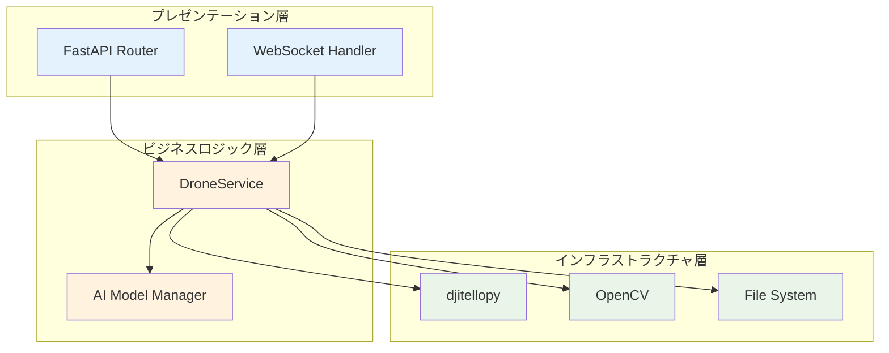

# MFG Drone Backend API

## 概要

Tello EDUドローンを制御し、リアルタイム映像配信と物体追跡機能を提供するバックエンドAPIシステムです。自動追従撮影システムのコアコンポーネントとして、ドローンの飛行制御、カメラ操作、AI物体認識を統合して提供します。

## システム構成

MFG Drone Backend APIは、以下の3層アーキテクチャで構成されています：



詳細な構成は [システム構成図](doc/system_architecture.md) を参照してください。

## 主要機能

### ✈️ ドローン制御
- **基本飛行制御**: 離陸・着陸・緊急停止
- **移動制御**: 方向指定移動・回転・座標指定飛行
- **高度制御**: カーブ飛行・ミッションパッド制御

### 📹 カメラ・映像
- **リアルタイム映像配信**: WebSocketによる低遅延ストリーミング
- **写真・動画撮影**: 高品質画像・動画の撮影・保存
- **映像設定**: 解像度・フレームレート調整

### 🤖 AI・物体認識
- **物体検出・追跡**: リアルタイム物体認識と自動追跡
- **AIモデル管理**: カスタムモデル学習・切り替え
- **追跡制御**: 対象物を中心に維持する自動制御

### 📊 センサーデータ
- **バッテリー情報**: 残量・電圧・温度監視
- **飛行状態**: 高度・座標・姿勢角取得
- **モーション情報**: 加速度・速度・飛行時間

## 技術スタック

| カテゴリ | 技術 | バージョン | 用途 |
|---------|------|-----------|------|
| **Webフレームワーク** | FastAPI | 0.115.0+ | REST API・WebSocket |
| **ASGIサーバー** | Uvicorn | 0.32.0+ | 非同期HTTP処理 |
| **ドローン制御** | djitellopy | 2.5.0 | Tello SDK Python wrapper |
| **映像処理** | OpenCV | 4.10.0+ | 画像・映像処理 |
| **数値計算** | NumPy | 2.1.0+ | データ処理 |
| **データ検証** | Pydantic | 2.10.0+ | 型安全性・バリデーション |
| **WebSocket** | websockets | 13.0+ | リアルタイム通信 |
| **ランタイム** | Python | 3.12+ | 実行環境 |

## クイックスタート

### 前提条件

- Python 3.12以上
- Tello EDUドローン
- WiFi接続環境

### インストール

```bash
# リポジトリクローン
git clone https://github.com/your-org/mfg_drone_by_claudecode.git
cd mfg_drone_by_claudecode/backend

# 仮想環境作成・有効化
python -m venv venv
source venv/bin/activate  # Windows: venv\Scripts\activate

# 依存関係インストール
pip install -e .
pip install -e ".[dev]"  # 開発依存関係も含める
```

### 起動

```bash
# 開発サーバー起動
python main.py

# または uvicorn直接起動
uvicorn main:app --host 0.0.0.0 --port 8000 --reload
```

### 動作確認

```bash
# ヘルスチェック
curl http://localhost:8000/health

# API文書確認
# ブラウザで http://localhost:8000/docs にアクセス
```

詳細な手順は [セットアップ手順](doc/setup_guide.md) を参照してください。

## API仕様

### エンドポイント概要

| カテゴリ | エンドポイント例 | 説明 |
|---------|----------------|------|
| **システム** | `GET /health` | ヘルスチェック |
| **接続管理** | `POST /drone/connect` | ドローン接続 |
| **飛行制御** | `POST /drone/takeoff` | 離陸 |
| **移動制御** | `POST /drone/move/forward` | 前進移動 |
| **カメラ** | `POST /drone/camera/stream/start` | 映像配信開始 |
| **センサー** | `GET /drone/sensors/battery` | バッテリー情報 |
| **追跡** | `POST /drone/tracking/start` | 物体追跡開始 |
| **AIモデル** | `GET /drone/models` | モデル一覧取得 |

### WebSocket通信

- **映像ストリーミング**: `ws://localhost:8000/stream`
- **リアルタイム状態**: `ws://localhost:8000/status`

完全なAPI仕様は [API仕様書](doc/api_specification.md) を参照してください。

## テスト

### テスト実行

```bash
# 全テスト実行
python -m pytest

# 単体テストのみ
python -m pytest tests/ -m "unit"

# カバレッジ付きテスト
python -m pytest --cov=. --cov-report=html

# 特定テストファイル
python -m pytest tests/test_connection.py -v
```

### テスト種別

- **単体テスト**: 個別コンポーネントのテスト（モック使用）
- **統合テスト**: API・サービス間連携のテスト
- **システムテスト**: 全体システムの動作テスト
- **実機テスト**: 実際のドローンを使用したテスト

詳細は [テスト実行手順](doc/testing_guide.md) を参照してください。

## 運用

### 本番環境デプロイ

```bash
# Raspberry Pi 5へのデプロイ
# 詳細手順は doc/setup_guide.md を参照

# systemdサービス起動
sudo systemctl start mfgdrone
sudo systemctl enable mfgdrone
```

### 監視・メンテナンス

- **ヘルスチェック**: 5分間隔の自動監視
- **ログローテーション**: 日次ローテーション・30日保存
- **バックアップ**: 日次フルバックアップ
- **セキュリティ**: ファイアウォール・アクセスログ監視

詳細は [運用手順](doc/operation_guide.md) を参照してください。

## ドキュメント一覧

### 📋 設計・仕様

- **[システム構成図](doc/system_architecture.md)** - 全体アーキテクチャ・技術スタック
- **[システムコンテキスト](doc/system_context.md)** - 外部アクター・システム境界
- **[ユースケース設計](doc/use_cases.md)** - 機能要件・シナリオ
- **[方式設計書](doc/design_specification.md)** - 技術的設計方針・品質属性

### 📖 API・技術仕様

- **[API仕様書](doc/api_specification.md)** - 完全なREST API仕様
- **[用語集](doc/glossary.md)** - 専門用語・略語集

### 🛠️ 開発・運用

- **[セットアップ手順](doc/setup_guide.md)** - 開発環境・本番環境構築
- **[テスト実行手順](doc/testing_guide.md)** - テスト戦略・実行方法
- **[運用手順](doc/operation_guide.md)** - 監視・メンテナンス・トラブルシューティング

## 貢献

### 開発環境

```bash
# 開発依存関係インストール
pip install -e ".[dev]"

# pre-commitフック設定
pre-commit install

# コード品質チェック
black .
ruff check .
mypy .
```

### コード品質基準

- **型安全性**: MyPy厳格モード
- **フォーマット**: Black (line-length=100)
- **Lint**: Ruff設定
- **テストカバレッジ**: 80%以上
- **文書化**: docstring必須

## ライセンス

MIT License

## サポート

### 問題報告

- **バグ報告**: GitHub Issues
- **機能要望**: GitHub Discussions
- **セキュリティ**: security@example.com

### 開発チーム

- **プロジェクトリード**: MFG Drone Team
- **技術責任者**: システム設計・開発
- **QA担当**: テスト・品質保証

---

**関連リポジトリ**

- [Frontend Admin](../frontend/admin/) - 管理者インターフェース
- [Frontend User](../frontend/user/) - ユーザーインターフェース

**技術サポート**

- [FastAPI公式ドキュメント](https://fastapi.tiangolo.com/)
- [djitellopy GitHub](https://github.com/damiafuentes/DJITelloPy)
- [OpenCV公式サイト](https://opencv.org/)