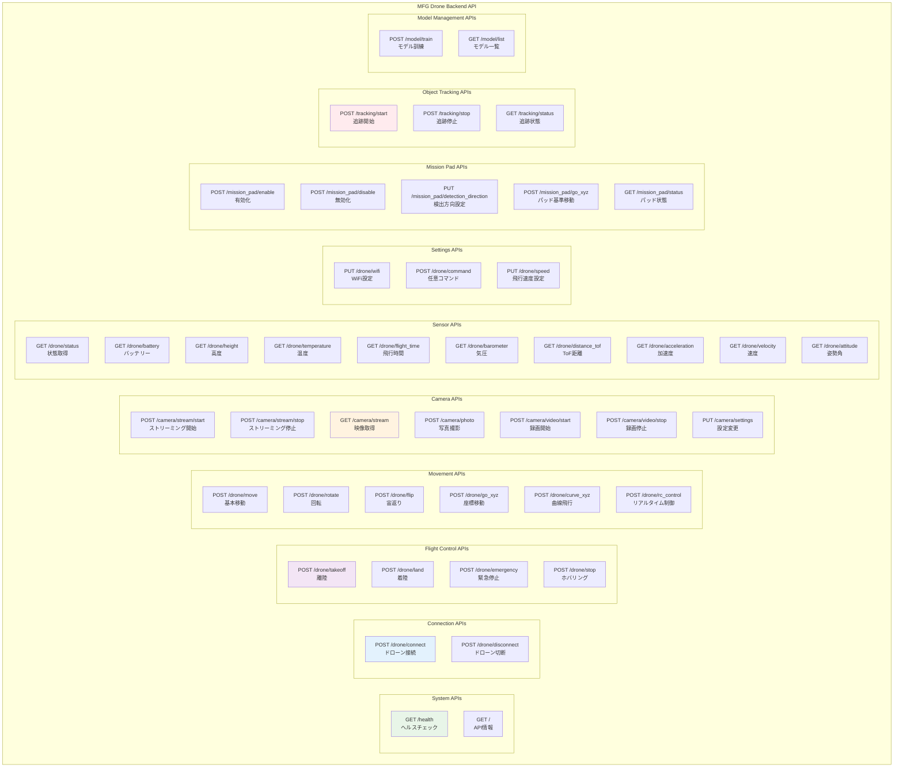
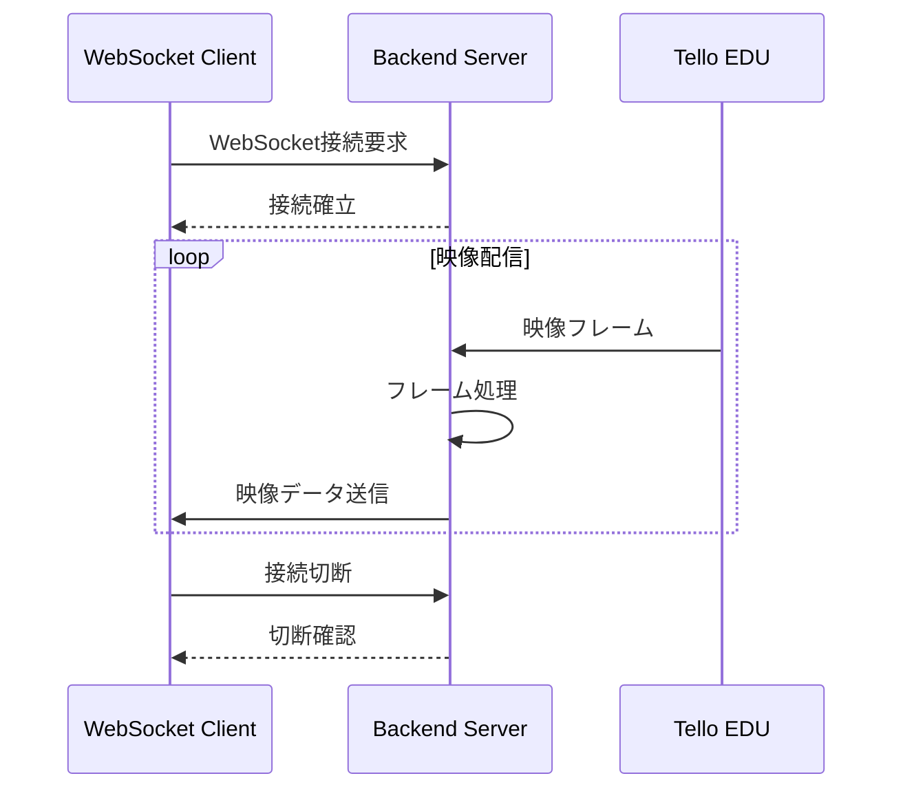

# API仕様書

## 概要

MFG Drone Backend API は REST API および WebSocket を提供し、Tello EDU ドローンの包括的な制御、AI による物体認識・追跡、リアルタイム映像ストリーミングを実現します。

## API 基本情報

| 項目 | 値 |
|------|-----|
| **ベースURL** | `http://192.168.1.100:8000` (本番環境) |
| **開発URL** | `http://localhost:8000` (開発環境) |
| **APIバージョン** | v1.0.0 |
| **認証方式** | なし (将来実装予定) |
| **データ形式** | JSON |
| **文字エンコーディング** | UTF-8 |

## API エンドポイント分類



## 詳細 API 仕様

### 1. システム API

#### GET /health
**概要**: システムの健全性を確認

**レスポンス例**:
```json
{
  "status": "healthy",
  "timestamp": "2024-01-15T10:30:00Z",
  "checks": {
    "drone_connection": true,
    "camera_status": true,
    "ai_service": true
  }
}
```

### 2. 接続管理 API

#### POST /drone/connect
**概要**: Tello EDU ドローンとの接続を確立

**リクエスト**: なし

**レスポンス**:
```json
{
  "success": true,
  "message": "ドローンに接続しました",
  "drone_info": {
    "serial_number": "0TQZH77ED00001",
    "firmware_version": "01.04.0001",
    "sdk_version": "30"
  }
}
```

**エラーレスポンス**:
```json
{
  "error": "ドローン接続に失敗しました",
  "code": "DRONE_CONNECTION_FAILED",
  "details": {
    "reason": "No response from drone",
    "retry_after": 5
  }
}
```

#### POST /drone/disconnect
**概要**: ドローンとの接続を切断

**レスポンス**:
```json
{
  "success": true,
  "message": "ドローンから切断しました"
}
```

### 3. 飛行制御 API

#### POST /drone/takeoff
**概要**: ドローンを自動離陸させる

**事前条件**:
- ドローンが接続済み
- バッテリー残量 > 20%
- 飛行中でない

**レスポンス**:
```json
{
  "success": true,
  "message": "離陸しました",
  "flight_info": {
    "takeoff_time": "2024-01-15T10:30:00Z",
    "initial_height": 100,
    "battery_level": 85
  }
}
```

#### POST /drone/land
**概要**: ドローンを自動着陸させる

**事前条件**:
- ドローンが飛行中

**レスポンス**:
```json
{
  "success": true,
  "message": "着陸しました",
  "flight_summary": {
    "total_flight_time": 180,
    "max_height": 250,
    "battery_consumed": 15
  }
}
```

#### POST /drone/emergency
**概要**: 緊急停止（即座にモーター停止）

**レスポンス**:
```json
{
  "success": true,
  "message": "緊急停止しました",
  "emergency_info": {
    "stop_time": "2024-01-15T10:35:00Z",
    "reason": "manual_trigger"
  }
}
```

### 4. 移動制御 API

#### POST /drone/move
**概要**: 基本方向移動

**リクエストボディ**:
```json
{
  "direction": "forward",
  "distance": 100
}
```

**パラメータ**:
- `direction`: `up`, `down`, `left`, `right`, `forward`, `back`
- `distance`: 20-500 (cm)

**レスポンス**:
```json
{
  "success": true,
  "message": "forward方向に100cm移動しました",
  "position_info": {
    "previous_position": {"x": 0, "y": 0, "z": 100},
    "current_position": {"x": 100, "y": 0, "z": 100},
    "movement_time": 2.5
  }
}
```

#### POST /drone/rotate
**概要**: ヨー軸回転

**リクエストボディ**:
```json
{
  "direction": "clockwise",
  "angle": 90
}
```

**パラメータ**:
- `direction`: `clockwise`, `counter_clockwise`
- `angle`: 1-360 (度)

#### POST /drone/go_xyz
**概要**: 3D座標を指定した移動

**リクエストボディ**:
```json
{
  "x": 100,
  "y": 50,
  "z": 150,
  "speed": 50
}
```

**パラメータ**:
- `x`, `y`, `z`: -500〜500 (cm)
- `speed`: 10-100 (cm/s)

#### POST /drone/rc_control
**概要**: リアルタイムRC制御

**リクエストボディ**:
```json
{
  "left_right_velocity": 20,
  "forward_backward_velocity": 0,
  "up_down_velocity": 10,
  "yaw_velocity": -15
}
```

**パラメータ**: 各速度 -100〜100 (%)

### 5. カメラ API

#### POST /camera/stream/start
**概要**: ビデオストリーミング開始

**レスポンス**:
```json
{
  "success": true,
  "message": "ストリーミングを開始しました",
  "stream_info": {
    "resolution": "1280x720",
    "fps": 30,
    "bitrate": 2000,
    "stream_url": "/camera/stream"
  }
}
```

#### GET /camera/stream
**概要**: リアルタイム映像ストリーム取得

**レスポンス**: `multipart/x-mixed-replace` 形式のストリーミングデータ

**WebSocket版**:
```javascript
// クライアント側 JavaScript
const ws = new WebSocket('ws://192.168.1.100:8000/camera/ws');
ws.onmessage = function(event) {
    const imageData = event.data;
    // 映像表示処理
};
```

#### PUT /camera/settings
**概要**: カメラ設定変更

**リクエストボディ**:
```json
{
  "resolution": "high",
  "fps": "middle",
  "bitrate": 3
}
```

**パラメータ**:
- `resolution`: `high` (720p), `low` (480p)
- `fps`: `high` (30fps), `middle` (15fps), `low` (5fps)
- `bitrate`: 1-5

### 6. センサー API

#### GET /drone/status
**概要**: ドローンの包括的状態取得

**レスポンス**:
```json
{
  "connected": true,
  "flying": true,
  "battery": 75,
  "height": 120,
  "temperature": 45,
  "flight_time": 240,
  "speed": 15.5,
  "barometer": 1013.25,
  "distance_tof": 150,
  "acceleration": {
    "x": 0.02,
    "y": -0.01,
    "z": 9.81
  },
  "velocity": {
    "x": 0,
    "y": 5,
    "z": 0
  },
  "attitude": {
    "pitch": 2,
    "roll": -1,
    "yaw": 45
  },
  "position": {
    "x": 100,
    "y": 50,
    "z": 120
  }
}
```

#### GET /drone/battery
**概要**: バッテリー残量取得

**レスポンス**:
```json
{
  "battery": 75,
  "voltage": 3.7,
  "charging": false,
  "estimated_flight_time": 8
}
```

### 7. 物体追跡 API

#### POST /tracking/start
**概要**: 物体追跡開始

**リクエストボディ**:
```json
{
  "target_object": "person",
  "tracking_mode": "center",
  "confidence_threshold": 0.7
}
```

**パラメータ**:
- `target_object`: 追跡対象オブジェクト名
- `tracking_mode`: `center` (画面中央維持), `follow` (追従飛行)
- `confidence_threshold`: 0.0-1.0 (信頼度閾値)

**レスポンス**:
```json
{
  "success": true,
  "message": "'person'の追跡を開始しました（centerモード）",
  "tracking_id": "track_001",
  "model_info": {
    "model_name": "person_detector_v2",
    "accuracy": 0.92,
    "last_trained": "2024-01-10T15:00:00Z"
  }
}
```

#### GET /tracking/status
**概要**: 追跡状態取得

**レスポンス**:
```json
{
  "is_tracking": true,
  "target_object": "person",
  "target_detected": true,
  "confidence": 0.85,
  "target_position": {
    "x": 320,
    "y": 240,
    "width": 100,
    "height": 150,
    "center_offset": {
      "x": -20,
      "y": 10
    }
  },
  "tracking_metrics": {
    "frames_processed": 1500,
    "detection_rate": 0.95,
    "avg_confidence": 0.82
  }
}
```

### 8. AIモデル管理 API

#### POST /model/train
**概要**: 物体認識モデル訓練

**リクエスト**: `multipart/form-data`
- `object_name`: 学習対象オブジェクト名
- `images`: 学習用画像ファイル群

**レスポンス**:
```json
{
  "success": true,
  "task_id": "train_task_001",
  "estimated_time": 1800,
  "message": "モデル訓練を開始しました"
}
```

#### GET /model/list
**概要**: 利用可能モデル一覧取得

**レスポンス**:
```json
{
  "models": [
    {
      "name": "person_detector",
      "created_at": "2024-01-10T15:00:00Z",
      "accuracy": 0.92,
      "training_images": 150,
      "model_size": "2.5MB"
    },
    {
      "name": "car_detector",
      "created_at": "2024-01-08T10:30:00Z",
      "accuracy": 0.88,
      "training_images": 200,
      "model_size": "3.1MB"
    }
  ]
}
```

## WebSocket API

### 映像ストリーミング WebSocket

**エンドポイント**: `ws://192.168.1.100:8000/camera/ws`

**接続フロー**:


**メッセージ形式**:
```json
{
  "type": "video_frame",
  "timestamp": "2024-01-15T10:30:00.123Z",
  "frame_id": 12345,
  "data": "base64_encoded_image_data",
  "metadata": {
    "width": 1280,
    "height": 720,
    "fps": 30
  }
}
```

### リアルタイム状態監視 WebSocket

**エンドポイント**: `ws://192.168.1.100:8000/status/ws`

**ステータス更新メッセージ**:
```json
{
  "type": "status_update",
  "timestamp": "2024-01-15T10:30:00Z",
  "data": {
    "battery": 74,
    "height": 125,
    "temperature": 46,
    "connection_quality": "good"
  }
}
```

## エラーコード体系

### HTTPステータスコード

| コード | 意味 | 使用ケース |
|-------|------|-----------|
| **200** | OK | 成功 |
| **400** | Bad Request | 無効なリクエストパラメータ |
| **404** | Not Found | リソースが見つからない |
| **409** | Conflict | 状態競合（例：既に飛行中） |
| **422** | Unprocessable Entity | バリデーションエラー |
| **500** | Internal Server Error | サーバー内部エラー |
| **503** | Service Unavailable | ドローン未接続 |

### アプリケーションエラーコード

| コード | 説明 | HTTPステータス |
|-------|------|---------------|
| `DRONE_NOT_CONNECTED` | ドローンが接続されていない | 503 |
| `DRONE_CONNECTION_FAILED` | ドローン接続に失敗 | 500 |
| `INVALID_PARAMETER` | 無効なパラメータ | 400 |
| `COMMAND_FAILED` | コマンド実行失敗 | 500 |
| `COMMAND_TIMEOUT` | コマンドタイムアウト | 408 |
| `NOT_FLYING` | ドローンが飛行していない | 409 |
| `ALREADY_FLYING` | 既に飛行中 | 409 |
| `LOW_BATTERY` | バッテリー残量不足 | 409 |
| `STREAMING_NOT_STARTED` | ストリーミング未開始 | 409 |
| `STREAMING_ALREADY_STARTED` | ストリーミング既開始 | 409 |
| `OBJECT_NOT_DETECTED` | 対象物体が検出されない | 404 |
| `MODEL_NOT_FOUND` | モデルが見つからない | 404 |
| `TRAINING_IN_PROGRESS` | 訓練処理中 | 409 |

## レート制限

| エンドポイントカテゴリ | 制限 | ウィンドウ |
|-------------------|------|----------|
| **飛行制御** | 10 req/min | 1分間 |
| **移動制御** | 30 req/min | 1分間 |
| **センサー取得** | 300 req/min | 1分間 |
| **設定変更** | 5 req/min | 1分間 |
| **モデル訓練** | 1 req/hour | 1時間 |

## API使用例

### Python クライアント例

```python
import httpx
import asyncio
import websocket

class DroneClient:
    def __init__(self, base_url="http://192.168.1.100:8000"):
        self.base_url = base_url
        self.client = httpx.AsyncClient()
    
    async def connect_drone(self):
        response = await self.client.post(f"{self.base_url}/drone/connect")
        return response.json()
    
    async def takeoff(self):
        response = await self.client.post(f"{self.base_url}/drone/takeoff")
        return response.json()
    
    async def move(self, direction, distance):
        data = {"direction": direction, "distance": distance}
        response = await self.client.post(f"{self.base_url}/drone/move", json=data)
        return response.json()
    
    async def get_status(self):
        response = await self.client.get(f"{self.base_url}/drone/status")
        return response.json()

# 使用例
async def main():
    drone = DroneClient()
    
    # ドローン接続
    result = await drone.connect_drone()
    print(f"接続結果: {result}")
    
    # 離陸
    result = await drone.takeoff()
    print(f"離陸結果: {result}")
    
    # 前進
    result = await drone.move("forward", 100)
    print(f"移動結果: {result}")
    
    # 状態確認
    status = await drone.get_status()
    print(f"現在の状態: {status}")

asyncio.run(main())
```

### JavaScript WebSocket例

```javascript
class DroneVideoStream {
    constructor(wsUrl = "ws://192.168.1.100:8000/camera/ws") {
        this.wsUrl = wsUrl;
        this.ws = null;
    }
    
    connect() {
        this.ws = new WebSocket(this.wsUrl);
        
        this.ws.onopen = () => {
            console.log("映像ストリーム接続成功");
        };
        
        this.ws.onmessage = (event) => {
            const frameData = JSON.parse(event.data);
            this.displayFrame(frameData);
        };
        
        this.ws.onerror = (error) => {
            console.error("WebSocketエラー:", error);
        };
    }
    
    displayFrame(frameData) {
        const img = document.getElementById('droneVideo');
        img.src = `data:image/jpeg;base64,${frameData.data}`;
    }
    
    disconnect() {
        if (this.ws) {
            this.ws.close();
        }
    }
}

// 使用例
const videoStream = new DroneVideoStream();
videoStream.connect();
```

## API パフォーマンス

### レスポンス時間目標

| API カテゴリ | 目標時間 | 測定方法 |
|-------------|---------|---------|
| **システム情報** | < 10ms | 平均応答時間 |
| **センサーデータ** | < 50ms | 95%ile |
| **飛行制御** | < 100ms | 95%ile |
| **画像処理** | < 200ms | 平均処理時間 |

### スループット目標

- **同時接続数**: 最大10クライアント (WebSocket)
- **API リクエスト**: 1000 req/sec
- **映像ストリーミング**: 30 FPS per client

## セキュリティ考慮事項

### 入力検証
- すべてのリクエストパラメータの型・範囲チェック
- SQLインジェクション対策（将来のDB導入時）
- ファイルアップロード時の形式・サイズ制限

### アクセス制御（将来実装）
- JWT ベースの認証
- ロールベースのアクセス制御
- API キーによる制限

### 通信セキュリティ（将来実装）
- HTTPS/TLS 暗号化
- WebSocket Secure (WSS)
- CORS ポリシーの適切な設定