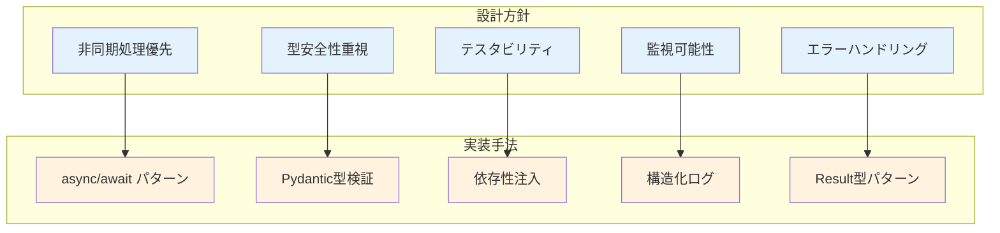
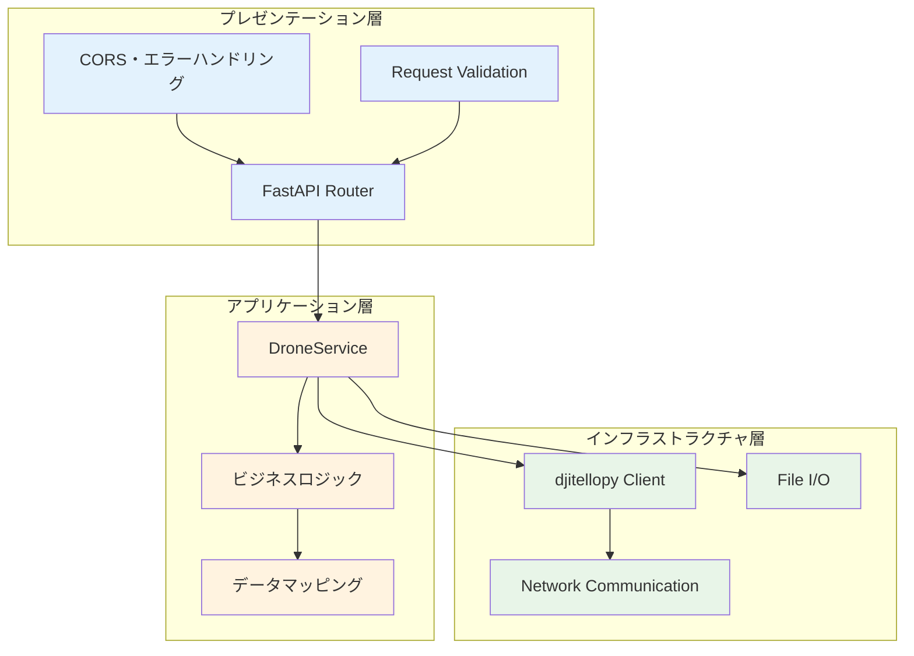
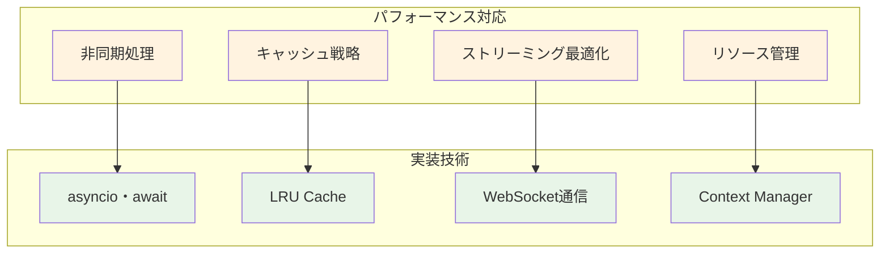
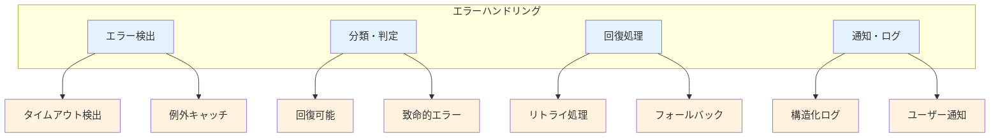
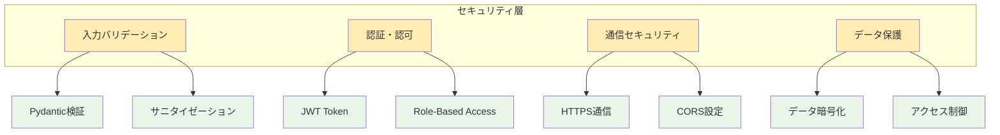
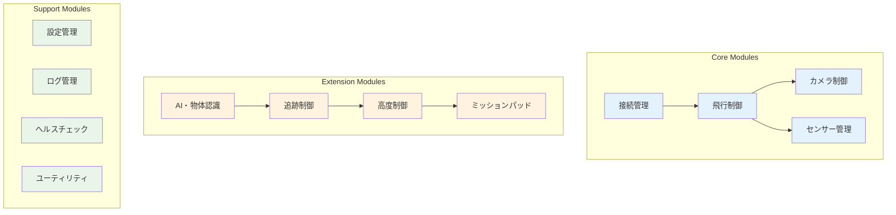
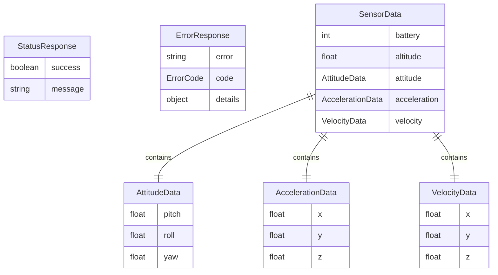
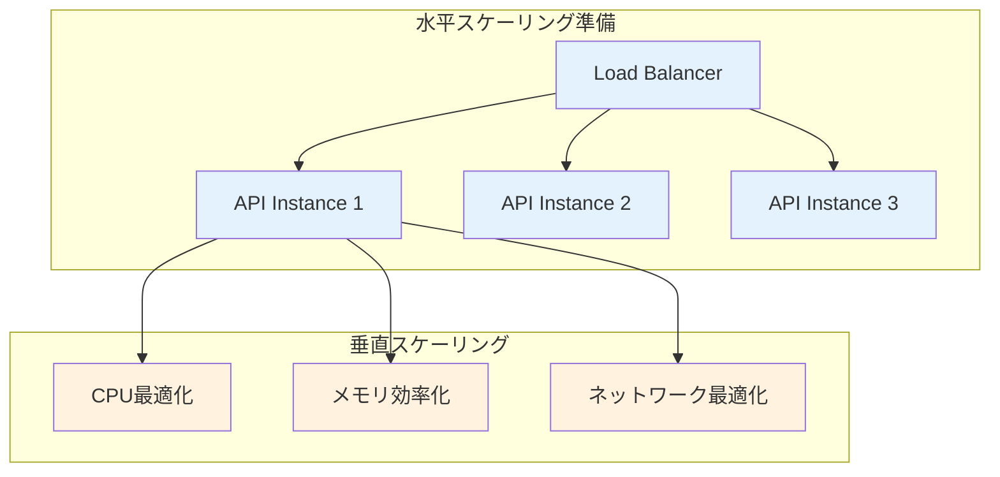
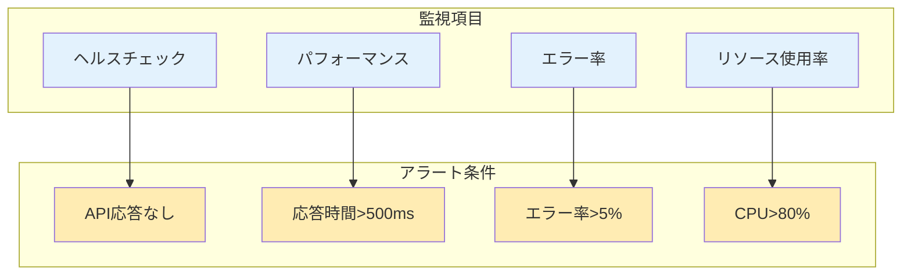

# 方式設計書

## 概要

MFG Drone Backend APIの技術的設計方針、アーキテクチャパターン、品質属性への対応方式を定義します。

## 設計原則

### 1. 基本設計原則

- **関心の分離 (Separation of Concerns)**: レイヤー分割による責任の明確化
- **依存性逆転 (Dependency Inversion)**: 抽象への依存、具象への非依存
- **単一責任 (Single Responsibility)**: 各クラス・モジュールは単一の責任を持つ
- **開放閉鎖 (Open/Closed)**: 拡張に開いて、修正に閉じた設計
- **非同期ファースト**: I/Oバウンドなドローン制御に最適化

### 2. 設計方針



## アーキテクチャパターン

### 1. レイヤードアーキテクチャ



### 2. 依存性注入パターン

```python
# 依存性注入の実装例
@lru_cache()
def get_drone_service() -> DroneService:
    return DroneService()

# 型エイリアス
DroneServiceDep = Annotated[DroneService, Depends(get_drone_service)]

# エンドポイントでの使用
@router.post("/takeoff")
async def takeoff(drone_service: DroneServiceDep):
    return await drone_service.takeoff()
```

### 3. Repository パターン（将来拡張）

```mermaid
graph TB
    subgraph "Repository パターン"
        Service[DroneService]
        IRepo[IDroneRepository<br/>Interface]
        TelloRepo[TelloRepository<br/>Implementation]
        MockRepo[MockRepository<br/>Test Implementation]
    end
    
    Service --> IRepo
    IRepo <|.. TelloRepo
    IRepo <|.. MockRepo
    
    classDef interface fill:#e1f5fe
    classDef implementation fill:#fff3e0
    
    class IRepo interface
    class TelloRepo,MockRepo,Service implementation
```

## 技術スタック選定理由

### 1. Webフレームワーク: FastAPI

**選定理由**:
- 非同期処理のネイティブサポート
- 自動API文書生成 (OpenAPI/Swagger)
- Pydanticによる型安全性
- 高いパフォーマンス (Starlette ベース)

**設定例**:
```python
app = FastAPI(
    title="MFG Drone Backend API",
    description="Tello EDU自動追従撮影システム",
    version="1.0.0",
    openapi_url="/openapi.json"
)
```

### 2. ドローン制御: djitellopy

**選定理由**:
- Tello SDK公式Python wrapper
- 非同期操作サポート
- 豊富なAPIカバレッジ
- アクティブなコミュニティ

### 3. 映像処理: OpenCV

**選定理由**:
- 豊富な画像・映像処理機能
- AI/MLライブラリとの親和性
- リアルタイム処理性能
- クロスプラットフォーム対応

## 品質属性対応

### 1. パフォーマンス



**具体的対応**:
- 非同期I/O: `async/await` によるノンブロッキング処理
- 接続プーリング: ドローン接続の効率的管理
- キャッシュ: センサーデータの適切なキャッシング
- ストリーミング最適化: フレームレート・品質調整

### 2. 可用性・信頼性

**エラーハンドリング戦略**:


**実装例**:
```python
async def safe_drone_command(self, command: str, timeout: int = 5):
    """安全なドローンコマンド実行"""
    try:
        result = await asyncio.wait_for(
            self.drone.send_command(command), 
            timeout=timeout
        )
        return {"success": True, "result": result}
    except asyncio.TimeoutError:
        return {"success": False, "error": "COMMAND_TIMEOUT"}
    except Exception as e:
        logger.error(f"Command failed: {command}", exc_info=e)
        return {"success": False, "error": "COMMAND_FAILED"}
```

### 3. セキュリティ



### 4. 拡張性・保守性

**モジュラー設計**:


## データ設計

### 1. APIデータモデル



### 2. 設定データ構造

```python
class DroneSettings(BaseModel):
    """ドローン設定"""
    speed: int = Field(10, ge=1, le=100, description="飛行速度")
    wifi_ssid: Optional[str] = Field(None, description="WiFi SSID")
    camera_quality: int = Field(720, description="カメラ品質")
    
class TrackingSettings(BaseModel):
    """追跡設定"""
    sensitivity: float = Field(0.5, ge=0.1, le=1.0)
    tracking_mode: TrackingMode = Field(TrackingMode.CENTER)
    target_object: str = Field("", description="追跡対象")
```

## 非機能要件対応

### 1. パフォーマンス要件

| 項目 | 目標値 | 対応方式 |
|------|-------|---------|
| API応答時間 | < 100ms | 非同期処理・キャッシュ |
| 映像遅延 | < 200ms | WebSocket・フレーム最適化 |
| ドローン制御遅延 | < 50ms | UDP直接通信 |
| 同時接続数 | 10接続 | 接続プール・非同期処理 |

### 2. 可用性要件

| 項目 | 目標値 | 対応方式 |
|------|-------|---------|
| システム稼働率 | 99.5% | エラーハンドリング・自動復旧 |
| MTTR | < 1分 | ヘルスチェック・アラート |
| データ整合性 | 100% | バリデーション・トランザクション |

### 3. スケーラビリティ対応



## 開発・運用方針

### 1. 開発プロセス

- **テスト駆動開発**: 単体・統合・E2Eテスト
- **継続的インテグレーション**: 自動テスト・コード品質チェック
- **型安全性**: MyPy・Pydantic厳格モード
- **コード品質**: Black・Ruff・pre-commit

### 2. 運用監視



### 3. ログ設計

```python
import structlog

logger = structlog.get_logger()

# 構造化ログの例
await logger.info(
    "drone_command_executed",
    command="takeoff",
    drone_id="tello_001",
    execution_time=0.025,
    success=True
)
```

## 将来拡張考慮事項

### 1. マルチドローン対応

- ドローンID管理
- 編隊飛行制御
- 負荷分散

### 2. クラウド連携

- AIモデルのクラウド学習
- データ分析・可視化
- リモート監視

### 3. 他社ドローン対応

- ドライバー抽象化
- プロトコル統一
- 設定管理拡張