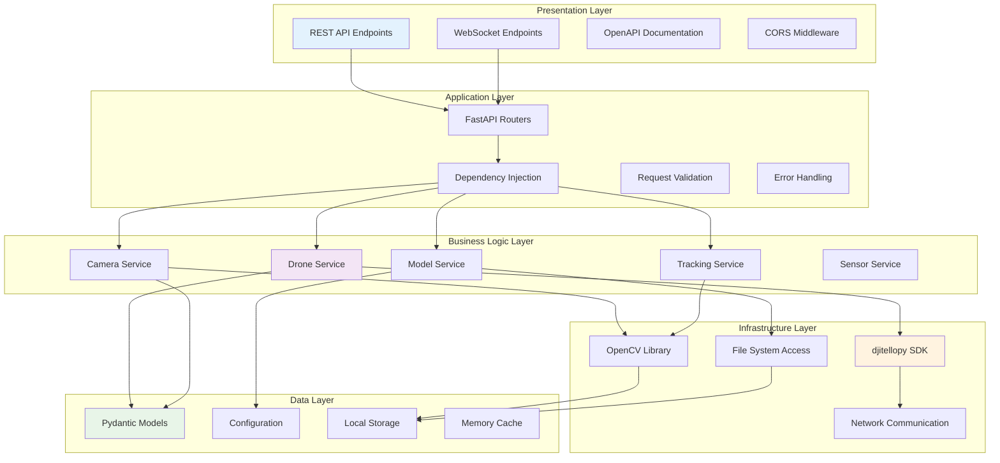
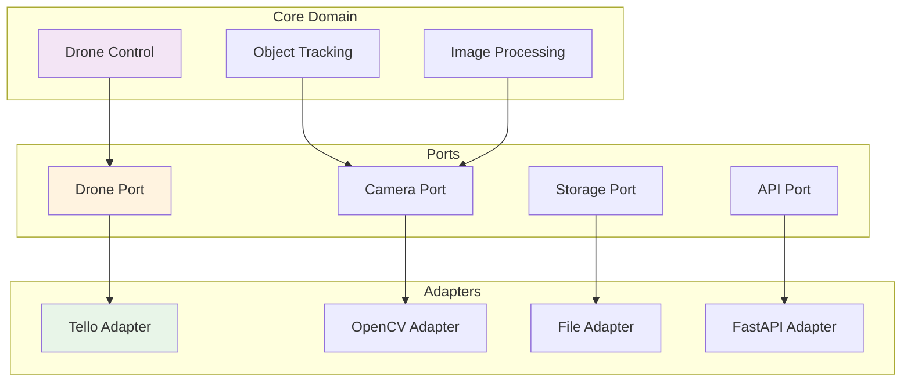
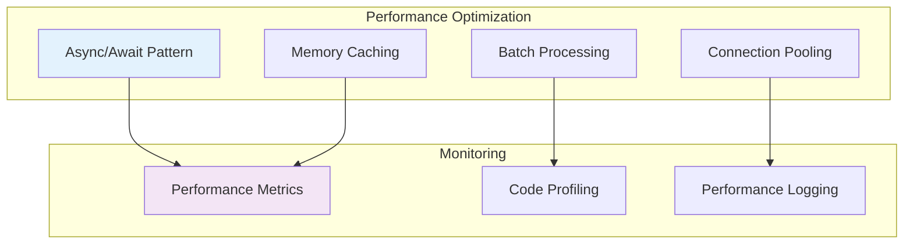
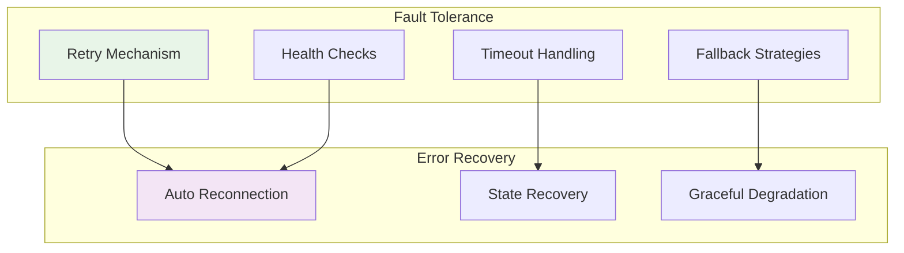
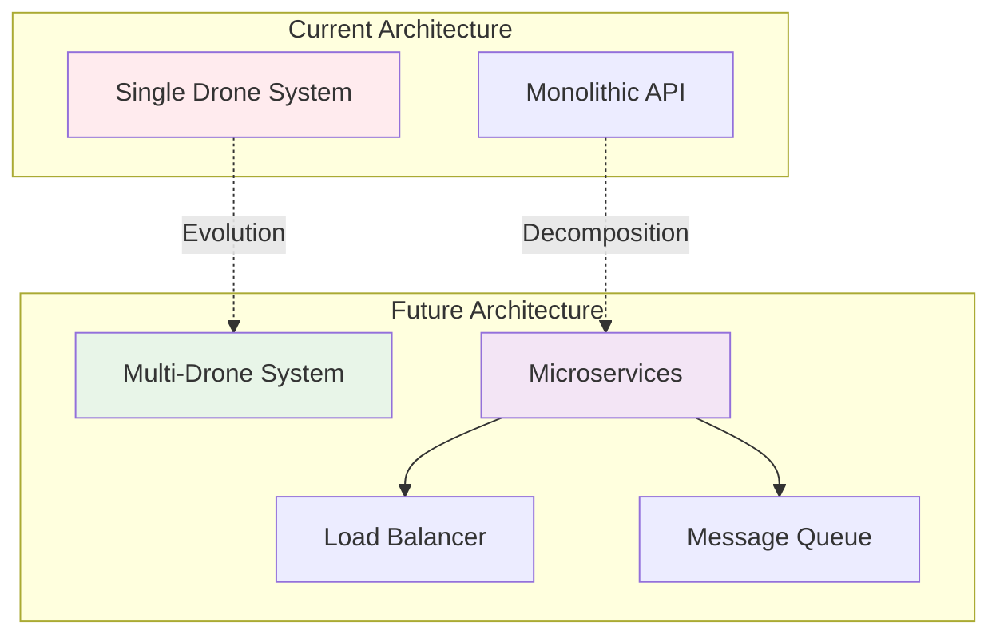
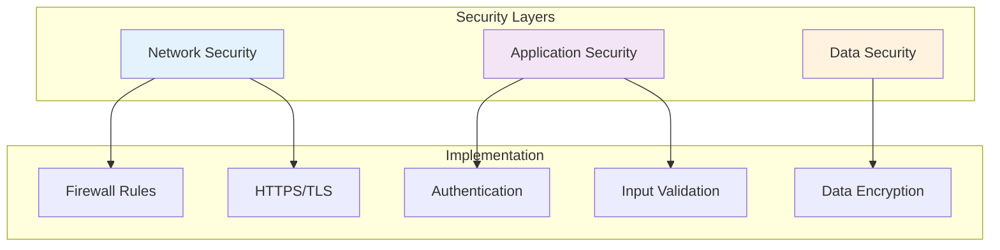
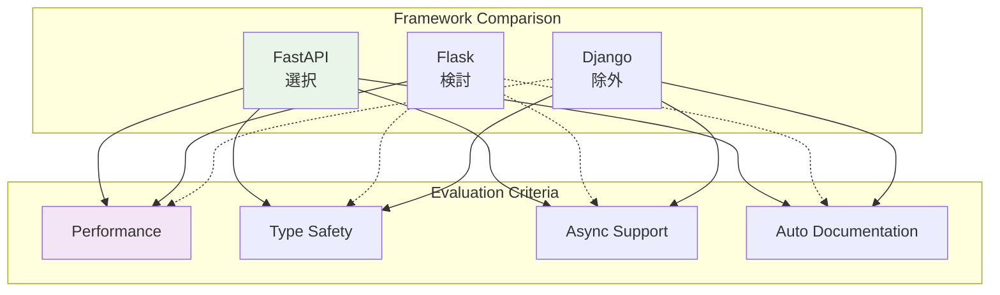
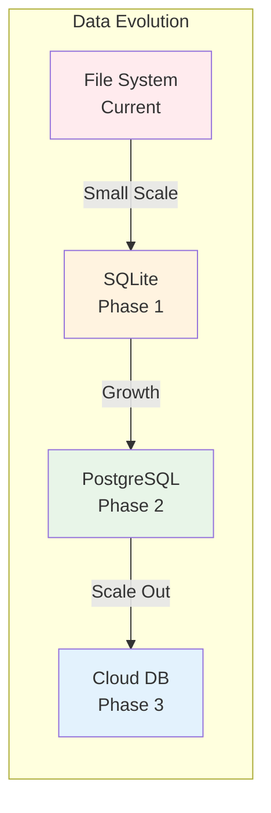
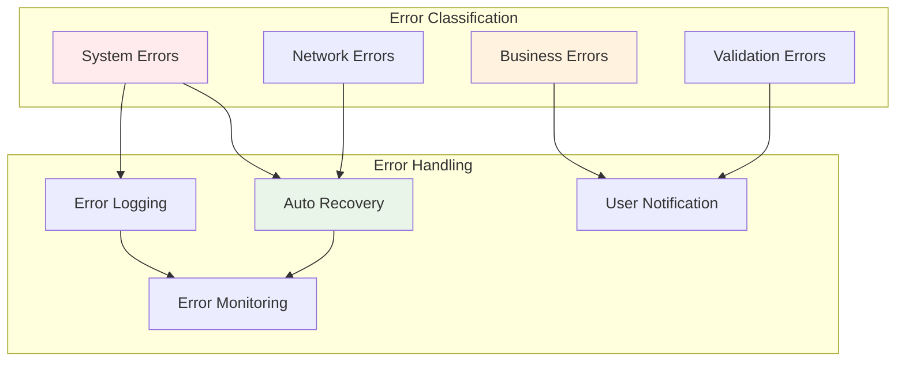
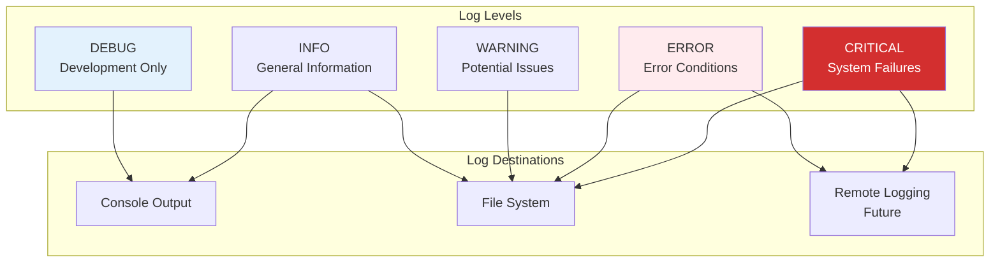

# 方式設計書

## 概要

MFG Drone Backend API の方式設計では、システムアーキテクチャの設計原則、品質属性、技術選定理由、および実装戦略を詳細に定義します。

## アーキテクチャパターン

### レイヤードアーキテクチャ



### ヘキサゴナルアーキテクチャ要素



## 設計原則

### 1. 関心の分離 (Separation of Concerns)

**実装戦略**:
- 各レイヤーは特定の責任のみを持つ
- ビジネスロジックをインフラストラクチャから分離
- 横断的関心事（ログ、エラーハンドリング）の独立管理

**具体例**:
```python
# ビジネスロジック層
class DroneService:
    async def takeoff(self) -> Dict[str, Any]:
        # ビジネスルールのみに集中
        if not self._is_connected:
            return {"success": False, "message": "ドローンが接続されていません"}
        
        result = self.drone.takeoff()
        self._is_flying = True if result else False
        return {"success": result, "message": "離陸しました" if result else "離陸に失敗しました"}

# インフラストラクチャ層
@router.post("/takeoff")
async def takeoff_endpoint():
    # HTTP関連の処理のみ
    result = await drone_service.takeoff()
    return JSONResponse(content=result)
```

### 2. 依存性の逆転 (Dependency Inversion)

```mermaid
graph TB
    subgraph "High Level Modules"
        DroneService[Drone Service]
        TrackingService[Tracking Service]
    end
    
    subgraph "Abstractions"
        IDroneController[IDroneController Interface]
        IImageProcessor[IImageProcessor Interface]
    end
    
    subgraph "Low Level Modules"
        TelloController[Tello Controller]
        OpenCVProcessor[OpenCV Processor]
    end

    DroneService --> IDroneController
    TrackingService --> IImageProcessor
    
    IDroneController <|.. TelloController
    IImageProcessor <|.. OpenCVProcessor
    
    style DroneService fill:#f3e5f5
    style IDroneController fill:#fff3e0
    style TelloController fill:#e8f5e8
```

### 3. 単一責任原則 (Single Responsibility Principle)

**サービス層の責任分離**:
- `DroneService`: ドローンの物理制御のみ
- `CameraService`: 映像処理のみ
- `TrackingService`: 物体追跡ロジックのみ
- `ModelService`: AIモデル管理のみ

### 4. 開放閉鎖原則 (Open/Closed Principle)

**拡張性の確保**:
```python
# 基底インターフェース
class IObjectDetector:
    async def detect(self, image: np.ndarray) -> List[Detection]:
        pass

# 既存実装
class YOLODetector(IObjectDetector):
    async def detect(self, image: np.ndarray) -> List[Detection]:
        # YOLO実装

# 新しい実装（既存コードを変更せずに追加）
class TensorFlowDetector(IObjectDetector):
    async def detect(self, image: np.ndarray) -> List[Detection]:
        # TensorFlow実装
```

## 品質属性設計

### 1. パフォーマンス (Performance)

**目標値**:
- API応答時間: < 100ms (95%ile)
- 映像ストリーミング遅延: < 200ms
- AI処理時間: < 50ms per frame

**実装戦略**:



**具体的実装**:
```python
# 非同期処理によるパフォーマンス向上
@router.get("/stream")
async def video_stream():
    async def generate_frames():
        while streaming:
            frame = await capture_frame()  # 非同期フレーム取得
            processed = await process_frame(frame)  # 非同期AI処理
            yield processed
    return StreamingResponse(generate_frames(), media_type="multipart/x-mixed-replace")

# キャッシングによる応答時間短縮
@lru_cache(maxsize=100)
async def get_drone_status():
    return await drone.get_comprehensive_status()
```

### 2. 可用性 (Availability)

**目標値**: 99.9% uptime (稼働時間)

**設計戦略**:



**実装例**:
```python
# リトライ機構
@retry(stop=stop_after_attempt(3), wait=wait_exponential(multiplier=1, min=4, max=10))
async def send_drone_command(command: str):
    try:
        return await drone.send_command(command, timeout=5)
    except TimeoutError:
        await reconnect_drone()
        raise

# ヘルスチェック
@router.get("/health")
async def health_check():
    checks = {
        "drone_connection": await check_drone_connection(),
        "camera_status": await check_camera_status(),
        "ai_service": await check_ai_service()
    }
    overall_health = all(checks.values())
    return {"status": "healthy" if overall_health else "unhealthy", "details": checks}
```

### 3. 拡張性 (Scalability)

**水平スケーリング戦略**:



### 4. セキュリティ (Security)

**セキュリティ層設計**:



**セキュリティ実装**:
```python
# 入力検証
class FlightCommand(BaseModel):
    direction: Literal["up", "down", "left", "right", "forward", "back"]
    distance: int = Field(ge=20, le=500, description="移動距離(cm)")
    
    @validator('distance')
    def validate_safe_distance(cls, v):
        if v > 300:  # 安全距離制限
            raise ValueError('安全距離を超えています')
        return v

# レート制限
@router.post("/move")
@rate_limit("5/minute")
async def move_drone(command: FlightCommand):
    return await drone_service.move(command.direction, command.distance)
```

## 技術選定理由

### フレームワーク選定

#### FastAPI選定理由

**技術的利点**:
1. **高性能**: Starlette/Uvicornベースの非同期処理
2. **型安全性**: Pydanticによる自動検証
3. **ドキュメント自動生成**: OpenAPI仕様の自動作成
4. **WebSocket対応**: リアルタイム通信サポート

**比較分析**:


#### djitellopy選定理由

**選定基準**:
1. **公式サポート**: DJI Tello SDK準拠
2. **Python統合**: Pythonエコシステムとの親和性
3. **コミュニティ**: アクティブな開発コミュニティ
4. **機能網羅**: Tello EDU全機能対応

### データベース戦略

**現在**: ファイルシステムベース
**将来**: SQLite → PostgreSQL 移行計画



## エラーハンドリング戦略

### エラー分類体系



### エラーコード体系

| カテゴリ | コード範囲 | 例 |
|---------|-----------|-----|
| **システムエラー** | 5000-5999 | 5001: INTERNAL_ERROR |
| **ドローンエラー** | 4000-4999 | 4001: DRONE_NOT_CONNECTED |
| **バリデーションエラー** | 3000-3999 | 3001: INVALID_PARAMETER |
| **ネットワークエラー** | 2000-2999 | 2001: CONNECTION_TIMEOUT |

### 実装例

```python
# 例外階層
class DroneError(Exception):
    """ベース例外クラス"""
    def __init__(self, message: str, code: str, details: dict = None):
        self.message = message
        self.code = code
        self.details = details or {}

class ConnectionError(DroneError):
    """接続関連エラー"""
    pass

class FlightError(DroneError):
    """飛行制御エラー"""
    pass

# グローバルエラーハンドラ
@app.exception_handler(DroneError)
async def drone_error_handler(request: Request, exc: DroneError):
    logger.error(f"Drone error: {exc.code} - {exc.message}", extra=exc.details)
    return JSONResponse(
        status_code=400,
        content={
            "error": exc.message,
            "code": exc.code,
            "details": exc.details
        }
    )
```

## ログ・監視戦略

### ログレベル設計



### 構造化ログ

```python
import structlog

logger = structlog.get_logger()

# 構造化ログの例
await logger.info(
    "drone_command_executed",
    command="takeoff",
    drone_id="tello_001",
    battery_level=85,
    flight_time=120,
    user_id="admin_001"
)
```

## 非機能要件マトリックス

| 品質属性 | 目標値 | 測定方法 | 実装戦略 |
|---------|-------|---------|---------|
| **応答時間** | < 100ms | APM監視 | 非同期処理、キャッシング |
| **スループット** | 1000 req/sec | 負荷テスト | 接続プール、バッチ処理 |
| **可用性** | 99.9% | ヘルスチェック | 自動復旧、フェイルオーバー |
| **拡張性** | 10x growth | メトリクス監視 | マイクロサービス化 |
| **セキュリティ** | ゼロ侵害 | セキュリティ監査 | 多層防御、暗号化 |
| **保守性** | < 1h MTTR | インシデント管理 | 構造化ログ、監視 |

## 設計決定記録 (ADR)

### ADR-001: 非同期プログラミングモデル採用

**状況**: リアルタイム映像処理と同時ドローン制御が必要

**決定**: FastAPI + asyncio の非同期モデルを採用

**理由**:
- 同期処理では映像ストリーミング中にドローン制御が阻害される
- 非同期処理により複数の I/O 操作を並行実行可能
- Python 3.11 の非同期処理性能向上を活用

**結果**:
- 映像ストリーミングとドローン制御の同時実行実現
- レスポンス時間の大幅改善
- CPU使用率の最適化

### ADR-002: レイヤードアーキテクチャ採用

**状況**: 複雑なドローン制御ロジックの整理が必要

**決定**: プレゼンテーション、アプリケーション、ビジネス、インフラの4層構造

**理由**:
- 関心の分離による保守性向上
- テスタビリティの確保
- 将来的なマイクロサービス化への準備

### ADR-003: Pydantic モデル採用

**状況**: API リクエスト/レスポンスの型安全性確保が必要

**決定**: Pydantic を使用したデータモデル定義

**理由**:
- 実行時型チェックによるバグ予防
- 自動的なOpenAPI仕様生成
- バリデーション処理の自動化