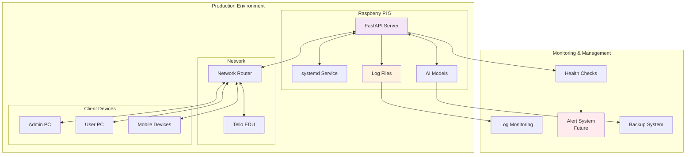

# 運用手順

## 概要

MFG Drone Backend API の本番環境における運用手順、監視方法、メンテナンス作業、トラブルシューティングを体系的に定義します。

## 運用アーキテクチャ



## サービス管理

### 1. systemd サービス操作

#### 基本操作
```bash
# サービス状態確認
sudo systemctl status mfg-drone-api

# サービス開始
sudo systemctl start mfg-drone-api

# サービス停止
sudo systemctl stop mfg-drone-api

# サービス再起動
sudo systemctl restart mfg-drone-api

# サービス設定再読み込み
sudo systemctl reload mfg-drone-api

# 自動起動有効化
sudo systemctl enable mfg-drone-api

# 自動起動無効化
sudo systemctl disable mfg-drone-api
```

#### サービス設定確認
```bash
# サービス設定表示
sudo systemctl show mfg-drone-api

# 設定ファイル確認
sudo systemctl cat mfg-drone-api

# 依存関係確認
sudo systemctl list-dependencies mfg-drone-api
```

### 2. プロセス監視

```bash
# プロセス確認
ps aux | grep uvicorn
pgrep -f "mfg-drone"

# リソース使用量確認
top -p $(pgrep -f uvicorn)
htop

# ネットワーク接続確認
sudo netstat -tulpn | grep :8000
sudo ss -tulpn | grep :8000
```

### 3. 設定管理

#### 環境変数確認
```bash
# サービス環境変数確認
sudo systemctl show-environment

# アプリケーション環境変数確認
sudo -u pi env | grep -E "(PYTHONPATH|LOG_LEVEL|ENVIRONMENT)"
```

#### 設定ファイル更新
```bash
# 設定ファイル編集
sudo vim /etc/systemd/system/mfg-drone-api.service

# 設定変更後の必須作業
sudo systemctl daemon-reload
sudo systemctl restart mfg-drone-api
```

## 監視・ヘルスチェック

### 1. アプリケーション監視

#### ヘルスチェック実行
```bash
# 基本ヘルスチェック
curl -f http://localhost:8000/health || echo "Health check failed"

# 詳細ステータス確認
curl -s http://localhost:8000/health | jq '.'

# ドローン接続状態確認
curl -s http://localhost:8000/drone/status | jq '.connected'
```

#### APIエンドポイント監視
```bash
# 全エンドポイント確認スクリプト
#!/bin/bash
endpoints=(
    "/health"
    "/drone/status"
    "/"
)

for endpoint in "${endpoints[@]}"; do
    echo "Checking $endpoint..."
    response=$(curl -s -o /dev/null -w "%{http_code}" http://localhost:8000$endpoint)
    if [ "$response" == "200" ]; then
        echo "✅ $endpoint: OK"
    else
        echo "❌ $endpoint: Failed ($response)"
    fi
done
```

### 2. システムリソース監視

#### CPU・メモリ監視
```bash
# リアルタイム監視
watch -n 5 'ps aux | grep uvicorn | grep -v grep'

# 統計情報取得
iostat 5 3
vmstat 5 3
free -h

# Raspberry Pi 固有の監視
vcgencmd measure_temp  # CPU温度
vcgencmd get_throttled  # スロットリング状態
```

#### ストレージ監視
```bash
# ディスク使用量確認
df -h
du -sh /home/pi/mfg_drone_by_claudecode/
du -sh /var/log/mfg_drone/

# inode使用量確認
df -i

# ログファイルサイズ確認
ls -lh /var/log/mfg_drone/
```

### 3. ネットワーク監視

```bash
# ネットワーク接続確認
ping -c 3 192.168.1.1  # ルーター
ping -c 3 8.8.8.8      # インターネット
ping -c 3 192.168.10.1 # Tello EDU (接続時)

# ポート監視
sudo nmap -p 8000 localhost

# ネットワーク統計
cat /proc/net/dev
iftop -i wlan0
```

## ログ管理

### 1. ログ確認

#### systemd ログ
```bash
# リアルタイムログ監視
sudo journalctl -u mfg-drone-api -f

# 最新ログ確認
sudo journalctl -u mfg-drone-api --since "1 hour ago"

# エラーログのみ表示
sudo journalctl -u mfg-drone-api -p err

# ログサイズ確認
sudo journalctl --disk-usage
```

#### アプリケーションログ
```bash
# ログファイル確認
tail -f /var/log/mfg_drone/app.log
tail -f /var/log/mfg_drone/error.log

# ログ検索
grep -i "error" /var/log/mfg_drone/app.log
grep -i "drone" /var/log/mfg_drone/app.log | tail -20
```

### 2. ログローテーション管理

#### ローテーション設定確認
```bash
# logrotate設定確認
sudo cat /etc/logrotate.d/mfg_drone

# 手動ローテーション実行
sudo logrotate -f /etc/logrotate.d/mfg_drone

# ローテーション状態確認
sudo logrotate -d /etc/logrotate.d/mfg_drone
```

#### ログクリーンアップ
```bash
# 古いログ削除（7日以上前）
find /var/log/mfg_drone/ -name "*.log.*" -mtime +7 -delete

# 圧縮ログ削除（30日以上前）
find /var/log/mfg_drone/ -name "*.gz" -mtime +30 -delete

# systemd ログクリーンアップ
sudo journalctl --vacuum-time=7d
sudo journalctl --vacuum-size=100M
```

## バックアップ・復旧

### 1. データバックアップ

#### 自動バックアップスクリプト
```bash
#!/bin/bash
# scripts/backup.sh

BACKUP_DIR="/home/pi/backups"
DATE=$(date +%Y%m%d_%H%M%S)
BACKUP_NAME="mfg_drone_backup_$DATE"

# バックアップディレクトリ作成
mkdir -p "$BACKUP_DIR"

# アプリケーションデータバックアップ
echo "Creating application backup..."
tar -czf "$BACKUP_DIR/$BACKUP_NAME.tar.gz" \
    --exclude="venv" \
    --exclude="__pycache__" \
    --exclude="*.pyc" \
    /home/pi/mfg_drone_by_claudecode/backend/

# AIモデルバックアップ
echo "Backing up AI models..."
if [ -d "/home/pi/models" ]; then
    cp -r /home/pi/models "$BACKUP_DIR/models_$DATE"
fi

# 設定ファイルバックアップ
echo "Backing up configurations..."
cp /etc/systemd/system/mfg-drone-api.service "$BACKUP_DIR/"
cp -r /home/pi/mfg_drone_by_claudecode/backend/config "$BACKUP_DIR/config_$DATE"

# 古いバックアップ削除（30日以上前）
find "$BACKUP_DIR" -name "*.tar.gz" -mtime +30 -delete

echo "Backup completed: $BACKUP_NAME.tar.gz"
```

#### バックアップ実行
```bash
# 手動バックアップ実行
./scripts/backup.sh

# 定期バックアップ設定（crontab）
crontab -e
# 毎日午前2時にバックアップ実行
0 2 * * * /home/pi/mfg_drone_by_claudecode/backend/scripts/backup.sh >> /var/log/backup.log 2>&1
```

### 2. 復旧手順

#### アプリケーション復旧
```bash
#!/bin/bash
# scripts/restore.sh

BACKUP_FILE="$1"

if [ -z "$BACKUP_FILE" ]; then
    echo "Usage: $0 <backup_file>"
    exit 1
fi

# サービス停止
sudo systemctl stop mfg-drone-api

# 既存ファイル退避
mv /home/pi/mfg_drone_by_claudecode /home/pi/mfg_drone_by_claudecode.old

# バックアップ展開
tar -xzf "$BACKUP_FILE" -C /

# 仮想環境再構築
cd /home/pi/mfg_drone_by_claudecode/backend
python -m venv venv
source venv/bin/activate
pip install -r requirements.txt

# サービス再開
sudo systemctl start mfg-drone-api

echo "Restore completed from $BACKUP_FILE"
```

## デプロイメント

### 1. 更新デプロイ手順

#### Gitベースデプロイ
```bash
#!/bin/bash
# scripts/deploy.sh

set -e

echo "🚀 Starting deployment..."

# 現在のブランチ・コミット確認
cd /home/pi/mfg_drone_by_claudecode
git branch
git log --oneline -5

# バックアップ作成
echo "📦 Creating backup..."
./backend/scripts/backup.sh

# サービス停止
echo "⏹️ Stopping service..."
sudo systemctl stop mfg-drone-api

# コード更新
echo "📥 Pulling latest code..."
git fetch origin
git checkout main
git pull origin main

# 依存関係更新
echo "📚 Updating dependencies..."
cd backend
source venv/bin/activate
pip install -r requirements.txt

# データベース移行（将来用）
# echo "🗃️ Running migrations..."
# python manage.py migrate

# 設定ファイル確認
echo "⚙️ Checking configuration..."
if [ ! -f "config/production.py" ]; then
    echo "❌ Production config not found!"
    exit 1
fi

# テスト実行
echo "🧪 Running tests..."
pytest tests/ -m "not e2e" --tb=short

# サービス再開
echo "▶️ Starting service..."
sudo systemctl start mfg-drone-api

# ヘルスチェック
echo "🏥 Health check..."
sleep 5
curl -f http://localhost:8000/health

echo "✅ Deployment completed successfully!"
```

### 2. ロールバック手順

```bash
#!/bin/bash
# scripts/rollback.sh

COMMIT_HASH="$1"

if [ -z "$COMMIT_HASH" ]; then
    echo "Usage: $0 <commit_hash>"
    echo "Available commits:"
    git log --oneline -10
    exit 1
fi

echo "🔄 Rolling back to $COMMIT_HASH..."

# サービス停止
sudo systemctl stop mfg-drone-api

# 指定コミットにロールバック
git checkout "$COMMIT_HASH"

# 依存関係確認・更新
cd backend
source venv/bin/activate
pip install -r requirements.txt

# サービス再開
sudo systemctl start mfg-drone-api

# ヘルスチェック
sleep 5
curl -f http://localhost:8000/health

echo "✅ Rollback completed!"
```

## メンテナンス作業

### 1. 定期メンテナンス

#### 日次メンテナンス
```bash
#!/bin/bash
# scripts/daily_maintenance.sh

echo "📅 Daily maintenance started at $(date)"

# ログローテーション確認
sudo logrotate -f /etc/logrotate.d/mfg_drone

# ディスク使用量チェック
DISK_USAGE=$(df -h / | awk 'NR==2 {print $5}' | sed 's/%//')
if [ "$DISK_USAGE" -gt 80 ]; then
    echo "⚠️ Disk usage is $DISK_USAGE%"
    # クリーンアップ実行
    find /tmp -mtime +7 -delete
    sudo journalctl --vacuum-size=50M
fi

# メモリ使用量チェック
MEMORY_USAGE=$(free | awk 'NR==2{printf "%.0f", $3*100/$2}')
if [ "$MEMORY_USAGE" -gt 85 ]; then
    echo "⚠️ Memory usage is $MEMORY_USAGE%"
    # メモリクリア
    echo 1 | sudo tee /proc/sys/vm/drop_caches
fi

# プロセス確認
if ! pgrep -f "uvicorn.*main:app" > /dev/null; then
    echo "❌ API service not running! Restarting..."
    sudo systemctl restart mfg-drone-api
fi

echo "✅ Daily maintenance completed"
```

#### 週次メンテナンス
```bash
#!/bin/bash
# scripts/weekly_maintenance.sh

echo "📆 Weekly maintenance started at $(date)"

# システム更新確認
sudo apt update
UPGRADES=$(apt list --upgradable 2>/dev/null | wc -l)
if [ "$UPGRADES" -gt 1 ]; then
    echo "📦 $UPGRADES packages can be upgraded"
    # セキュリティアップデートのみ適用
    sudo unattended-upgrade
fi

# Python依存関係セキュリティチェック
cd /home/pi/mfg_drone_by_claudecode/backend
source venv/bin/activate
pip audit

# バックアップ確認
BACKUP_COUNT=$(ls -1 /home/pi/backups/*.tar.gz | wc -l)
if [ "$BACKUP_COUNT" -lt 7 ]; then
    echo "⚠️ Only $BACKUP_COUNT backups found"
fi

# ログ統計
echo "📊 Log statistics:"
sudo journalctl -u mfg-drone-api --since "7 days ago" | \
    grep -E "(ERROR|WARNING)" | wc -l

echo "✅ Weekly maintenance completed"
```

### 2. システム最適化

#### パフォーマンス最適化
```bash
# CPUガバナー設定
echo 'performance' | sudo tee /sys/devices/system/cpu/cpu*/cpufreq/scaling_governor

# スワップ最適化
sudo sysctl vm.swappiness=10

# ネットワーク最適化
sudo sysctl net.core.rmem_max=26214400
sudo sysctl net.core.rmem_default=26214400
```

#### クリーンアップ作業
```bash
#!/bin/bash
# scripts/cleanup.sh

echo "🧹 Starting cleanup..."

# Python キャッシュ削除
find /home/pi/mfg_drone_by_claudecode -name "__pycache__" -type d -exec rm -rf {} +
find /home/pi/mfg_drone_by_claudecode -name "*.pyc" -delete

# ログクリーンアップ
find /var/log/mfg_drone -name "*.log.*" -mtime +7 -delete

# 一時ファイル削除
sudo find /tmp -mtime +3 -delete

# 不要パッケージ削除
sudo apt autoremove -y
sudo apt autoclean

echo "✅ Cleanup completed"
```

## トラブルシューティング

### 1. 一般的な問題と対処法

#### サービス起動失敗
```bash
# 問題: サービスが起動しない
# 確認手順:
sudo systemctl status mfg-drone-api
sudo journalctl -u mfg-drone-api --no-pager

# よくある原因と対処法:
# 1. ポート競合
sudo netstat -tulpn | grep :8000
sudo kill -9 <PID>

# 2. Python環境問題
cd /home/pi/mfg_drone_by_claudecode/backend
source venv/bin/activate
python -c "import fastapi; print('OK')"

# 3. 権限問題
sudo chown -R pi:pi /home/pi/mfg_drone_by_claudecode
chmod +x /home/pi/mfg_drone_by_claudecode/backend/main.py
```

#### ドローン接続問題
```bash
# 問題: ドローンに接続できない
# 確認手順:
ping -c 3 192.168.10.1

# WiFi接続確認
iwconfig
sudo iwlist scan | grep Tello

# ネットワーク設定確認
ip route show
cat /etc/dhcpcd.conf
```

#### 高負荷・パフォーマンス問題
```bash
# 問題: 応答が遅い
# 確認手順:
top -p $(pgrep -f uvicorn)
iostat 1 10
free -h

# 対処法:
# 1. プロセス数調整
# uvicorn main:app --workers 1  # 単一ワーカーに変更

# 2. メモリ解放
echo 3 | sudo tee /proc/sys/vm/drop_caches

# 3. CPU使用率高い場合
# AI処理の品質を下げる、フレームレート調整
```

### 2. ログ解析によるトラブルシューティング

#### エラーパターン分析
```bash
# エラー頻度分析
sudo journalctl -u mfg-drone-api --since "24 hours ago" | \
    grep ERROR | cut -d' ' -f5- | sort | uniq -c | sort -nr

# 特定エラーの詳細確認
sudo journalctl -u mfg-drone-api | grep "DRONE_CONNECTION_FAILED"

# エラー時系列分析
sudo journalctl -u mfg-drone-api --since "1 hour ago" | \
    grep -E "(ERROR|WARNING)" | head -20
```

#### 性能問題分析
```bash
# 応答時間分析
grep "response_time" /var/log/mfg_drone/app.log | \
    awk '{sum+=$NF; count++} END {print "Average:", sum/count "ms"}'

# メモリ使用量推移
grep "memory_usage" /var/log/mfg_drone/app.log | tail -20
```

### 3. 緊急時対応

#### 緊急停止手順
```bash
#!/bin/bash
# scripts/emergency_stop.sh

echo "🚨 Emergency stop initiated!"

# 1. ドローン緊急着陸
curl -X POST http://localhost:8000/drone/emergency

# 2. APIサービス停止
sudo systemctl stop mfg-drone-api

# 3. 関連プロセス強制終了
sudo pkill -f uvicorn
sudo pkill -f "python.*main.py"

# 4. 状況ログ保存
mkdir -p /tmp/emergency_logs
sudo journalctl -u mfg-drone-api --since "1 hour ago" > /tmp/emergency_logs/systemd.log
dmesg > /tmp/emergency_logs/dmesg.log
ps aux > /tmp/emergency_logs/processes.log

echo "🔴 Emergency stop completed. Logs saved to /tmp/emergency_logs/"
```

#### 災害復旧手順
```bash
#!/bin/bash
# scripts/disaster_recovery.sh

echo "🆘 Starting disaster recovery..."

# 1. システム状態確認
systemctl is-active mfg-drone-api
df -h
free -h

# 2. 最新バックアップから復旧
LATEST_BACKUP=$(ls -t /home/pi/backups/*.tar.gz | head -1)
if [ -n "$LATEST_BACKUP" ]; then
    echo "Restoring from: $LATEST_BACKUP"
    ./scripts/restore.sh "$LATEST_BACKUP"
fi

# 3. 設定確認・修正
cd /home/pi/mfg_drone_by_claudecode/backend
if [ ! -f "config/production.py" ]; then
    cp config/production.py.example config/production.py
fi

# 4. サービス再開
sudo systemctl restart mfg-drone-api

# 5. 健全性確認
sleep 10
curl -f http://localhost:8000/health

echo "✅ Disaster recovery completed"
```

## 運用チェックリスト

### 日次チェックリスト
- [ ] サービス稼働状況確認
- [ ] ヘルスチェック実行
- [ ] リソース使用量確認
- [ ] エラーログ確認
- [ ] バックアップ成功確認

### 週次チェックリスト
- [ ] システム更新確認
- [ ] セキュリティアップデート適用
- [ ] ログローテーション確認
- [ ] 性能メトリクス確認
- [ ] バックアップ整合性確認

### 月次チェックリスト
- [ ] 全体システム点検
- [ ] ディスク容量計画確認
- [ ] ネットワーク設定確認
- [ ] セキュリティ監査
- [ ] 災害復旧テスト

### 緊急時チェックリスト
- [ ] 緊急停止手順実行
- [ ] 状況ログ収集
- [ ] 関係者への通知
- [ ] 復旧作業実行
- [ ] 事後分析・改善