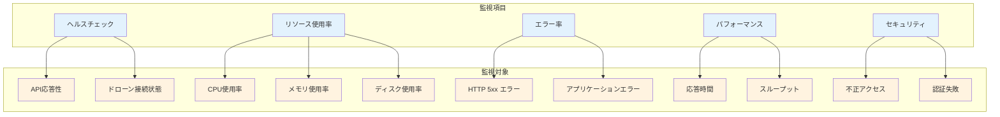
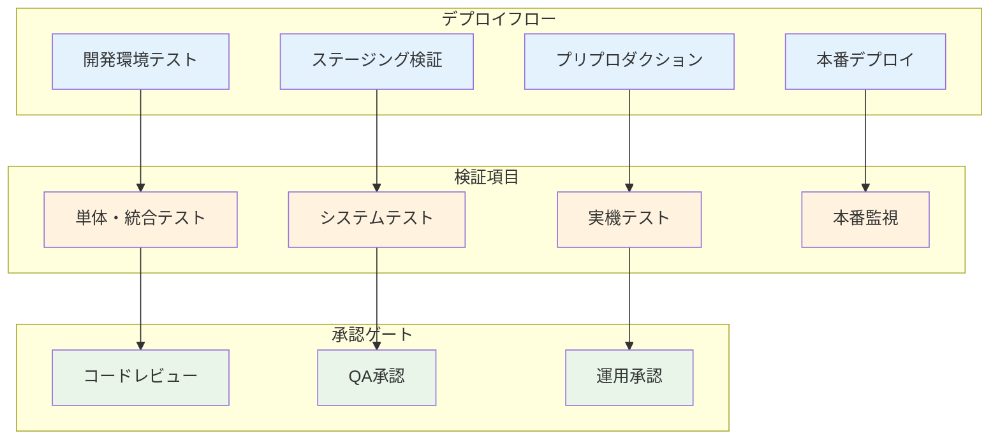
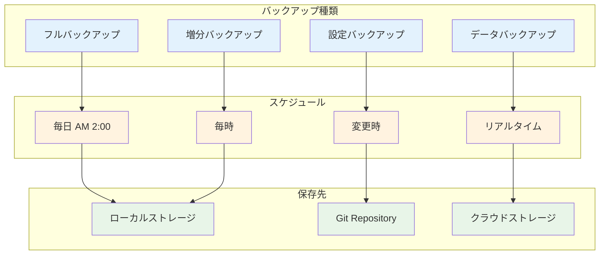

# 運用手順

## 概要

MFG Drone Backend APIの本番環境での運用手順、監視、メンテナンス、トラブルシューティングについて説明します。

## 日常運用チェックリスト

### 1. システム稼働確認

#### 毎日実行項目

```bash
# システム稼働状況確認
sudo systemctl status mfgdrone

# ヘルスチェック実行
curl http://192.168.1.100:8000/health

# ログエラー確認
sudo journalctl -u mfgdrone --since "1 day ago" | grep ERROR

# システムリソース確認
free -h
df -h
```

#### 週次確認項目

```bash
# ログファイルサイズ確認
du -sh /opt/mfgdrone/logs/

# セキュリティ更新確認  
sudo apt list --upgradable

# バックアップファイル確認
ls -la /opt/mfgdrone/backups/
```

## 監視・アラート設定

### 1. システム監視項目



### 2. アラート設定基準

| 項目 | 警告レベル | 危険レベル | 対応アクション |
|------|-----------|-----------|---------------|
| **CPU使用率** | 70% | 85% | プロセス調査・再起動 |
| **メモリ使用率** | 80% | 90% | メモリリーク調査 |
| **ディスク使用率** | 80% | 90% | ログローテーション |
| **API応答時間** | 500ms | 1000ms | パフォーマンス調査 |
| **エラー率** | 5% | 10% | ログ確認・調査 |
| **ドローン接続失敗** | 3回/時間 | 5回/時間 | ドローン・WiFi確認 |

### 3. 監視スクリプト

#### ヘルスチェックスクリプト

`/opt/mfgdrone/scripts/health_check.sh`:
```bash
#!/bin/bash

API_URL="http://192.168.1.100:8000"
LOG_FILE="/opt/mfgdrone/logs/health_check.log"
TIMESTAMP=$(date '+%Y-%m-%d %H:%M:%S')

# API ヘルスチェック
if curl -f -s "${API_URL}/health" > /dev/null; then
    echo "${TIMESTAMP} - API: OK" >> ${LOG_FILE}
else
    echo "${TIMESTAMP} - API: ERROR" >> ${LOG_FILE}
    # アラート送信（メール・Slack等）
    echo "API Health Check Failed" | mail -s "MFG Drone Alert" admin@example.com
fi

# システムリソースチェック
CPU_USAGE=$(top -bn1 | grep "Cpu(s)" | awk '{print $2}' | awk -F% '{print $1}')
MEM_USAGE=$(free | awk 'FNR==2{printf "%.0f", $3/$2*100}')

if (( $(echo "$CPU_USAGE > 85" | bc -l) )); then
    echo "${TIMESTAMP} - CPU usage critical: ${CPU_USAGE}%" >> ${LOG_FILE}
fi

if (( $MEM_USAGE > 90 )); then
    echo "${TIMESTAMP} - Memory usage critical: ${MEM_USAGE}%" >> ${LOG_FILE}
fi
```

#### cron設定

```bash
# 5分毎のヘルスチェック
echo "*/5 * * * * /opt/mfgdrone/scripts/health_check.sh" | sudo crontab -

# 毎時のリソースチェック
echo "0 * * * * /opt/mfgdrone/scripts/resource_check.sh" | sudo crontab -
```

## ログ管理

### 1. ログファイル構成

```
/opt/mfgdrone/logs/
├── app.log              # アプリケーションログ
├── access.log           # アクセスログ
├── error.log            # エラーログ  
├── drone.log            # ドローン通信ログ
├── performance.log      # パフォーマンスログ
└── health_check.log     # ヘルスチェックログ
```

### 2. ログローテーション設定

`/etc/logrotate.d/mfgdrone`:
```
/opt/mfgdrone/logs/*.log {
    daily
    rotate 30
    compress
    delaycompress
    missingok
    notifempty
    postrotate
        systemctl reload mfgdrone
    endscript
}
```

### 3. ログ分析コマンド

```bash
# エラー頻度分析
grep -c "ERROR" /opt/mfgdrone/logs/app.log

# 応答時間分析
awk '/response_time/ {sum+=$NF; count++} END {print "Average:", sum/count}' \
  /opt/mfgdrone/logs/performance.log

# アクセス頻度分析
awk '{print $1}' /opt/mfgdrone/logs/access.log | sort | uniq -c | sort -nr

# ドローン接続エラー分析
grep "CONNECTION_FAILED" /opt/mfgdrone/logs/drone.log | \
  awk '{print $1, $2}' | sort | uniq -c
```

## デプロイ手順

### 1. 段階的デプロイプロセス



### 2. 本番デプロイ手順

#### 2.1 事前準備

```bash
# バックアップ作成
sudo systemctl stop mfgdrone
sudo cp -r /opt/mfgdrone/mfg_drone_by_claudecode \
  /opt/mfgdrone/backups/backup-$(date +%Y%m%d-%H%M%S)

# 現在バージョン確認
cd /opt/mfgdrone/mfg_drone_by_claudecode
git log --oneline -1
```

#### 2.2 デプロイ実行

```bash
# 最新コード取得
git fetch origin
git checkout main
git pull origin main

# 依存関係更新
cd backend
source venv/bin/activate
pip install -e .

# 設定ファイル確認
diff .env.example .env

# テスト実行
python -m pytest tests/ -m "unit and integration" --tb=short

# サービス再起動
sudo systemctl start mfgdrone
sudo systemctl status mfgdrone
```

#### 2.3 デプロイ後確認

```bash
# ヘルスチェック
curl http://192.168.1.100:8000/health

# 主要API確認
curl http://192.168.1.100:8000/
curl http://192.168.1.100:8000/openapi.json

# ログ確認
sudo journalctl -u mfgdrone -n 50

# リソース使用量確認
ps aux | grep mfgdrone
free -h
```

### 3. ロールバック手順

```bash
# 緊急ロールバック
sudo systemctl stop mfgdrone

# 前バージョンに戻す
cd /opt/mfgdrone
rm -rf mfg_drone_by_claudecode
cp -r backups/backup-YYYYMMDD-HHMMSS mfg_drone_by_claudecode

# サービス再起動
sudo systemctl start mfgdrone

# 動作確認
curl http://192.168.1.100:8000/health
```

## パフォーマンス最適化

### 1. システムパフォーマンス監視

```bash
# CPU・メモリ使用量監視
htop

# ネットワーク使用量
iftop

# ディスクI/O監視
iotop

# プロセス別リソース使用量
ps aux --sort=-%cpu | head -10
ps aux --sort=-%mem | head -10
```

### 2. アプリケーション最適化

#### 2.1 設定チューニング

```python
# アプリケーション設定例
WORKER_PROCESSES = 2
WORKER_CONNECTIONS = 1000
KEEPALIVE_TIMEOUT = 2
MAX_REQUESTS = 1000
MAX_REQUESTS_JITTER = 100
```

#### 2.2 データベース最適化

```bash
# キャッシュ設定
echo "vm.swappiness=10" >> /etc/sysctl.conf

# ファイルシステム最適化
echo "noatime,nodiratime" >> /etc/fstab
```

### 3. ネットワーク最適化

```bash
# TCP設定最適化
echo "net.core.rmem_max = 134217728" >> /etc/sysctl.conf
echo "net.core.wmem_max = 134217728" >> /etc/sysctl.conf
echo "net.ipv4.tcp_rmem = 4096 65536 134217728" >> /etc/sysctl.conf

# 設定適用
sudo sysctl -p
```

## セキュリティ管理

### 1. セキュリティチェックリスト

#### 日次チェック

- [ ] 不正アクセスログ確認
- [ ] 認証失敗ログ確認
- [ ] ファイアウォールログ確認
- [ ] 異常なネットワーク通信確認

#### 週次チェック

- [ ] セキュリティ更新適用
- [ ] パスワード有効期限確認
- [ ] 証明書有効期限確認
- [ ] ログファイル整理

### 2. セキュリティ監視

```bash
# 認証失敗監視
grep "authentication failure" /var/log/auth.log

# 不正アクセス検出
grep "Failed password" /var/log/auth.log | awk '{print $11}' | \
  sort | uniq -c | sort -nr

# ファイアウォールログ確認
sudo ufw status verbose
```

### 3. インシデント対応

#### 3.1 セキュリティインシデント検出時

1. **即座の対応**
   ```bash
   # 緊急時サービス停止
   sudo systemctl stop mfgdrone
   
   # ネットワーク切断
   sudo ufw deny in
   ```

2. **調査・分析**
   ```bash
   # ログ保全
   sudo cp -r /var/log /opt/mfgdrone/incident-logs-$(date +%Y%m%d)
   
   # 通信ログ分析
   sudo netstat -an > network-connections.log
   ```

3. **復旧手順**
   ```bash
   # セキュリティパッチ適用
   sudo apt update && sudo apt upgrade
   
   # パスワード変更
   sudo passwd mfgdrone
   
   # 設定見直し
   sudo ufw --force reset
   sudo ufw default deny incoming
   sudo ufw allow ssh
   sudo ufw allow 8000
   sudo ufw enable
   ```

## バックアップ・復旧

### 1. バックアップ戦略



### 2. バックアップスクリプト

#### フルバックアップ

`/opt/mfgdrone/scripts/full_backup.sh`:
```bash
#!/bin/bash

BACKUP_DIR="/opt/mfgdrone/backups"
TIMESTAMP=$(date +%Y%m%d-%H%M%S)
BACKUP_NAME="full-backup-${TIMESTAMP}"

# バックアップディレクトリ作成
mkdir -p ${BACKUP_DIR}/${BACKUP_NAME}

# アプリケーションファイル
tar -czf ${BACKUP_DIR}/${BACKUP_NAME}/app.tar.gz \
  /opt/mfgdrone/mfg_drone_by_claudecode

# 設定ファイル
cp /opt/mfgdrone/mfg_drone_by_claudecode/backend/.env \
  ${BACKUP_DIR}/${BACKUP_NAME}/

# システム設定
cp /etc/systemd/system/mfgdrone.service \
  ${BACKUP_DIR}/${BACKUP_NAME}/

# ログファイル（直近7日分）
tar -czf ${BACKUP_DIR}/${BACKUP_NAME}/logs.tar.gz \
  --newer-mtime="7 days ago" /opt/mfgdrone/logs/

# データファイル
tar -czf ${BACKUP_DIR}/${BACKUP_NAME}/data.tar.gz \
  /opt/mfgdrone/data/

# 古いバックアップ削除（30日以上古い）
find ${BACKUP_DIR} -name "full-backup-*" -mtime +30 -exec rm -rf {} \;

echo "Backup completed: ${BACKUP_NAME}"
```

### 3. 復旧手順

#### 完全復旧

```bash
# サービス停止
sudo systemctl stop mfgdrone

# バックアップから復元
cd /opt/mfgdrone/backups/full-backup-YYYYMMDD-HHMMSS

# アプリケーション復元
tar -xzf app.tar.gz -C /

# 設定ファイル復元
cp .env /opt/mfgdrone/mfg_drone_by_claudecode/backend/
cp mfgdrone.service /etc/systemd/system/

# 権限設定
sudo chown -R mfgdrone:mfgdrone /opt/mfgdrone/

# サービス再起動
sudo systemctl daemon-reload
sudo systemctl start mfgdrone

# 動作確認
curl http://192.168.1.100:8000/health
```

## トラブルシューティング

### 1. 一般的な問題と解決策

#### API応答なし

```bash
# 症状確認
curl -I http://192.168.1.100:8000/health

# サービス状態確認
sudo systemctl status mfgdrone

# ログ確認
sudo journalctl -u mfgdrone -n 100

# 解決策
sudo systemctl restart mfgdrone
```

#### メモリ不足

```bash
# メモリ使用量確認
free -h
ps aux --sort=-%mem | head -10

# 解決策
# 不要プロセス終了
sudo kill -9 <PID>

# スワップ追加
sudo fallocate -l 2G /swapfile
sudo chmod 600 /swapfile
sudo mkswap /swapfile
sudo swapon /swapfile
```

#### ドローン接続失敗

```bash
# WiFi接続確認
iwconfig
ping 192.168.10.1

# ドローン状態確認
curl -X POST http://192.168.1.100:8000/drone/connect

# 解決策
# WiFi再接続
sudo ifdown wlan0
sudo ifup wlan0

# ドローン再起動（電源ボタン長押し）
```

### 2. エラーコード別対応

| エラーコード | 原因 | 対応策 |
|------------|------|--------|
| DRONE_NOT_CONNECTED | ドローン未接続 | WiFi確認・ドローン再起動 |
| COMMAND_TIMEOUT | 通信タイムアウト | ネットワーク確認・距離調整 |
| INTERNAL_ERROR | システムエラー | ログ確認・サービス再起動 |
| MODEL_NOT_FOUND | AIモデル未存在 | モデルファイル確認・再学習 |

### 3. 緊急時対応

#### システム完全停止

```bash
# 緊急停止
sudo systemctl stop mfgdrone
sudo ufw deny in

# 調査開始
sudo journalctl -u mfgdrone --since "1 hour ago" > emergency.log
```

#### データ破損時

```bash
# 最新バックアップから復旧
sudo systemctl stop mfgdrone
rm -rf /opt/mfgdrone/data/
tar -xzf /opt/mfgdrone/backups/latest/data.tar.gz -C /
sudo systemctl start mfgdrone
```

## 定期メンテナンス

### 1. 月次メンテナンス

- システム更新適用
- ログファイル分析・整理
- バックアップ検証
- パフォーマンス分析
- セキュリティ監査

### 2. 四半期メンテナンス

- ハードウェア点検
- 設定見直し
- 容量計画見直し
- 災害復旧訓練

### 3. 年次メンテナンス

- システム全体見直し
- セキュリティポリシー更新
- ハードウェア更新計画
- 運用手順書更新