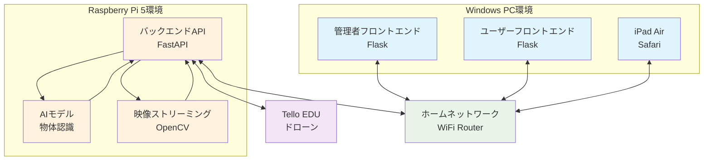
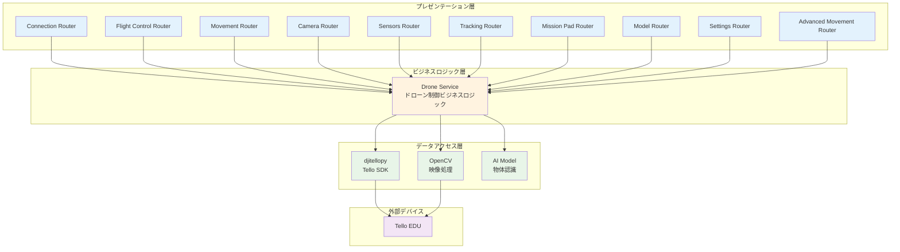
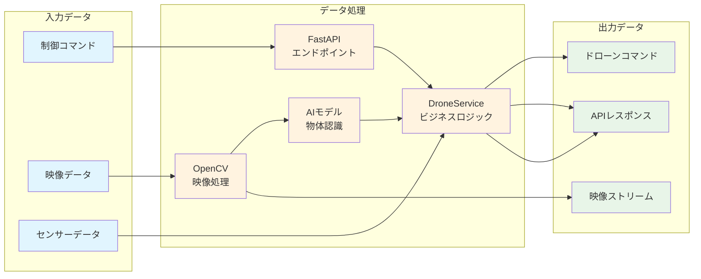
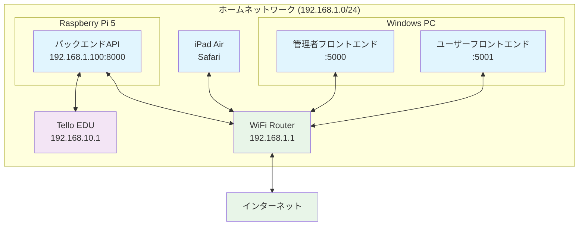

# システム構成図

## 概要

MFG Drone Backend APIは、Tello EDUドローンを制御し、リアルタイム映像配信と物体追跡機能を提供するバックエンドシステムです。

## 全体システム構成

## バックエンド内部アーキテクチャ

## データフロー図

## ネットワーク構成図

## 技術スタック詳細

| 層 | 技術 | バージョン | 用途 |
|---|---|---|---|
| **Webフレームワーク** | FastAPI | 0.115.0+ | REST API提供 |
| **ASGIサーバー** | Uvicorn | 0.32.0+ | 非同期HTTP処理 |
| **ドローン制御** | djitellopy | 2.5.0 | Tello SDK Python wrapper |
| **映像処理** | OpenCV | 4.10.0+ | カメラストリーミング・画像処理 |
| **数値計算** | NumPy | 2.1.0+ | 数値データ処理 |
| **画像処理** | Pillow | 11.0.0+ | 画像フォーマット変換 |
| **WebSocket** | websockets | 13.0+ | リアルタイム通信 |
| **ランタイム** | Python | 3.12+ | 実行環境 |

## アーキテクチャパターン

- **レイヤードアーキテクチャ**: プレゼンテーション層、ビジネスロジック層、データアクセス層の分離
- **依存性注入**: FastAPI Dependsを使用したサービス注入
- **シングルトンパターン**: DroneServiceの単一インスタンス管理
- **非同期処理**: async/awaitによる並行処理
- **RESTful API**: HTTP動詞とリソースベースのエンドポイント設計

## 非機能要件

- **パフォーマンス**: リアルタイム映像配信とドローン制御の低遅延
- **信頼性**: エラーハンドリングとフォールバック機能
- **スケーラビリティ**: 非同期処理による並行性
- **保守性**: テスト駆動開発とコード品質ツール
- **セキュリティ**: CORS設定とエラー情報の適切な管理