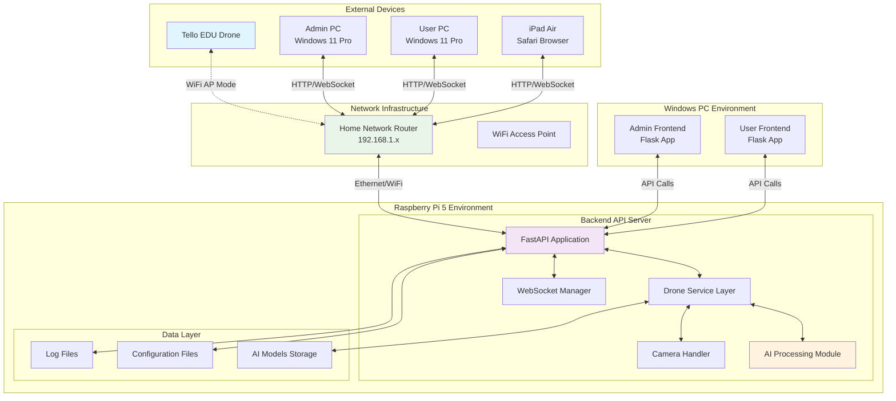
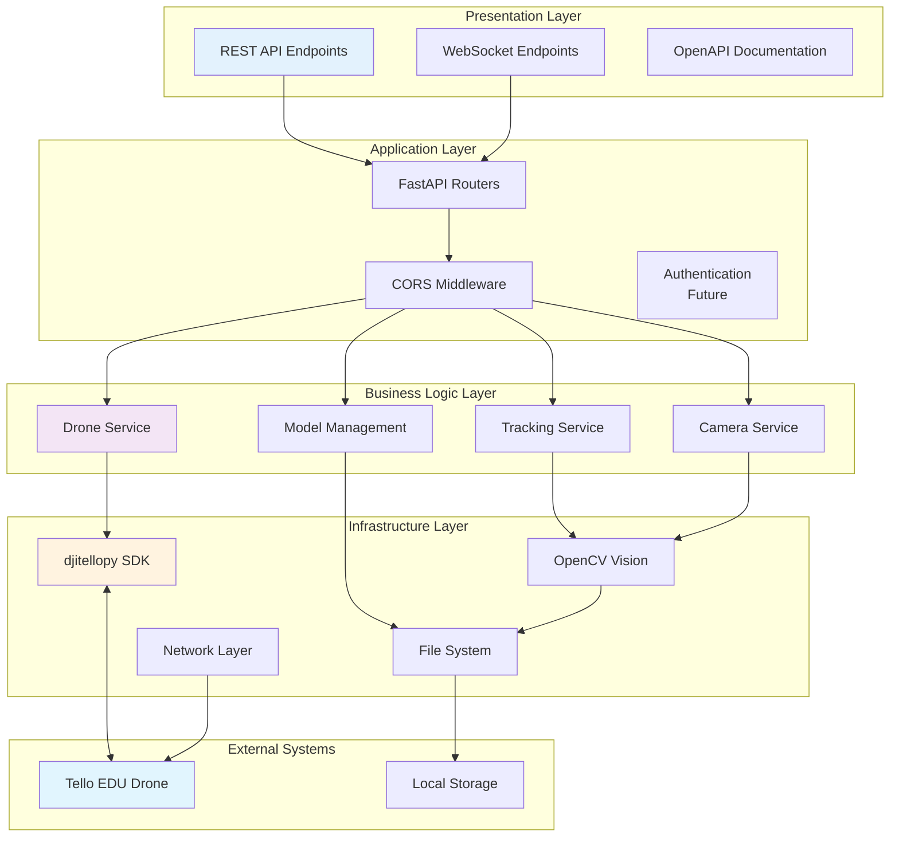
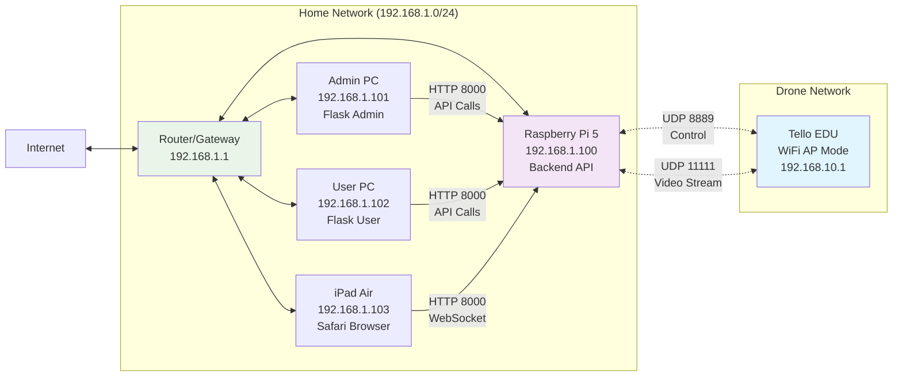
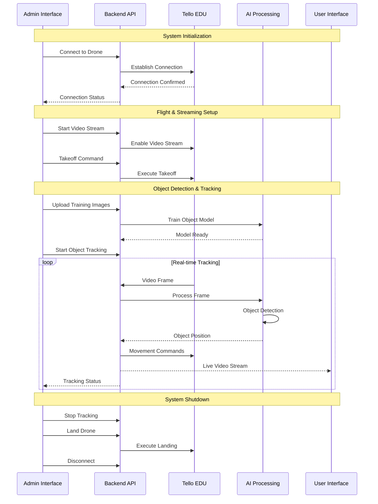
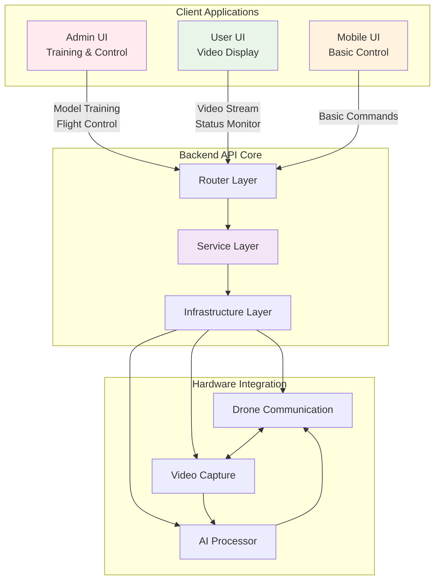
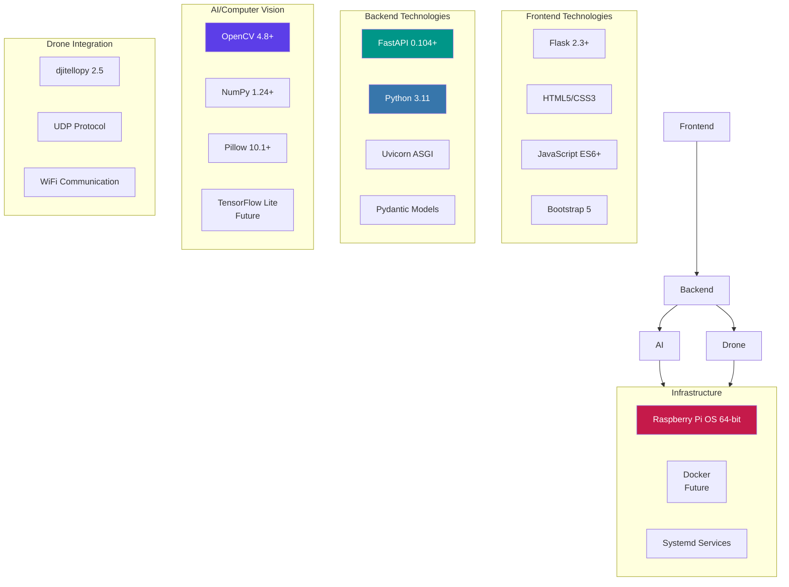
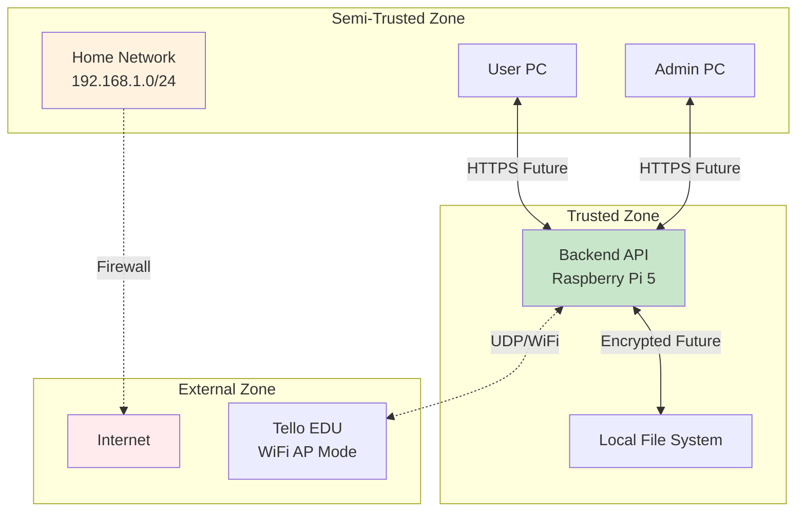

# システム構成図

## 概要

MFG Drone Backend API は、Tello EDU ドローンの自動追従撮影システムのコアとなるバックエンドサービスです。Raspberry Pi 5 上で動作し、ドローン制御、AI による物体認識・追跡、リアルタイム映像配信を統合的に提供します。

## 全体システム構成

## バックエンド内部アーキテクチャ

## ネットワーク構成

## データフロー図

## コンポーネント相互作用

## 技術スタック

## 性能特性

| 項目 | 仕様 | 備考 |
|------|------|------|
| **フレームレート** | 30 FPS | Tello EDU標準 |
| **映像解像度** | 720p (1280x720) | HD品質 |
| **制御遅延** | < 100ms | UDP通信 |
| **AI処理遅延** | < 50ms | 軽量モデル使用 |
| **同時接続** | 最大10クライアント | WebSocket制限 |
| **ネットワーク帯域** | 5-10 Mbps | 映像ストリーミング |

## セキュリティ境界

## 拡張性と将来計画

### 水平スケーリング
- 複数ドローン同時制御対応
- ロードバランサー導入
- マイクロサービス分離

### 機能拡張
- HTTPS/TLS暗号化
- ユーザー認証システム
- データベース永続化
- クラウド連携

### パフォーマンス最適化
- GPU加速AI処理
- キャッシュ層導入
- CDN配信対応