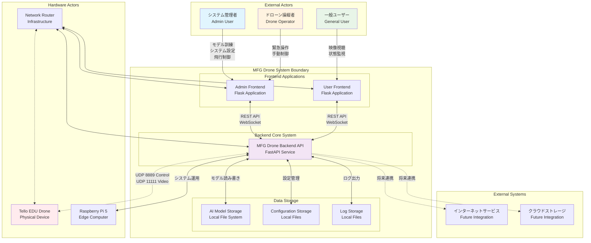
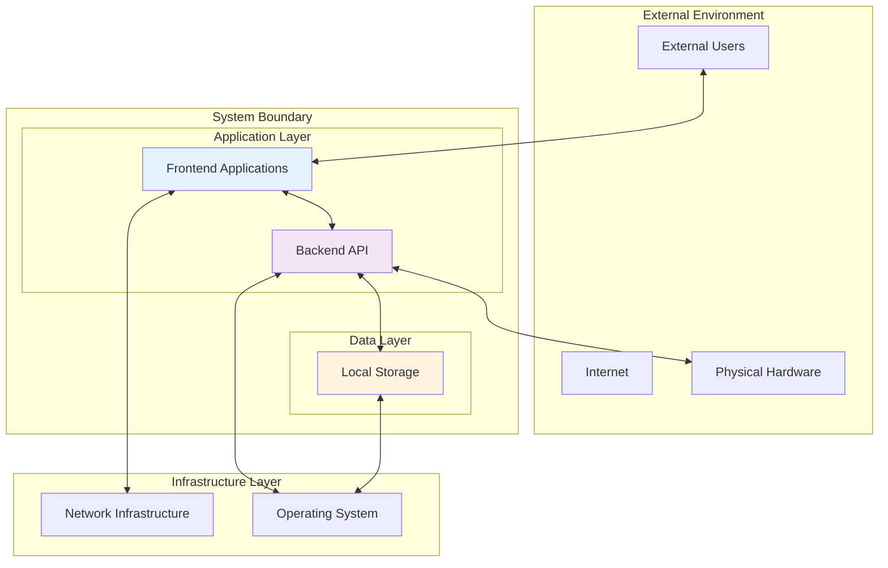
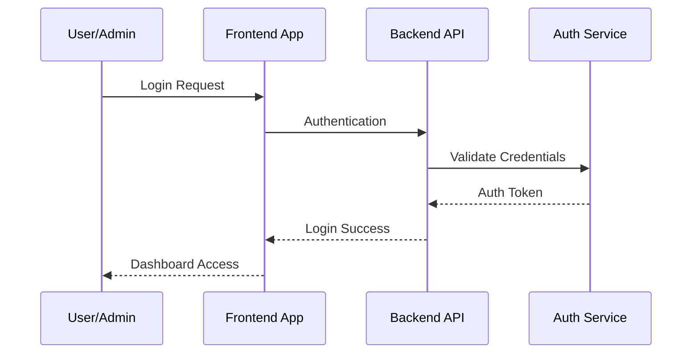
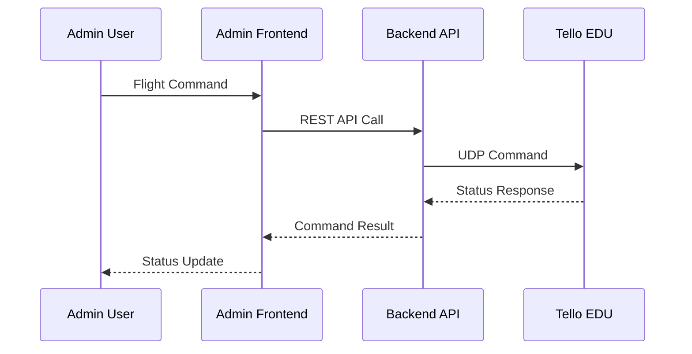
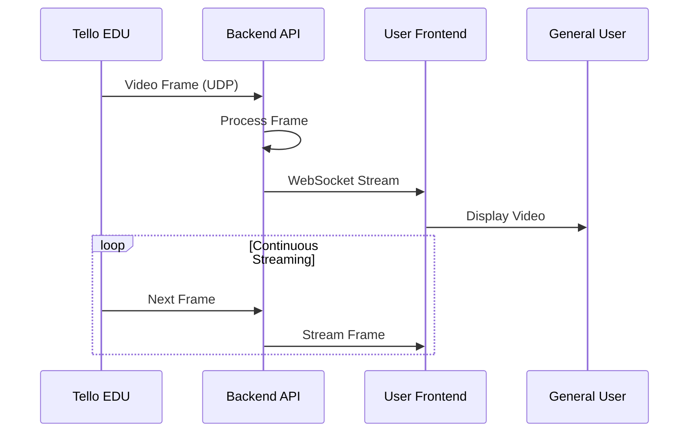
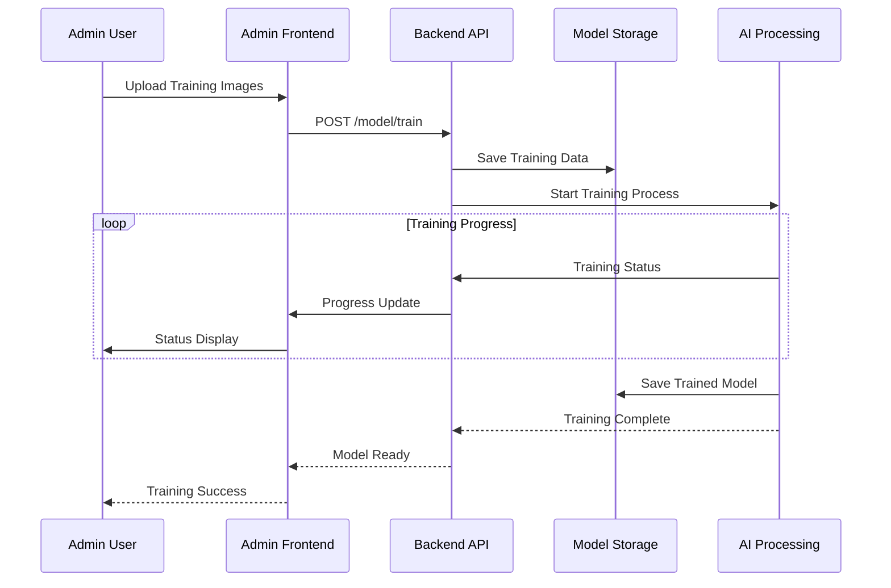
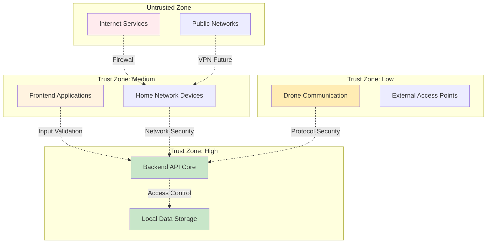

# システムコンテキストダイヤグラム

## 概要

システムコンテキスト図は、MFG Drone Backend API の外部環境との関係性を示し、システム境界と外部アクターとの相互作用を明確に定義します。

## システムコンテキスト図

## 外部アクター定義

### 人的アクター

#### 1. システム管理者 (Admin User)
**役割**: システム全体の管理・設定・監視を行う上級ユーザー

**責任範囲**:
- AI モデルの訓練・管理
- ドローンの飛行制御
- システム設定の変更
- セキュリティ設定の管理
- システム監視・メンテナンス

**システムとの関係**:
- Admin Frontend を通じた高権限操作
- 全ての API エンドポイントへのアクセス権
- システム状態の詳細監視

#### 2. 一般ユーザー (General User)
**役割**: リアルタイム映像の視聴とシステム状態の監視を行うエンドユーザー

**責任範囲**:
- ライブ映像ストリームの視聴
- ドローン状態の確認
- 基本的な情報取得

**システムとの関係**:
- User Frontend を通じた読み取り専用操作
- 制限された API エンドポイントへのアクセス
- リアルタイムデータの受信

#### 3. ドローン操縦者 (Drone Operator)
**役割**: 緊急時または手動制御が必要な場合の直接操縦担当者

**責任範囲**:
- 緊急時の手動介入
- 安全確保のための直接制御
- 飛行エリアの監視

**システムとの関係**:
- Admin Frontend または専用インターフェースを使用
- 緊急停止・手動制御の実行権限
- リアルタイム制御コマンドの送信

### ハードウェアアクター

#### 1. Tello EDU Drone
**特性**: DJI製の教育用小型ドローン

**機能**:
- 映像撮影・ストリーミング
- 自律飛行制御
- センサーデータ提供
- WiFi AP モードでの通信

**通信プロトコル**:
- UDP 8889: 制御コマンド送受信
- UDP 11111: 映像ストリーム受信

#### 2. Raspberry Pi 5
**特性**: バックエンド API のホスト環境

**役割**:
- FastAPI サーバーの実行環境
- AI 処理の計算リソース提供
- ローカルストレージの管理
- ネットワーク通信の処理

#### 3. Network Router
**特性**: ホームネットワークのインフラストラクチャ

**役割**:
- デバイス間通信の仲介
- インターネット接続の提供
- ネットワークセキュリティの確保

## システム境界

## データ交換フロー

### 1. ユーザー認証フロー (将来実装)

### 2. ドローン制御フロー

### 3. 映像ストリーミングフロー

### 4. AI モデル訓練フロー

## セキュリティ境界

## 外部依存関係

### ハードウェア依存
- **Tello EDU Drone**: djitellopy SDK での通信
- **Raspberry Pi 5**: ARM64 アーキテクチャ対応
- **Network Infrastructure**: WiFi 802.11n/ac 対応

### ソフトウェア依存
- **Python 3.11+**: 実行環境
- **FastAPI**: Web フレームワーク
- **OpenCV**: 画像処理
- **djitellopy**: ドローン制御 SDK

### ネットワーク依存
- **UDP プロトコル**: ドローン通信
- **HTTP/WebSocket**: クライアント通信
- **WiFi 接続**: すべての通信の基盤

## 制約と前提条件

### 技術制約
1. **ドローン通信範囲**: WiFi 接続可能範囲内（約100m）
2. **映像品質**: 720p 最大、30fps 制限
3. **同時接続数**: WebSocket 接続10台まで
4. **処理能力**: Raspberry Pi 5 の計算リソース制限

### 運用制約
1. **飛行時間**: バッテリー寿命による制限（約13分）
2. **天候条件**: 屋内または良好な屋外環境
3. **ネットワーク**: 安定したWiFi環境必須
4. **法的制限**: ドローン飛行に関する法規制遵守

### 将来拡張計画
1. **クラウド連携**: AWS/Azure との統合
2. **セキュリティ強化**: HTTPS、認証システム
3. **スケーラビリティ**: マルチドローン対応
4. **データ分析**: 飛行ログ解析機能