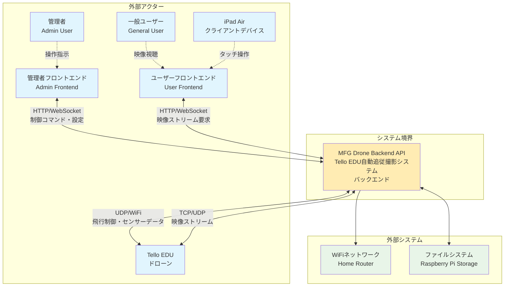
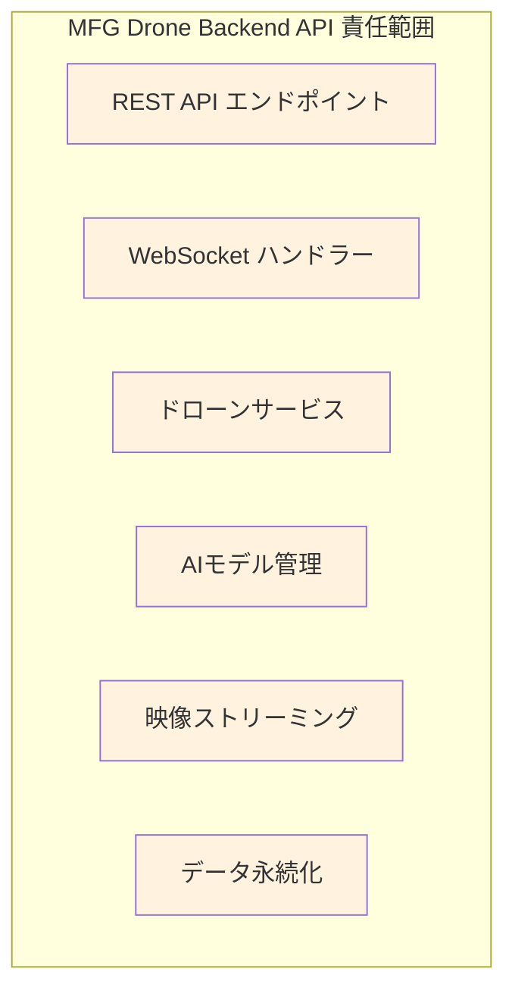
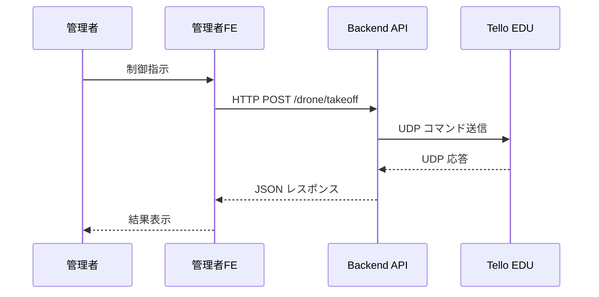
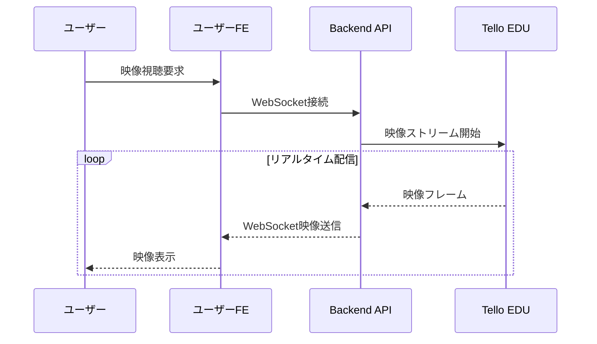
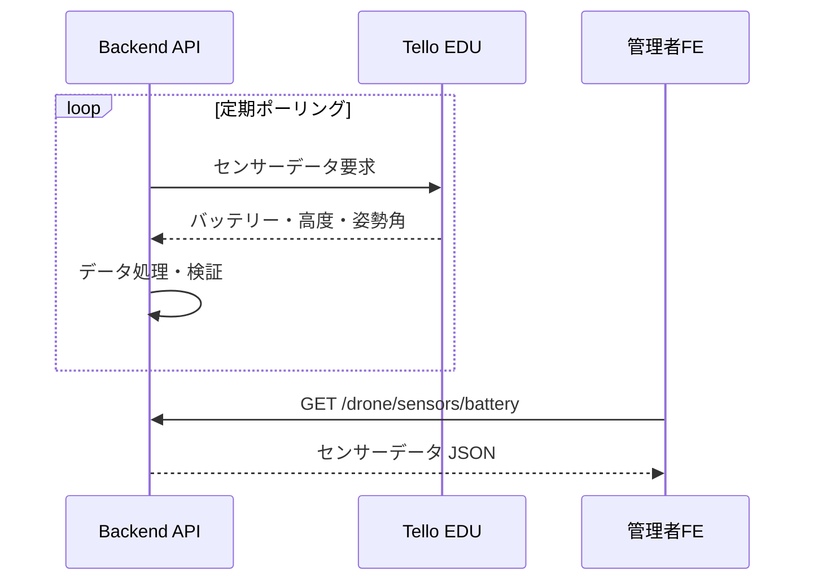
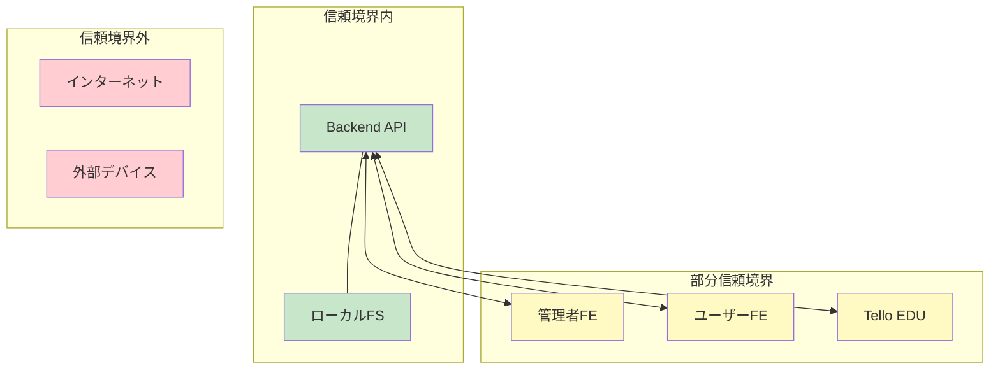

# システムコンテキストダイヤグラム

## 概要

MFG Drone Backend APIシステムの外部アクターとの関係、システム境界、データ交換フローを定義します。

## システムコンテキスト図

## 外部アクター定義

### 人間アクター

| アクター | 役割 | 権限レベル | 主な操作 |
|---------|------|-----------|---------|
| **管理者** | システム運用・設定管理 | 高 | <ul><li>ドローン接続・切断</li><li>飛行制御（離陸・着陸・移動）</li><li>AIモデル学習・管理</li><li>物体追跡開始・停止</li><li>システム設定変更</li></ul> |
| **一般ユーザー** | 映像視聴・基本操作 | 低 | <ul><li>リアルタイム映像視聴</li><li>録画映像再生</li><li>カメラ設定変更</li></ul> |

### システムアクター

| アクター | 種類 | 接続方式 | データ交換 |
|---------|------|---------|-----------|
| **管理者フロントエンド** | Webアプリケーション | HTTP/WebSocket | <ul><li>制御コマンド送信</li><li>ステータス取得</li><li>設定データ送受信</li><li>モデル学習結果取得</li></ul> |
| **ユーザーフロントエンド** | Webアプリケーション | HTTP/WebSocket | <ul><li>映像ストリーム受信</li><li>基本操作コマンド</li><li>カメラ設定</li></ul> |
| **Tello EDU** | 物理デバイス | WiFi (UDP/TCP) | <ul><li>飛行制御コマンド</li><li>センサーデータ</li><li>映像ストリーム</li><li>状態通知</li></ul> |
| **iPad Air** | クライアントデバイス | WiFi (HTTP) | <ul><li>Webブラウザ経由アクセス</li><li>タッチインターフェース</li></ul> |

## システム境界と責任範囲

### システム内部（責任範囲内）

**責任事項:**
- ドローン制御APIの提供
- リアルタイム映像配信
- 物体認識・追跡機能
- AIモデル学習・管理
- システム状態管理
- エラーハンドリング
- ログ記録

### システム外部（責任範囲外）

**責任外事項:**
- フロントエンドUI実装
- クライアントデバイス管理
- ネットワークインフラ
- ドローンハードウェア制御
- 外部ストレージ管理

## データ交換フロー

### 制御データフロー

### 映像データフロー

### センサーデータフロー

## 外部システム連携

### ネットワーク依存関係

- **WiFiルーター**: 全デバイス間通信の中継
- **インターネット接続**: 外部リソースアクセス（オプション）
- **ローカルネットワーク**: 192.168.1.0/24 セグメント

### ストレージ依存関係

- **ローカルファイルシステム**: 
  - AIモデルファイル保存
  - 録画映像ファイル
  - ログファイル
  - 設定ファイル

## セキュリティ境界

**セキュリティ考慮事項:**
- CORS設定による外部アクセス制限
- エラー情報の適切なサニタイゼーション
- センサーデータの検証とバリデーション
- ファイルアップロードの制限とスキャン