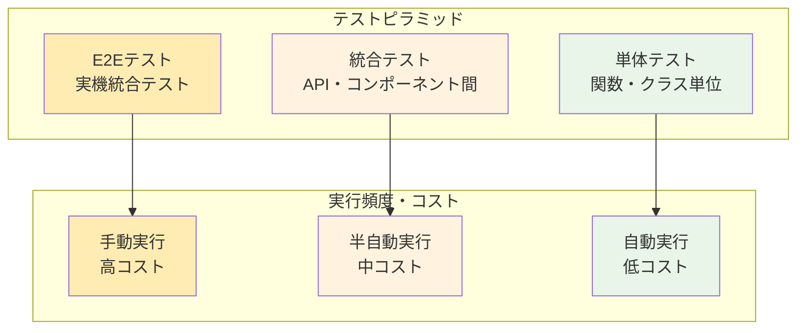

# テスト実行手順

## 概要

MFG Drone Backend APIの包括的なテスト戦略と実行手順を説明します。単体テストから実機テストまで段階的にカバーします。

## テスト戦略

### テストピラミッド



### テスト分類

| テスト種別 | 対象範囲 | 実行環境 | 実行頻度 |
|-----------|---------|---------|---------|
| **単体テスト** | 個別関数・クラス | モック | 毎回コミット |
| **統合テスト** | API・サービス間連携 | スタブ | 毎回PR |
| **システムテスト** | 全体機能 | モックドローン | 毎回リリース |
| **実機テスト** | 実際のドローン制御 | 実機 | 手動実行 |

## テスト環境セットアップ

### 1. テスト依存関係インストール

```bash
# 開発環境セットアップ
pip install -e ".[dev]"

# または個別インストール
pip install pytest pytest-asyncio httpx pytest-cov
```

### 2. テスト設定確認

#### pytest設定（pyproject.toml）

```toml
[tool.pytest.ini_options]
minversion = "6.0"
addopts = "-ra -q --strict-markers"
testpaths = ["tests"]
python_files = ["test_*.py", "*_test.py"]
markers = [
    "unit: Unit tests",
    "integration: Integration tests", 
    "system: System tests",
    "slow: Slow running tests",
    "drone: Tests requiring actual drone"
]
```

#### 環境変数設定

```bash
# テスト用環境変数
export TEST_MODE=true
export USE_MOCK_DRONE=true
export LOG_LEVEL=DEBUG
```

### 3. テストデータ準備

```bash
# テスト用ディレクトリ作成
mkdir -p tests/data/images
mkdir -p tests/data/videos
mkdir -p tests/data/models

# テストファイル配置
cp sample_data/* tests/data/
```

## 単体テスト実行

### 1. 基本的なテスト実行

```bash
# 全単体テスト実行
python -m pytest tests/ -m "unit"

# 特定ファイルのテスト
python -m pytest tests/test_drone_service_units.py -v

# 特定テスト関数
python -m pytest tests/test_drone_service_units.py::test_connect_success -v
```

### 2. カバレッジ付きテスト

```bash
# カバレッジレポート生成
python -m pytest --cov=. --cov-report=html --cov-report=term

# カバレッジ閾値チェック
python -m pytest --cov=. --cov-fail-under=80
```

### 3. 並列テスト実行

```bash
# pytest-xdist使用（要インストール）
pip install pytest-xdist
python -m pytest -n auto
```

## 統合テスト実行

### 1. API統合テスト

```bash
# 全API統合テスト
python -m pytest tests/ -m "integration" -v

# 特定APIグループ
python -m pytest tests/test_*_api.py
```

### 2. サービス統合テスト

```bash
# サービス層統合テスト
python -m pytest tests/test_drone_service_units.py \
  tests/test_dependencies_units.py -v
```

### 3. データベース・ファイルI/O テスト

```bash
# データ永続化テスト
python -m pytest tests/ -k "test_file or test_data" -v
```

## システムテスト実行

### 1. 全体システムテスト

```bash
# アプリケーション起動テスト
python -m pytest tests/test_main_units.py -v

# システム統合テスト
python -m pytest tests/test_system.py -v
```

### 2. API エンドツーエンドテスト

```bash
# 全APIエンドポイント テスト
python -m pytest tests/test_system_api.py -v

# 実際のHTTPリクエスト テスト
python -m pytest tests/ -m "system" -v
```

## 実機テスト実行

### 1. 実機テスト準備

#### 1.1 ドローン準備チェックリスト

- [ ] Tello EDU バッテリー 80%以上
- [ ] プロペラ装着確認
- [ ] 障害物のない広いスペース確保
- [ ] WiFi接続確認
- [ ] 緊急停止手順の確認

#### 1.2 安全設定

```bash
# 実機モード有効化
export USE_MOCK_DRONE=false
export DRONE_TIMEOUT=10
export SAFETY_MODE=true
```

### 2. 段階的実機テスト

#### 2.1 接続テスト

```bash
# ドローン接続のみテスト
python -m pytest tests/test_connection.py::test_real_drone_connection \
  -m "drone" -v -s
```

#### 2.2 基本制御テスト

```bash
# 離陸・着陸テスト
python -m pytest tests/test_flight_control.py::test_real_takeoff_land \
  -m "drone" -v -s
```

#### 2.3 移動制御テスト

```bash
# 基本移動テスト
python -m pytest tests/test_movement.py::test_real_movement \
  -m "drone" -v -s
```

#### 2.4 カメラテスト

```bash
# カメラ・ストリーミングテスト
python -m pytest tests/test_camera.py::test_real_streaming \
  -m "drone" -v -s
```

## パフォーマンステスト

### 1. 負荷テスト

```bash
# pip install locust
# locustfile.py 作成後
locust -f tests/performance/locustfile.py --host=http://localhost:8000
```

### 2. ストレステスト

```python
# tests/performance/stress_test.py
import asyncio
import aiohttp
import time

async def stress_test_api():
    async with aiohttp.ClientSession() as session:
        tasks = []
        for i in range(100):
            task = session.get('http://localhost:8000/drone/sensors/battery')
            tasks.append(task)
        
        start_time = time.time()
        responses = await asyncio.gather(*tasks)
        end_time = time.time()
        
        print(f"100 requests completed in {end_time - start_time:.2f} seconds")
```

### 3. メモリ使用量テスト

```bash
# メモリプロファイラ使用
pip install memory-profiler
python -m memory_profiler tests/performance/memory_test.py
```

## 自動テスト実行

### 1. pre-commit フック

`.pre-commit-config.yaml`:
```yaml
repos:
  - repo: local
    hooks:
      - id: pytest-unit
        name: Run unit tests
        entry: python -m pytest tests/ -m "unit" --tb=short
        language: system
        pass_filenames: false
```

### 2. GitHub Actions CI

`.github/workflows/test.yml`:
```yaml
name: Tests

on: [push, pull_request]

jobs:
  test:
    runs-on: ubuntu-latest
    strategy:
      matrix:
        python-version: [3.12]
    
    steps:
    - uses: actions/checkout@v4
    - name: Set up Python
      uses: actions/setup-python@v4
      with:
        python-version: ${{ matrix.python-version }}
    
    - name: Install dependencies
      run: |
        pip install -e ".[dev]"
    
    - name: Run unit tests
      run: |
        python -m pytest tests/ -m "unit" --cov=. --cov-report=xml
    
    - name: Run integration tests
      run: |
        python -m pytest tests/ -m "integration" -v
```

## テストデータ管理

### 1. テストフィクスチャ

```python
# tests/fixtures/drone_factory.py
import pytest
from tests.stubs.drone_stub import TelloStub

@pytest.fixture
def mock_drone():
    """モックドローンインスタンス"""
    return TelloStub()

@pytest.fixture
def connected_drone():
    """接続済みモックドローン"""
    drone = TelloStub()
    drone.connect()
    return drone
```

### 2. テストデータファクトリー

```python
# tests/data/factories.py
from dataclasses import dataclass
from typing import Dict, Any

@dataclass
class SensorDataFactory:
    @staticmethod
    def create_battery_data(percentage: int = 85) -> Dict[str, Any]:
        return {
            "percentage": percentage,
            "voltage": 4.1,
            "temperature": 28.5
        }
    
    @staticmethod
    def create_attitude_data() -> Dict[str, Any]:
        return {
            "pitch": 2.5,
            "roll": -1.2, 
            "yaw": 45.8
        }
```

## テスト結果分析

### 1. カバレッジレポート

```bash
# HTMLレポート生成
python -m pytest --cov=. --cov-report=html
open htmlcov/index.html

# カバレッジ数値確認
python -m pytest --cov=. --cov-report=term-missing
```

### 2. テスト結果サマリー

```bash
# 詳細レポート出力
python -m pytest --html=tests/reports/report.html --self-contained-html

# JUnit XML出力（CI用）
python -m pytest --junitxml=tests/reports/junit.xml
```

### 3. 失敗テスト分析

```bash
# 失敗テストのみ再実行
python -m pytest --lf

# ステップバイステップ実行
python -m pytest --pdb
```

## テストベストプラクティス

### 1. テスト作成原則

- **独立性**: テスト間で状態を共有しない
- **反復可能性**: 何度実行しても同じ結果
- **高速性**: 単体テストは1秒以内
- **明確性**: テスト名から目的が理解できる

### 2. テスト命名規則

```python
def test_[what_is_being_tested]_[scenario]_[expected_result]():
    """
    例:
    test_drone_connect_when_drone_available_returns_success()
    test_takeoff_when_not_connected_raises_exception()
    """
    pass
```

### 3. アサーション推奨パターン

```python
# 推奨: 具体的なアサーション
assert response.status_code == 200
assert response.json()["success"] is True
assert "成功" in response.json()["message"]

# 非推奨: 曖昧なアサーション
assert response.ok
assert response.json()
```

## トラブルシューティング

### 1. よくあるテスト失敗

#### モック設定エラー

```python
# 修正前
def test_drone_command():
    # モックが適切に設定されていない
    result = drone_service.takeoff()
    assert result["success"]

# 修正後  
def test_drone_command(mock_drone):
    with patch('services.drone_service.create_drone_instance', return_value=mock_drone):
        mock_drone.takeoff.return_value = True
        result = drone_service.takeoff()
        assert result["success"]
```

#### 非同期テストエラー

```python
# 修正前
def test_async_function():
    result = async_function()  # エラー: コルーチンが直接呼ばれている

# 修正後
@pytest.mark.asyncio
async def test_async_function():
    result = await async_function()
    assert result is not None
```

### 2. テスト環境問題

#### ポート競合

```bash
# ポート使用確認
lsof -i :8000

# テスト用ポート変更
export TEST_PORT=8001
```

#### タイムアウト問題

```python
# テストタイムアウト延長
@pytest.mark.timeout(30)
def test_slow_operation():
    # 時間のかかる処理
    pass
```

### 3. CI/CD環境での問題

#### 依存関係の問題

```bash
# キャッシュクリア
pip cache purge
rm -rf .pytest_cache

# 依存関係再インストール
pip install --force-reinstall -e ".[dev]"
```

## 継続的改善

### 1. テストメトリクス監視

- カバレッジ率の推移
- テスト実行時間の変化
- 失敗率・成功率の分析

### 2. テストメンテナンス

- 不安定なテストの修正
- 重複テストの統合
- 新機能のテスト追加

### 3. テスト自動化拡充

- より多くのシナリオのカバー
- パフォーマンステストの自動化
- 実機テストの部分自動化