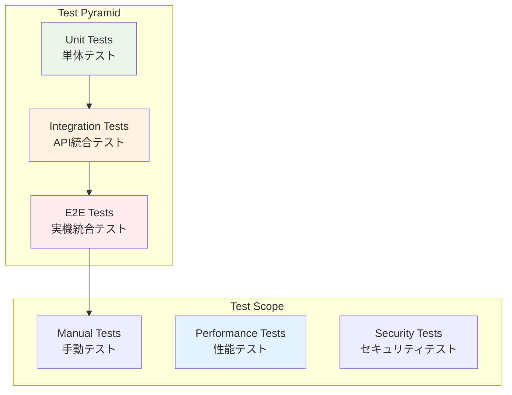

# テスト実行手順

## 概要

MFG Drone Backend API の包括的なテスト戦略、実行手順、品質保証プロセスを定義します。テストピラミッドに基づく段階的なテストアプローチを採用しています。

## テスト戦略

### テストピラミッド



### テストレベル定義

| テストレベル | 目的 | 実行頻度 | 実行時間 |
|-------------|------|---------|----------|
| **単体テスト** | 個別コンポーネントの動作確認 | 毎回のコミット | < 30秒 |
| **統合テスト** | API エンドポイントの動作確認 | 毎回のプッシュ | < 2分 |
| **E2E テスト** | 実機を使用した完全なシナリオテスト | デイリー | < 10分 |
| **性能テスト** | レスポンス時間・スループット測定 | 週次 | < 30分 |
| **手動テスト** | UI/UX、例外ケースの確認 | リリース前 | 1-2時間 |

## テスト環境設定

### 1. テスト依存関係インストール

```bash
# 仮想環境アクティベート
source venv/bin/activate

# テスト用依存関係インストール
pip install -r test_requirements.txt

# インストール内容確認
pip list | grep -E "(pytest|coverage|httpx|mock)"
```

### 2. テスト設定ファイル

#### pytest.ini 設定
```ini
[tool:pytest]
testpaths = tests
python_files = test_*.py
python_classes = Test*
python_functions = test_*
addopts = 
    --strict-markers
    --strict-config
    --verbose
    --tb=short
    --cov=.
    --cov-report=html
    --cov-report=term-missing
    --cov-fail-under=80

markers =
    unit: 単体テスト
    integration: 統合テスト
    e2e: E2Eテスト
    slow: 実行時間の長いテスト
    drone: 実機ドローンが必要なテスト
```

#### conftest.py 確認
```bash
# 共通テスト設定確認
cat tests/conftest.py
```

### 3. モックドローン設定

```bash
# ドローンスタブ確認
ls tests/stubs/
# drone_stub.py: モックドローン実装

# テスト用ファクトリー確認
ls tests/fixtures/
# drone_factory.py: テストデータ生成
```

## 単体テスト

### 1. 単体テスト実行

```bash
# 全単体テスト実行
pytest tests/ -m unit -v

# 特定モジュールのテスト
pytest tests/test_drone_service_units.py -v

# 特定テストメソッド実行
pytest tests/test_drone_service_units.py::TestDroneService::test_connect -v
```

### 2. カバレッジ確認

```bash
# カバレッジ付きテスト実行
pytest tests/ -m unit --cov=services --cov-report=html

# カバレッジレポート確認
# htmlcov/index.html をブラウザで開く
```

### 3. 単体テスト例

#### サービス層テスト例
```python
import pytest
from unittest.mock import AsyncMock, Mock
from services.drone_service import DroneService

class TestDroneService:
    @pytest.fixture
    def drone_service(self):
        return DroneService()
    
    @pytest.mark.unit
    async def test_connect_success(self, drone_service):
        """ドローン接続成功テスト"""
        # モックドローン設定
        mock_drone = Mock()
        mock_drone.connect.return_value = True
        drone_service.drone = mock_drone
        
        # テスト実行
        result = await drone_service.connect()
        
        # 検証
        assert result["success"] is True
        assert "接続しました" in result["message"]
        assert drone_service._is_connected is True
        mock_drone.connect.assert_called_once()
    
    @pytest.mark.unit
    async def test_takeoff_not_connected(self, drone_service):
        """未接続状態での離陸エラーテスト"""
        # 初期状態（未接続）
        drone_service._is_connected = False
        
        # テスト実行
        result = await drone_service.takeoff()
        
        # 検証
        assert result["success"] is False
        assert "接続されていません" in result["message"]
```

### 4. モデルテスト例

```python
import pytest
from pydantic import ValidationError
from models.requests import MoveRequest

class TestRequestModels:
    @pytest.mark.unit
    def test_move_request_valid(self):
        """有効な移動リクエスト"""
        request = MoveRequest(direction="forward", distance=100)
        assert request.direction == "forward"
        assert request.distance == 100
    
    @pytest.mark.unit
    def test_move_request_invalid_direction(self):
        """無効な方向指定"""
        with pytest.raises(ValidationError):
            MoveRequest(direction="invalid", distance=100)
    
    @pytest.mark.unit
    def test_move_request_invalid_distance(self):
        """無効な距離指定"""
        with pytest.raises(ValidationError):
            MoveRequest(direction="forward", distance=10)  # 最小値20未満
```

## 統合テスト

### 1. API統合テスト実行

```bash
# 全API統合テスト実行
pytest tests/ -m integration -v

# 特定APIテスト
pytest tests/test_connection_api.py -v
pytest tests/test_flight_control_api.py -v
pytest tests/test_camera_api.py -v
```

### 2. テストクライアント使用

```python
import pytest
from httpx import AsyncClient
from main import app

class TestConnectionAPI:
    @pytest.mark.integration
    async def test_drone_connect_endpoint(self):
        """ドローン接続APIテスト"""
        async with AsyncClient(app=app, base_url="http://test") as client:
            response = await client.post("/drone/connect")
            
            assert response.status_code == 200
            data = response.json()
            assert data["success"] is True
            assert "message" in data
    
    @pytest.mark.integration
    async def test_health_check(self):
        """ヘルスチェックAPIテスト"""
        async with AsyncClient(app=app, base_url="http://test") as client:
            response = await client.get("/health")
            
            assert response.status_code == 200
            data = response.json()
            assert "status" in data
```

### 3. WebSocket テスト

```python
import pytest
import websockets
from fastapi.testclient import TestClient
from main import app

class TestWebSocketAPI:
    @pytest.mark.integration
    def test_video_stream_websocket(self):
        """映像ストリーミングWebSocketテスト"""
        client = TestClient(app)
        
        with client.websocket_connect("/camera/ws") as websocket:
            # 接続確認
            data = websocket.receive_json()
            assert "type" in data
            
            # フレームデータ受信テスト
            frame_data = websocket.receive_json()
            assert frame_data["type"] == "video_frame"
            assert "data" in frame_data
```

## E2E テスト

### 1. 実機テスト準備

```bash
# 実機テストモード設定
export DRONE_SIMULATOR=false
export DRONE_REAL_DEVICE=true

# 実機接続確認
ping 192.168.10.1  # Tello EDU デフォルトIP
```

### 2. 完全シナリオテスト

```python
import pytest
import asyncio
from httpx import AsyncClient
from main import app

class TestE2EScenario:
    @pytest.mark.e2e
    @pytest.mark.drone
    async def test_complete_flight_scenario(self):
        """完全な飛行シナリオテスト"""
        async with AsyncClient(app=app, base_url="http://test") as client:
            # 1. ドローン接続
            response = await client.post("/drone/connect")
            assert response.status_code == 200
            
            # 2. ストリーミング開始
            response = await client.post("/camera/stream/start")
            assert response.status_code == 200
            
            # 3. 離陸
            response = await client.post("/drone/takeoff")
            assert response.status_code == 200
            
            # 4. 移動
            response = await client.post("/drone/move", 
                json={"direction": "forward", "distance": 50})
            assert response.status_code == 200
            
            # 5. ホバリング（安全確認）
            await asyncio.sleep(2)
            
            # 6. 着陸
            response = await client.post("/drone/land")
            assert response.status_code == 200
            
            # 7. ストリーミング停止
            response = await client.post("/camera/stream/stop")
            assert response.status_code == 200
            
            # 8. 切断
            response = await client.post("/drone/disconnect")
            assert response.status_code == 200
```

### 3. 物体追跡E2Eテスト

```python
@pytest.mark.e2e
@pytest.mark.slow
async def test_object_tracking_scenario(self):
    """物体追跡シナリオテスト"""
    async with AsyncClient(app=app, base_url="http://test") as client:
        # 前提条件確認
        response = await client.get("/model/list")
        models = response.json()["models"]
        assert len(models) > 0, "訓練済みモデルが必要です"
        
        # 接続・離陸
        await client.post("/drone/connect")
        await client.post("/camera/stream/start")
        await client.post("/drone/takeoff")
        
        # 物体追跡開始
        response = await client.post("/tracking/start", 
            json={"target_object": "person", "tracking_mode": "center"})
        assert response.status_code == 200
        
        # 追跡状態確認
        await asyncio.sleep(5)
        response = await client.get("/tracking/status")
        status = response.json()
        assert status["is_tracking"] is True
        
        # 追跡停止・着陸
        await client.post("/tracking/stop")
        await client.post("/drone/land")
        await client.post("/drone/disconnect")
```

## 性能テスト

### 1. レスポンス時間テスト

```python
import time
import statistics
import pytest
from httpx import AsyncClient

class TestPerformance:
    @pytest.mark.slow
    async def test_api_response_times(self):
        """API応答時間テスト"""
        async with AsyncClient(app=app, base_url="http://test") as client:
            response_times = []
            
            # 100回のリクエスト実行
            for _ in range(100):
                start_time = time.time()
                response = await client.get("/drone/status")
                end_time = time.time()
                
                assert response.status_code == 200
                response_times.append(end_time - start_time)
            
            # 統計計算
            avg_time = statistics.mean(response_times)
            p95_time = statistics.quantiles(response_times, n=20)[18]  # 95%ile
            
            # 性能要件確認
            assert avg_time < 0.1, f"平均応答時間: {avg_time:.3f}s > 0.1s"
            assert p95_time < 0.2, f"95%ile応答時間: {p95_time:.3f}s > 0.2s"
```

### 2. 負荷テスト

```bash
# Locustを使用した負荷テスト
pip install locust

# 負荷テストファイル作成
cat > locustfile.py << EOF
from locust import HttpUser, task, between

class DroneAPIUser(HttpUser):
    wait_time = between(1, 3)
    
    @task(3)
    def get_status(self):
        self.client.get("/drone/status")
    
    @task(1)
    def get_health(self):
        self.client.get("/health")
    
    def on_start(self):
        # テストユーザー初期化
        pass
EOF

# 負荷テスト実行
locust -f locustfile.py --host=http://localhost:8000
```

### 3. メモリ使用量テスト

```python
import psutil
import pytest
from memory_profiler import profile

class TestMemoryUsage:
    @pytest.mark.slow
    @profile
    def test_memory_leak_detection(self):
        """メモリリーク検出テスト"""
        initial_memory = psutil.Process().memory_info().rss
        
        # 大量のリクエスト処理シミュレーション
        for _ in range(1000):
            # メモリ使用量の多い処理
            pass
        
        final_memory = psutil.Process().memory_info().rss
        memory_increase = final_memory - initial_memory
        
        # メモリ増加量確認（50MB以下）
        assert memory_increase < 50 * 1024 * 1024
```

## テストデータ管理

### 1. テストフィクスチャ

```python
# tests/fixtures/test_data.py
import json
from pathlib import Path

def load_test_image():
    """テスト用画像データ読み込み"""
    test_data_dir = Path(__file__).parent / "data"
    with open(test_data_dir / "test_image.jpg", "rb") as f:
        return f.read()

def load_mock_responses():
    """モックレスポンスデータ読み込み"""
    test_data_dir = Path(__file__).parent / "data"
    with open(test_data_dir / "mock_responses.json") as f:
        return json.load(f)

# テストデータ例
MOCK_DRONE_STATUS = {
    "connected": True,
    "battery": 85,
    "height": 120,
    "temperature": 45,
    "flight_time": 180
}
```

### 2. データベースモック（将来用）

```python
import pytest
from unittest.mock import AsyncMock

@pytest.fixture
async def mock_database():
    """モックデータベース"""
    db_mock = AsyncMock()
    db_mock.execute.return_value = None
    db_mock.fetch_all.return_value = []
    return db_mock
```

## 継続的テスト

### 1. GitHub Actions設定

```yaml
# .github/workflows/test.yml
name: Test Suite

on: [push, pull_request]

jobs:
  unit-tests:
    runs-on: ubuntu-latest
    steps:
    - uses: actions/checkout@v3
    - name: Set up Python
      uses: actions/setup-python@v4
      with:
        python-version: '3.12'
    
    - name: Install dependencies
      run: |
        pip install -r requirements.txt
        pip install -r test_requirements.txt
    
    - name: Run unit tests
      run: pytest tests/ -m unit --cov=.
    
    - name: Upload coverage
      uses: codecov/codecov-action@v3

  integration-tests:
    runs-on: ubuntu-latest
    needs: unit-tests
    steps:
    - uses: actions/checkout@v3
    - name: Set up Python
      uses: actions/setup-python@v4
      with:
        python-version: '3.12'
    
    - name: Install dependencies
      run: |
        pip install -r requirements.txt
        pip install -r test_requirements.txt
    
    - name: Run integration tests
      run: pytest tests/ -m integration
```

### 2. テスト実行スクリプト

```bash
#!/bin/bash
# scripts/run_tests.sh

set -e

echo "🧪 Starting test suite..."

# 単体テスト
echo "📋 Running unit tests..."
pytest tests/ -m unit --cov=. --cov-report=term-missing

# 統合テスト
echo "🔗 Running integration tests..."
pytest tests/ -m integration

# E2Eテスト（条件付き）
if [ "$RUN_E2E" = "true" ]; then
    echo "🎯 Running E2E tests..."
    pytest tests/ -m e2e
fi

# 性能テスト（条件付き）
if [ "$RUN_PERFORMANCE" = "true" ]; then
    echo "🚀 Running performance tests..."
    pytest tests/ -m slow
fi

echo "✅ All tests completed successfully!"
```

## テスト品質保証

### 1. テストカバレッジ目標

| 項目 | 目標カバレッジ |
|------|---------------|
| **全体** | > 80% |
| **サービス層** | > 90% |
| **ルーター層** | > 85% |
| **モデル層** | > 95% |

### 2. テスト品質メトリクス

```bash
# カバレッジレポート生成
pytest --cov=. --cov-report=html --cov-report=term

# テスト実行時間測定
pytest --durations=10

# 並列テスト実行
pytest -n auto  # pytest-xdist使用
```

### 3. コード品質チェック

```bash
# リンティング
flake8 tests/
pylint tests/

# 型チェック
mypy tests/ --ignore-missing-imports

# セキュリティチェック
bandit -r tests/
```

## トラブルシューティング

### 1. 一般的なテスト問題

#### テスト環境問題
```bash
# 依存関係の問題
pip install --upgrade pytest pytest-asyncio

# パス問題
export PYTHONPATH=$PWD:$PYTHONPATH

# キャッシュクリア
pytest --cache-clear
```

#### 非同期テスト問題
```python
# pytest-asyncioの適切な使用
@pytest.mark.asyncio
async def test_async_function():
    result = await async_function()
    assert result is not None
```

### 2. 実機テスト特有の問題

#### ドローン接続問題
```bash
# ネットワーク確認
ping 192.168.10.1

# ファイアウォール確認
sudo ufw status

# ドローン状態確認
# Tello EDU の電源・WiFi状態を物理的に確認
```

#### テストデータ問題
```bash
# テストファイル権限確認
ls -la tests/fixtures/data/

# テストデータ再生成
python tests/generate_test_data.py
```

## テスト実行チェックリスト

### 開発時
- [ ] 単体テスト実行・合格
- [ ] 変更箇所の統合テスト実行
- [ ] カバレッジ80%以上維持
- [ ] リンティング合格

### プルリクエスト時
- [ ] 全単体テスト合格
- [ ] 全統合テスト合格
- [ ] 新機能のテスト追加
- [ ] テストドキュメント更新

### リリース前
- [ ] 全E2Eテスト合格
- [ ] 性能テスト実行
- [ ] 手動テスト実行
- [ ] 回帰テスト実行

### 定期実行
- [ ] 週次E2Eテスト
- [ ] 月次性能ベンチマーク
- [ ] セキュリティテスト
- [ ] テストデータ更新