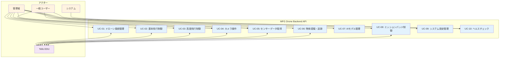
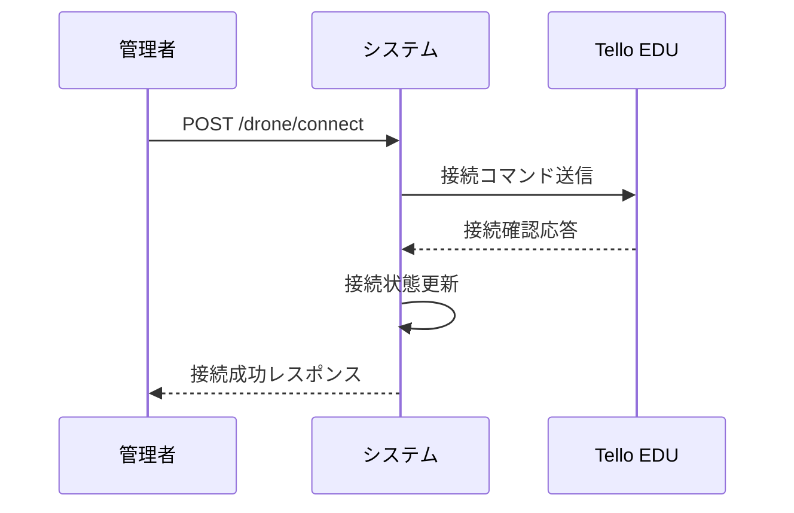
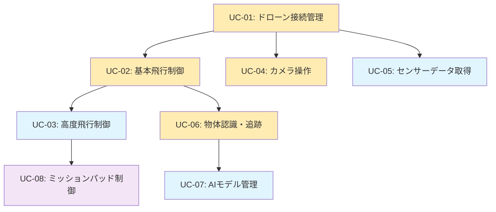

# ユースケース設計

## 概要

MFG Drone Backend APIシステムのユースケース図と詳細記述を定義します。

## ユースケース図

## ユースケース一覧

| ID | ユースケース名 | 主アクター | 副アクター | 優先度 |
|----|---------------|-----------|-----------|--------|
| UC-01 | ドローン接続管理 | 管理者 | Tello EDU | 高 |
| UC-02 | 基本飛行制御 | 管理者 | Tello EDU | 高 |
| UC-03 | 高度飛行制御 | 管理者 | Tello EDU | 中 |
| UC-04 | カメラ操作 | 管理者、一般ユーザー | Tello EDU | 高 |
| UC-05 | センサーデータ取得 | 管理者、一般ユーザー | Tello EDU | 中 |
| UC-06 | 物体認識・追跡 | 管理者 | Tello EDU | 高 |
| UC-07 | AIモデル管理 | 管理者 | - | 中 |
| UC-08 | ミッションパッド制御 | 管理者 | Tello EDU | 低 |
| UC-09 | システム設定管理 | 管理者 | - | 中 |
| UC-10 | ヘルスチェック | システム、一般ユーザー | - | 低 |

## 詳細ユースケース記述

### UC-01: ドローン接続管理

**概要**: ドローンとの接続・切断を管理する

**主アクター**: 管理者  
**副アクター**: Tello EDU  
**前提条件**: 
- ドローンが電源ONでWiFi接続可能状態
- バックエンドAPIが起動済み

**基本フロー**:
1. 管理者がドローン接続を要求
2. システムがTello EDUへ接続試行
3. ドローンから接続確認応答を受信
4. システムが接続状態を管理・記録
5. 管理者に接続成功を通知

**代替フロー**:
- 3a. 接続タイムアウト → エラー通知とリトライ提案
- 3b. ドローン応答なし → 接続失敗通知

**事後条件**: ドローンが接続状態に設定される

### UC-02: 基本飛行制御

**概要**: ドローンの離陸・着陸・緊急停止を制御する

**主アクター**: 管理者  
**副アクター**: Tello EDU  
**前提条件**: ドローンが接続済み状態

**基本フロー（離陸）**:
1. 管理者が離陸コマンドを送信
2. システムがドローンの現在状態を確認
3. 離陸条件をチェック（バッテリー、障害物等）
4. Tello EDUに離陸コマンド送信
5. ドローンから離陸完了通知を受信
6. 飛行状態を更新
7. 管理者に離陸成功を通知

**例外フロー**:
- 3a. バッテリー不足 → エラー通知
- 4a. コマンド送信失敗 → リトライ実行
- 5a. 離陸失敗応答 → エラー詳細通知

**事後条件**: ドローンが飛行状態に設定される

### UC-03: 高度飛行制御

**概要**: 座標指定飛行や複雑な移動パターンを実行する

**主アクター**: 管理者  
**副アクター**: Tello EDU  
**前提条件**: ドローンが飛行中状態

**基本フロー**:
1. 管理者が座標指定移動を要求
2. システムが目標座標の妥当性を検証
3. 移動経路を計算・最適化
4. 段階的移動コマンドをドローンに送信
5. 各段階での位置確認とフィードバック制御
6. 目標位置到達まで制御を継続
7. 移動完了を管理者に通知

### UC-04: カメラ操作

**概要**: ドローンカメラの制御と映像配信を管理する

**主アクター**: 管理者、一般ユーザー  
**副アクター**: Tello EDU  
**前提条件**: ドローンが接続済み状態

**基本フロー（映像ストリーミング）**:
1. ユーザーが映像視聴を要求
2. システムがドローンに映像ストリーム開始を指示
3. ドローンから映像データストリームを受信
4. 映像データを処理・最適化
5. WebSocket経由でクライアントに配信
6. リアルタイム映像表示

**基本フロー（写真撮影）**:
1. 管理者が写真撮影を要求
2. システムがドローンに撮影コマンド送信
3. ドローンが写真撮影実行
4. 撮影画像をシステムが受信・保存
5. 保存場所を管理者に通知

### UC-05: センサーデータ取得

**概要**: ドローンの各種センサーデータを収集・提供する

**主アクター**: 管理者、一般ユーザー  
**副アクター**: Tello EDU  
**前提条件**: ドローンが接続済み状態

**基本フロー**:
1. ユーザーがセンサーデータを要求
2. システムがドローンにセンサーデータ問い合わせ
3. ドローンから各種センサー値を受信
4. データの妥当性検証・フォーマット変換
5. JSON形式でユーザーにレスポンス

**取得可能センサーデータ**:
- バッテリー残量・電圧・温度
- 高度・座標位置
- 姿勢角（ピッチ・ロール・ヨー）
- 加速度・速度データ
- 飛行時間・モーター温度

### UC-06: 物体認識・追跡

**概要**: AIモデルを使用した物体認識と自動追跡を実行する

**主アクター**: 管理者  
**副アクター**: Tello EDU  
**前提条件**: 
- ドローンが飛行中状態
- 対象物体のAIモデルが学習済み
- カメラストリーミングが有効

**基本フロー**:
1. 管理者が追跡対象オブジェクトを指定
2. システムが該当AIモデルをロード
3. リアルタイム映像から物体検出を開始
4. 物体位置と画面中心との差分を計算
5. 物体を中心に保つための移動コマンド生成
6. ドローンに自動移動指示を送信
7. 追跡継続またはユーザー停止まで反復

**代替フロー**:
- 4a. 物体検出失敗 → 検索パターン実行
- 6a. 移動コマンド失敗 → 一時停止とリトライ

### UC-07: AIモデル管理

**概要**: 物体認識用AIモデルの学習・管理を行う

**主アクター**: 管理者  
**前提条件**: 管理者権限での認証済み

**基本フロー（モデル学習）**:
1. 管理者が学習用画像データセットをアップロード
2. システムが画像データの妥当性を検証
3. 学習パラメータの設定・確認
4. AIモデル学習プロセスを開始
5. 学習進捗を定期的に管理者に通知
6. 学習完了後、モデル精度を評価
7. モデルファイルを保存・登録

**基本フロー（モデル切り替え）**:
1. 管理者が使用モデルの変更を要求
2. システムが利用可能モデル一覧を提示
3. 管理者が新しいモデルを選択
4. 現在のモデルをアンロード
5. 新しいモデルをロード・初期化
6. モデル切り替え完了を通知

### UC-08: ミッションパッド制御

**概要**: ミッションパッドを使用した精密位置制御を実行する

**主アクター**: 管理者  
**副アクター**: Tello EDU  
**前提条件**: 
- ミッションパッドが設置済み
- ドローンが飛行中状態

**基本フロー**:
1. 管理者がミッションパッド検出を有効化
2. システムがドローンにパッド検出モード設定
3. ドローンが下向きカメラでパッド検索
4. パッド検出時、ID・位置情報を取得
5. パッド座標を基準とした精密移動を実行
6. 管理者に現在位置とパッド情報を通知

### UC-09: システム設定管理

**概要**: ドローンやシステムの各種設定を管理する

**主アクター**: 管理者  
**前提条件**: 管理者権限での認証済み

**設定項目**:
- ドローン飛行速度設定
- WiFi接続設定変更
- カメラ品質・フレームレート設定
- 追跡感度・パラメータ調整
- ログレベル・出力設定

### UC-10: ヘルスチェック

**概要**: システムの健全性を監視・報告する

**主アクター**: システム、一般ユーザー  
**前提条件**: バックエンドAPIが起動済み

**基本フロー**:
1. ヘルスチェック要求を受信
2. 各コンポーネントの状態を確認
3. ドローン接続状態を検証
4. 必要リソースの可用性をチェック
5. 統合ヘルスステータスを生成
6. JSON形式でレスポンス返却

**ヘルスチェック項目**:
- API応答性能
- ドローン接続状態
- メモリ・CPU使用率
- ストレージ容量
- 必要サービス稼働状況

## ユースケース関連図

