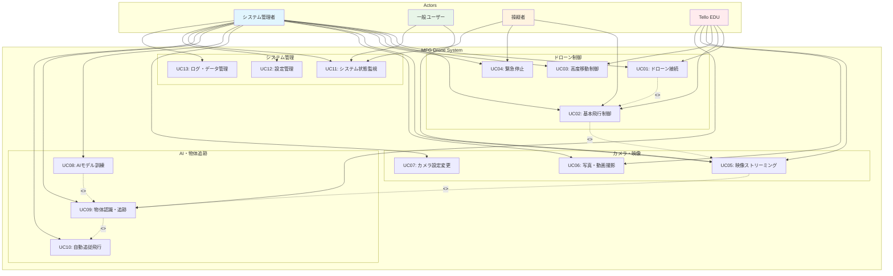
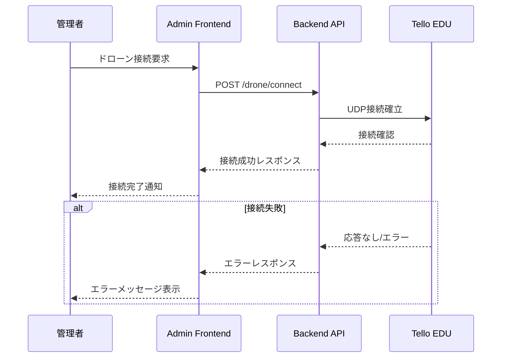
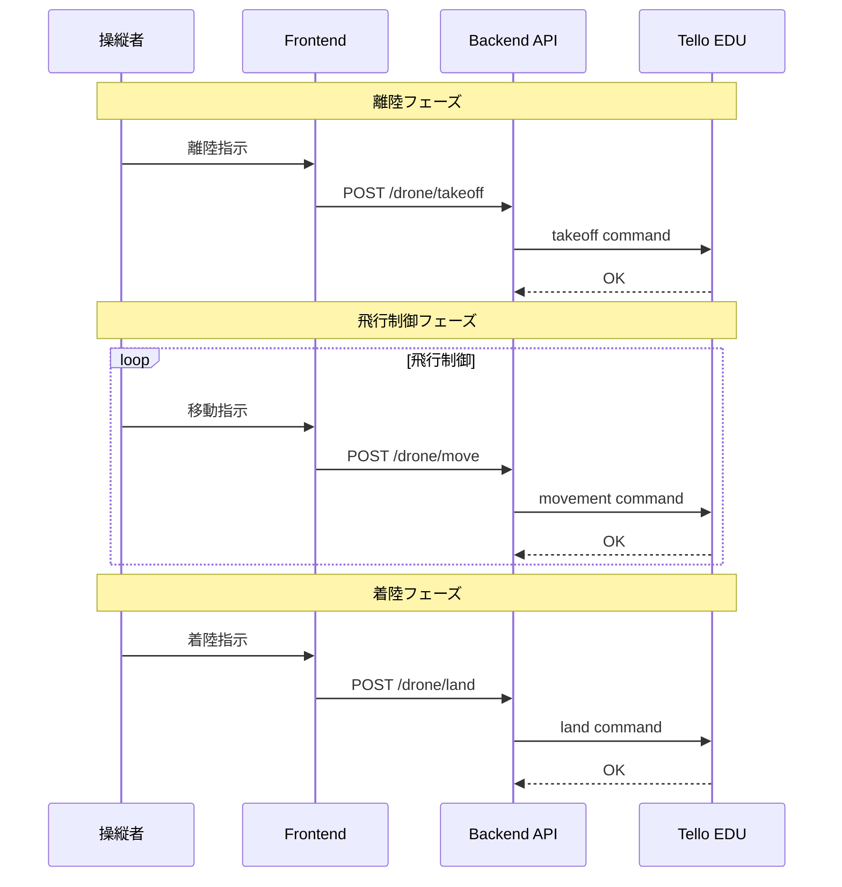
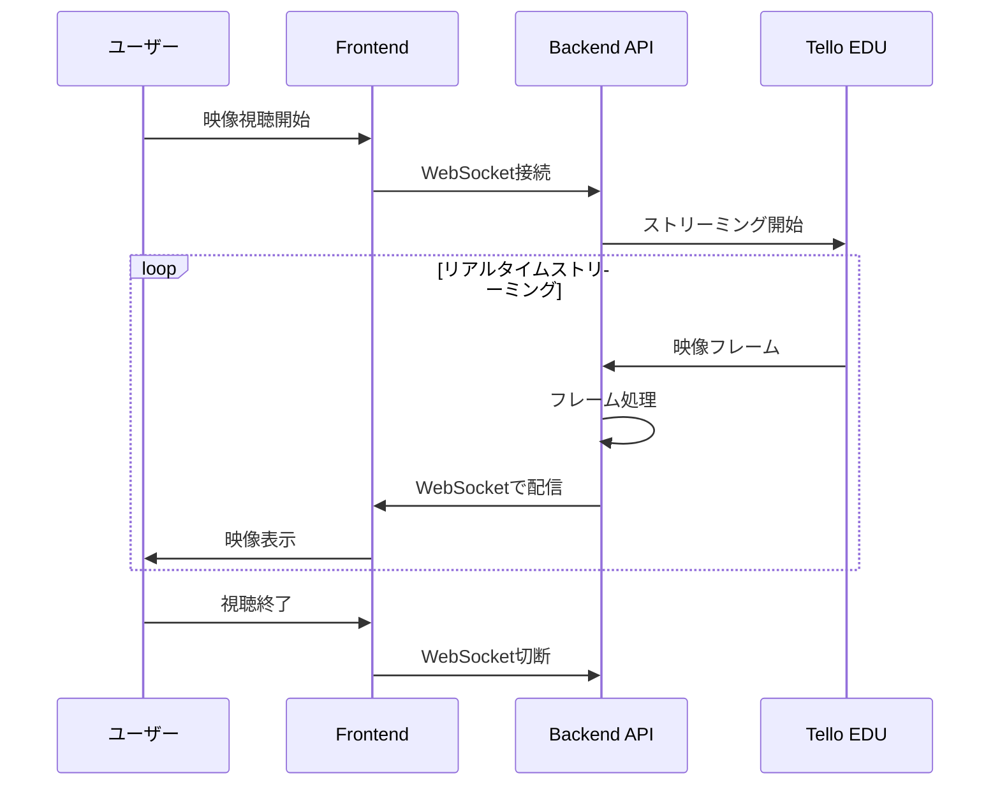
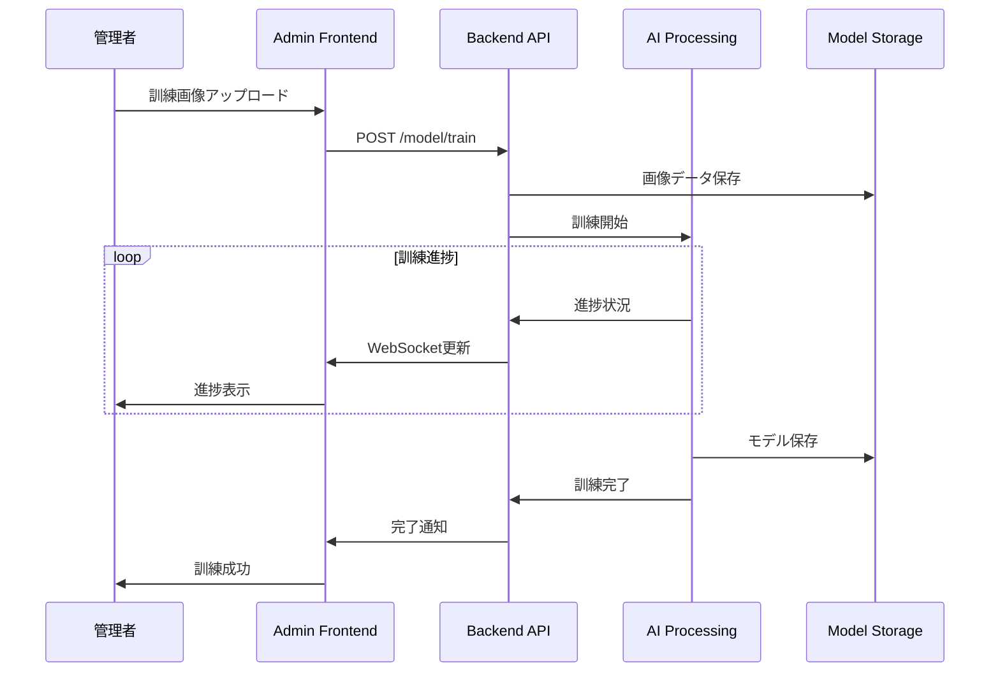
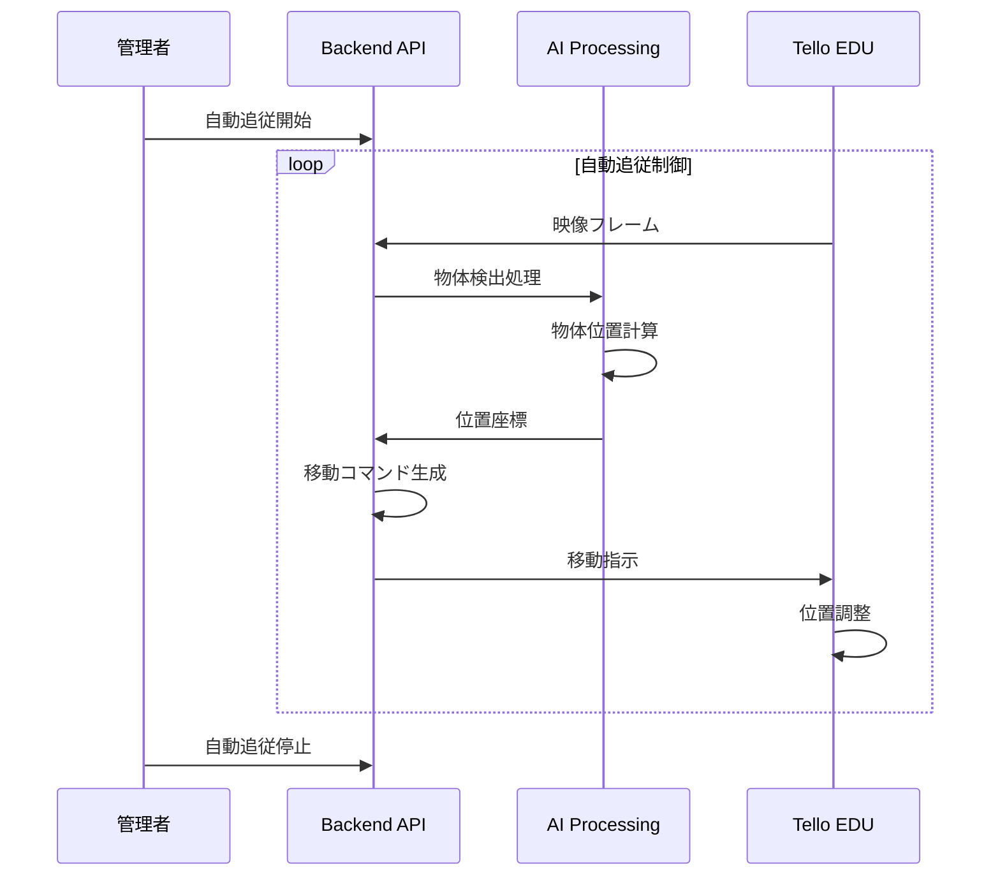
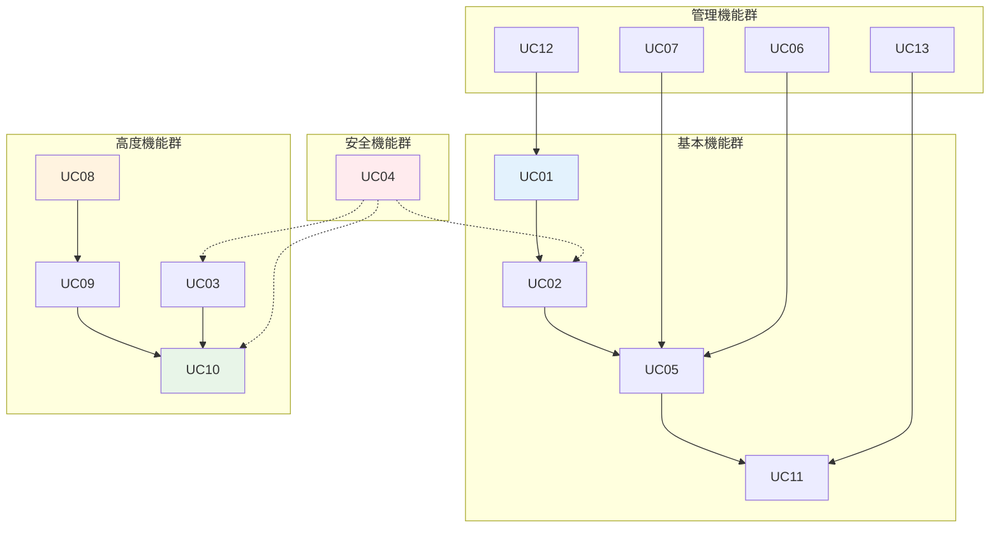

# ユースケース設計

## 概要

MFG Drone Backend API のユースケース設計では、システムの機能要件を明確に定義し、各アクターがシステムとどのように相互作用するかを体系的に示します。

## ユースケース図

## 詳細ユースケース記述

### UC01: ドローン接続

**概要**: システム管理者がTello EDUドローンとの接続を確立する

**アクター**: システム管理者、Tello EDU

**事前条件**:
- Tello EDUの電源が入っている
- WiFiネットワークが利用可能
- Backend APIサーバーが起動している

**基本フロー**:
1. システム管理者がAdmin Frontendにアクセス
2. ドローン接続ボタンをクリック
3. Backend APIがTello EDUへの接続を試行
4. ドローンからの応答を確認
5. 接続状態をUIに表示

**代替フロー**:
- **3a**: ドローンが応答しない場合、エラーメッセージを表示
- **4a**: 接続タイムアウトの場合、再試行オプションを提供

**事後条件**:
- ドローンとの通信チャネルが確立される
- システム状態が「接続済み」に更新される

### UC02: 基本飛行制御

**概要**: システム管理者または操縦者がドローンの基本的な飛行制御を行う

**アクター**: システム管理者、操縦者、Tello EDU

**事前条件**:
- ドローンが接続済み
- 飛行エリアの安全性が確認済み
- バッテリー残量が十分

**基本フロー**:
1. 管理者/操縦者が飛行制御画面にアクセス
2. 離陸コマンドを実行
3. 方向移動コマンド（上下、前後、左右、回転）を送信
4. 着陸コマンドを実行

**代替フロー**:
- **2a**: バッテリー不足の場合、離陸を拒否
- **3a**: 飛行中に障害物検知時、自動停止
- **4a**: 緊急着陸が必要な場合、緊急停止実行

**事後条件**:
- ドローンが指定された位置に移動
- 飛行ログが記録される

### UC03: 高度移動制御

**概要**: 3D座標を指定したドローンの高精度移動制御

**アクター**: システム管理者、Tello EDU

**事前条件**:
- ドローンが飛行中
- 座標系が初期化済み
- 移動範囲が安全領域内

**基本フロー**:
1. 管理者が目標座標(X,Y,Z)と速度を指定
2. システムが移動経路の安全性を検証
3. ドローンに座標移動コマンドを送信
4. 移動完了まで位置監視

**代替フロー**:
- **2a**: 危険な座標の場合、移動を拒否
- **4a**: 移動中に障害物検知時、経路修正または停止

### UC04: 緊急停止

**概要**: 危険な状況でドローンを緊急停止させる

**アクター**: システム管理者、操縦者、Tello EDU

**事前条件**:
- ドローンが動作中（飛行中または移動中）

**基本フロー**:
1. 緊急事態の検知または手動トリガー
2. すべての移動コマンドを即座に停止
3. ドローンをホバリング状態または緊急着陸
4. システム状態を緊急停止モードに変更

**事後条件**:
- ドローンが安全な状態で停止
- 緊急停止ログが記録される

### UC05: 映像ストリーミング

**概要**: ドローンのカメラ映像をリアルタイムでストリーミング配信

**アクター**: システム管理者、一般ユーザー、Tello EDU

**事前条件**:
- ドローンが接続済み
- カメラが正常動作
- ネットワーク帯域が十分

**基本フロー**:
1. ユーザーが映像ストリーミング画面にアクセス
2. ドローンのカメラストリーミングを開始
3. リアルタイム映像をWebSocketで配信
4. 複数クライアントで同時視聴

**代替フロー**:
- **3a**: ネットワーク遅延発生時、品質を自動調整
- **4a**: 接続数上限時、新規接続を制限

### UC06: 写真・動画撮影

**概要**: ドローンカメラで写真撮影および動画録画を行う

**アクター**: システム管理者、Tello EDU

**事前条件**:
- ドローンが接続済み
- ストレージ容量が十分

**基本フロー**:
1. 管理者が撮影モード（写真/動画）を選択
2. 撮影開始コマンドを送信
3. ドローンで撮影実行
4. 撮影データをローカルストレージに保存

### UC07: カメラ設定変更

**概要**: ドローンカメラの解像度、フレームレート等の設定を変更

**アクター**: システム管理者、Tello EDU

**基本フロー**:
1. 管理者がカメラ設定画面にアクセス
2. 解像度、FPS、ビットレートを指定
3. 設定変更コマンドを送信
4. 新しい設定での映像確認

### UC08: AIモデル訓練

**概要**: 物体認識のためのAIモデルを訓練用画像データから作成

**アクター**: システム管理者

**事前条件**:
- 訓練用画像データが準備済み
- 計算リソースが利用可能

**基本フロー**:
1. 管理者が訓練用画像をアップロード
2. 対象オブジェクト名を指定
3. モデル訓練処理を開始
4. 訓練進捗をリアルタイム監視
5. 訓練完了後、モデルを保存

### UC09: 物体認識・追跡

**概要**: 訓練済みモデルを使用して映像内の特定物体を認識・追跡

**アクター**: システム管理者、Tello EDU

**事前条件**:
- 訓練済みモデルが利用可能
- ドローンが飛行中
- 映像ストリーミングが有効

**基本フロー**:
1. 管理者が追跡対象オブジェクトを選択
2. 物体認識処理を開始
3. リアルタイム映像から対象物体を検出
4. 物体位置を継続的に追跡
5. 追跡情報をUIに表示

### UC10: 自動追従飛行

**概要**: 認識した物体を自動的に追従してドローンが飛行

**アクター**: システム管理者、Tello EDU

**事前条件**:
- 物体認識・追跡が有効
- 自動飛行モードが有効
- 安全な飛行環境

**基本フロー**:
1. 管理者が自動追従モードを有効化
2. 追跡中の物体位置に基づいて移動コマンド生成
3. ドローンが物体を画面中央に保持するよう移動
4. 物体の移動に合わせて継続的に追従

### UC11: システム状態監視

**概要**: ドローンとシステム全体の状態をリアルタイムで監視

**アクター**: システム管理者、一般ユーザー、操縦者

**基本フロー**:
1. ユーザーが状態監視画面にアクセス
2. ドローンのバッテリー、高度、温度等を取得
3. システムの接続状態、処理状況を取得
4. 状態情報をリアルタイム更新

### UC12: 設定管理

**概要**: システムおよびドローンの各種設定を管理

**アクター**: システム管理者

**基本フロー**:
1. 管理者が設定画面にアクセス
2. WiFi設定、飛行速度、安全パラメータ等を変更
3. 設定を保存・適用
4. 設定変更の確認

### UC13: ログ・データ管理

**概要**: システムの動作ログ、飛行ログ、エラーログを管理

**アクター**: システム管理者

**基本フロー**:
1. 管理者がログ管理画面にアクセス
2. ログの種類・期間を指定して検索
3. ログの詳細確認・エクスポート
4. 古いログの削除・アーカイブ

## ユースケース関連図

## 優先度マトリックス

| ユースケース | 重要度 | 緊急度 | 実装優先度 |
|-------------|-------|-------|-----------|
| UC01: ドローン接続 | 高 | 高 | 1 |
| UC02: 基本飛行制御 | 高 | 高 | 2 |
| UC04: 緊急停止 | 高 | 高 | 3 |
| UC05: 映像ストリーミング | 高 | 中 | 4 |
| UC11: システム状態監視 | 高 | 中 | 5 |
| UC08: AIモデル訓練 | 中 | 中 | 6 |
| UC09: 物体認識・追跡 | 中 | 中 | 7 |
| UC03: 高度移動制御 | 中 | 低 | 8 |
| UC10: 自動追従飛行 | 中 | 低 | 9 |
| UC06: 写真・動画撮影 | 低 | 低 | 10 |
| UC07: カメラ設定変更 | 低 | 低 | 11 |
| UC12: 設定管理 | 低 | 低 | 12 |
| UC13: ログ・データ管理 | 低 | 低 | 13 |