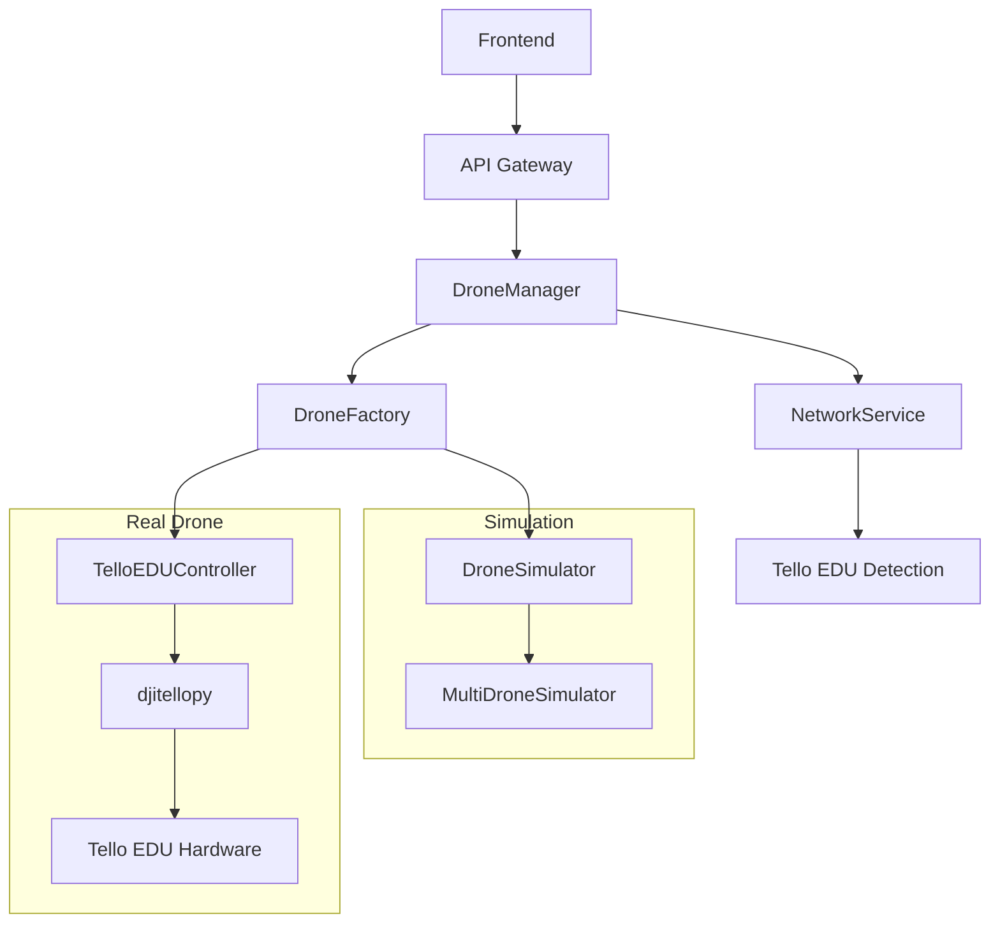

# 実機ドローンAPI仕様書

## 概要

本仕様書は、Phase 6で実装されたTello EDU実機ドローン対応のAPI仕様について説明します。既存のシミュレーションAPI との100%互換性を保ちながら、実機ドローン固有の機能を提供します。

## アーキテクチャ

### ハイブリッドシステム設計



## 新規APIエンドポイント

### 1. 実機ドローン検出

#### `GET /api/drones/detect`

LAN内の実機ドローンを自動検出します。

**パラメータ:**
- `timeout` (float, optional): スキャンタイムアウト（秒）、デフォルト: 5.0

**レスポンス:**
```json
[
  {
    "ip_address": "192.168.10.1",
    "battery_level": 85,
    "signal_strength": 90,
    "response_time_ms": 125.5,
    "detected_at": "2024-01-01T12:00:00Z",
    "detection_method": "tello_command",
    "hostname": "TELLO-ABC123",
    "is_available": true
  }
]
```

**使用例:**
```bash
curl -X GET "http://localhost:8000/api/drones/detect?timeout=10.0"
```

### 2. ドローンタイプ情報取得

#### `GET /api/drones/{drone_id}/type-info`

ドローンが実機かシミュレーションかの詳細情報を取得します。

**パス パラメータ:**
- `drone_id` (string): ドローンID

**レスポンス:**
```json
{
  "drone_id": "drone_001",
  "name": "Tello EDU #1",
  "type": "real",
  "ip_address": "192.168.10.1",
  "is_connected": true,
  "connection_status": "connected",
  "last_seen": "2024-01-01T12:00:00Z",
  "drone_class": "real",
  "is_real_drone": true,
  "connection_state": "connected",
  "real_ip_address": "192.168.10.1"
}
```

### 3. 実機ドローン接続検証

#### `POST /api/drones/verify-connection`

指定されたIPアドレスの実機ドローンへの接続を検証します。

**リクエストボディ:**
```json
{
  "ip_address": "192.168.10.1"
}
```

**レスポンス:**
```json
{
  "ip_address": "192.168.10.1",
  "is_reachable": true,
  "battery_level": 85,
  "signal_strength": 90,
  "response_time_ms": 125.5,
  "verified_at": "2024-01-01T12:00:00Z",
  "is_available_for_connection": true
}
```

### 4. ネットワーク状態取得

#### `GET /api/system/network-status`

ドローン検出に関するネットワーク統計情報を取得します。

**レスポンス:**
```json
{
  "network_service": {
    "scan_statistics": {
      "total_scans": 5,
      "successful_detections": 3,
      "failed_attempts": 2,
      "average_scan_time": 3.2,
      "last_scan_time": "2024-01-01T12:00:00Z"
    },
    "detected_drones_count": 2,
    "verified_drones_count": 2,
    "is_scanning": false,
    "auto_scan_enabled": true
  },
  "drone_factory": {
    "total_drones": 3,
    "real_drones": 2,
    "simulation_drones": 1,
    "detected_real_drones": 2,
    "configured_drones": 3
  },
  "total_detected_real_drones": 2,
  "total_connected_drones": 1,
  "real_connected_count": 1,
  "simulation_connected_count": 0,
  "auto_scan_enabled": true,
  "last_scan_time": "2024-01-01T12:00:00Z"
}
```

### 5. 自動スキャン管理

#### `POST /api/system/auto-scan/start`

実機ドローンの自動検出スキャンを開始します。

**パラメータ:**
- `interval_seconds` (float, optional): スキャン間隔（秒）、デフォルト: 60.0

**レスポンス:**
```json
{
  "message": "自動スキャンを開始しました（間隔: 60.0秒）"
}
```

#### `POST /api/system/auto-scan/stop`

実機ドローンの自動検出スキャンを停止します。

**レスポンス:**
```json
{
  "message": "自動スキャンを停止しました"
}
```

## 拡張されたAPIエンドポイント

### ドローン状態取得の拡張

#### `GET /api/drones/{drone_id}/status`

既存のAPI互換性を保ちつつ、実機ドローン固有の情報を追加します。

**実機ドローンの場合の追加フィールド:**
```json
{
  "drone_id": "drone_001",
  "connection_status": "connected",
  "flight_status": "flying",
  "battery_level": 85,
  "flight_time": 120,
  "height": 150,
  "temperature": 28.5,
  "speed": 25.3,
  "wifi_signal": 90,
  "attitude": {
    "pitch": 2.1,
    "roll": -1.5,
    "yaw": 45.0
  },
  "last_updated": "2024-01-01T12:00:00Z",
  // 実機固有の追加情報
  "real_drone_info": {
    "connection_state": "connected",
    "real_ip_address": "192.168.10.1",
    "hardware_version": "TELLO EDU v2.0",
    "firmware_version": "01.04.0050"
  }
}
```

## WebSocket API拡張

### 新規メッセージタイプ

#### 1. 実機ドローンスキャン

**送信:**
```json
{
  "type": "scan_real_drones",
  "timeout": 5.0
}
```

**応答:**
```json
{
  "type": "scan_started",
  "timeout": 5.0,
  "timestamp": "2024-01-01T12:00:00Z"
}
```

```json
{
  "type": "scan_completed",
  "detected_drones": [...],
  "count": 2,
  "timestamp": "2024-01-01T12:00:05Z"
}
```

#### 2. ネットワーク状態取得

**送信:**
```json
{
  "type": "get_network_status"
}
```

**応答:**
```json
{
  "type": "network_status",
  "status": {...},
  "timestamp": "2024-01-01T12:00:00Z"
}
```

#### 3. 接続検証

**送信:**
```json
{
  "type": "verify_drone_connection",
  "ip_address": "192.168.10.1"
}
```

**応答:**
```json
{
  "type": "connection_verification",
  "verification_result": {...},
  "timestamp": "2024-01-01T12:00:00Z"
}
```

#### 4. ドローンタイプ情報取得

**送信:**
```json
{
  "type": "get_drone_type_info",
  "drone_id": "drone_001"
}
```

**応答:**
```json
{
  "type": "drone_type_info",
  "drone_id": "drone_001",
  "type_info": {...},
  "timestamp": "2024-01-01T12:00:00Z"
}
```

#### 5. 自動スキャン制御

**開始:**
```json
{
  "type": "start_auto_scan",
  "interval_seconds": 60.0
}
```

**停止:**
```json
{
  "type": "stop_auto_scan"
}
```

### 自動ブロードキャストイベント

#### 1. ネットワーク状態更新

```json
{
  "type": "network_status_update",
  "network_status": {...},
  "timestamp": "2024-01-01T12:00:00Z"
}
```

#### 2. 実機ドローン検出

```json
{
  "type": "real_drone_detected",
  "ip_address": "192.168.10.1",
  "timestamp": "2024-01-01T12:00:00Z"
}
```

#### 3. 実機ドローン切断

```json
{
  "type": "real_drone_disconnected",
  "ip_address": "192.168.10.1",
  "timestamp": "2024-01-01T12:00:00Z"
}
```

#### 4. 実機ドローン状態更新拡張

既存のドローン状態更新に実機情報を追加：

```json
{
  "type": "drone_status_update",
  "drone_id": "drone_001",
  "status": {...},
  "real_drone_info": {
    "connection_state": "connected",
    "real_ip_address": "192.168.10.1",
    "is_real_drone": true
  },
  "timestamp": "2024-01-01T12:00:00Z"
}
```

## エラーハンドリング

### 実機ドローン固有のエラーコード

| エラーコード | 説明 | HTTPステータス |
|-------------|------|---------------|
| REAL_DRONE_NOT_FOUND | 指定されたIPアドレスで実機ドローンが見つからない | 404 |
| CONNECTION_VERIFICATION_FAILED | 実機ドローンとの接続検証に失敗 | 503 |
| NETWORK_SCAN_FAILED | ネットワークスキャンに失敗 | 500 |
| TELLO_CONNECTION_ERROR | Tello EDU固有の接続エラー | 503 |
| BATTERY_TOO_LOW | バッテリー残量不足で操作不可 | 400 |
| REAL_DRONE_BUSY | 実機ドローンが他の操作で使用中 | 409 |

### エラーレスポンス例

```json
{
  "detail": "実機ドローンとの接続検証に失敗しました",
  "error_code": "CONNECTION_VERIFICATION_FAILED",
  "additional_info": {
    "ip_address": "192.168.10.1",
    "last_successful_connection": "2024-01-01T11:50:00Z",
    "suggested_action": "ドローンの電源とネットワーク接続を確認してください"
  }
}
```

## 設定

### 環境変数

```bash
# ドローン動作モード
DRONE_MODE=auto              # auto, simulation, real, hybrid
TELLO_AUTO_DETECT=true       # 自動検出有効/無効
TELLO_CONNECTION_TIMEOUT=10  # 接続タイムアウト(秒)
TELLO_DEFAULT_IP=192.168.10.1  # デフォルトIP

# ネットワーク設定
TELLO_SCAN_RANGE=192.168.1.0/24  # スキャン範囲
TELLO_UDP_PORT=8889              # コマンドポート
NETWORK_SCAN_INTERVAL=60         # 自動スキャン間隔(秒)
```

### 設定ファイル (drone_config.yaml)

```yaml
global:
  default_mode: "auto"
  space_bounds: [20.0, 20.0, 10.0]
  auto_detection:
    enabled: true
    timeout: 5.0
    scan_interval: 30.0

drones:
  - id: "drone_001"
    name: "Tello EDU #1"
    mode: "auto"
    ip_address: null  # 自動検出
    auto_detect: true
    initial_position: [0.0, 0.0, 0.0]
    fallback_to_simulation: true

network:
  discovery:
    default_ips:
      - "192.168.10.1"
      - "192.168.1.1"
    scan_ranges:
      - "192.168.1.0/24"
      - "192.168.10.0/24"
    connection_timeout: 3.0
```

## 使用例

### JavaScript/TypeScript クライアント例

```typescript
// 実機ドローン検出
const detectRealDrones = async () => {
  const response = await fetch('/api/drones/detect?timeout=10');
  const detectedDrones = await response.json();
  console.log('検出された実機ドローン:', detectedDrones);
};

// WebSocket接続と実機ドローンイベント監視
const ws = new WebSocket('ws://localhost:8000/ws');

ws.onmessage = (event) => {
  const message = JSON.parse(event.data);
  
  switch (message.type) {
    case 'real_drone_detected':
      console.log('新しい実機ドローンを検出:', message.ip_address);
      break;
    case 'network_status_update':
      console.log('ネットワーク状態更新:', message.network_status);
      break;
    case 'drone_status_update':
      if (message.real_drone_info) {
        console.log('実機ドローン状態更新:', message);
      }
      break;
  }
};

// 実機ドローンスキャン開始
ws.send(JSON.stringify({
  type: 'scan_real_drones',
  timeout: 5.0
}));
```

### Python クライアント例

```python
import requests
import websocket
import json

# 実機ドローン検出
def detect_real_drones(timeout=5.0):
    response = requests.get(f'http://localhost:8000/api/drones/detect?timeout={timeout}')
    return response.json()

# ドローン接続（実機・シミュレーション自動判定）
def connect_drone(drone_id):
    response = requests.post(f'http://localhost:8000/api/drones/{drone_id}/connect')
    return response.json()

# WebSocket接続
def on_message(ws, message):
    data = json.loads(message)
    print(f"受信: {data['type']}")
    
    if data['type'] == 'real_drone_detected':
        print(f"実機ドローン検出: {data['ip_address']}")

ws = websocket.WebSocketApp("ws://localhost:8000/ws", on_message=on_message)
ws.run_forever()
```

## 互換性

### 既存APIとの互換性

- **100%後方互換**: 既存のシミュレーションAPIは変更なしで動作
- **透過的な実機対応**: 既存のクライアントコードは変更なしで実機ドローンに対応
- **段階的移行**: シミュレーションから実機への段階的移行をサポート

### バージョニング

- **APIバージョン**: v1.6.0 (Phase 6対応)
- **互換性保証**: v1.x系との完全互換性
- **廃止予定**: なし（既存機能はすべて維持）

## パフォーマンス考慮事項

### ネットワークスキャン

- **並列スキャン**: 最大50並列接続でスキャン効率化
- **タイムアウト管理**: 適応的タイムアウトでレスポンス最適化
- **キャッシュ機能**: スキャン結果を30秒間キャッシュ

### リアルタイム通信

- **WebSocket最適化**: 実機ドローンイベントの低遅延配信
- **ブロードキャスト効率化**: 変更検出による無駄な配信抑制
- **接続管理**: 自動切断検出と再接続機能

## セキュリティ

### ネットワークセキュリティ

- **IP範囲制限**: 設定可能なスキャン対象IP範囲
- **接続レート制限**: DDoS攻撃防止
- **認証**: Tello EDU固有認証の実装

### データ保護

- **機密情報保護**: IPアドレス等の適切な管理
- **ログ管理**: セキュリティイベントの記録
- **アクセス制御**: API エンドポイントアクセス制御

## トラブルシューティング

### よくある問題

1. **実機ドローンが検出されない**
   - ネットワーク接続確認
   - IP範囲設定確認
   - ファイアウォール設定確認

2. **接続が不安定**
   - WiFi信号強度確認
   - 電池残量確認
   - 干渉源の除去

3. **パフォーマンス低下**
   - スキャン間隔調整
   - 並列接続数制限
   - ネットワーク帯域確認

### ログ分析

```bash
# 実機ドローン関連ログ
grep "real_drone" /var/log/drone_api.log

# ネットワークスキャンログ
grep "network_scan" /var/log/drone_api.log

# 接続エラーログ
grep "connection.*failed" /var/log/drone_api.log
```

## 今後の拡張予定

### Phase 7以降の予定

- **複数実機同時制御**: 複数Tello EDUの協調制御
- **高度なテレメトリ**: 詳細なセンサーデータ取得
- **ミッション自動化**: 自動飛行ミッション機能
- **クラウド連携**: クラウドベースのドローン管理

---

**Document Version**: 1.0.0  
**Last Updated**: 2024-01-01  
**Authors**: Claude Code AI Assistant  
**Related Documents**: 
- [PHASE6_TELLO_INTEGRATION_README.md](./plan/PHASE6_TELLO_INTEGRATION_README.md)
- [user_guide.md](./user_guide.md)
- [hardware_setup_guide.md](./hardware_setup_guide.md)