# 管理者用フロントエンド 画面設計

## 概要

MFG Drone Admin Frontend の画面設計では、管理者が直感的にドローン制御システムを操作できるUIを提供します。画面構成図と画面遷移図を通じて、ユーザビリティを重視した設計を示します。

## 画面構成図

### 全体レイアウト構成

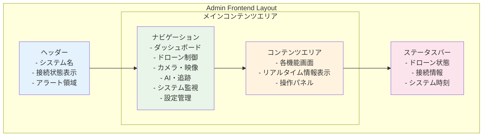

### 詳細画面構成

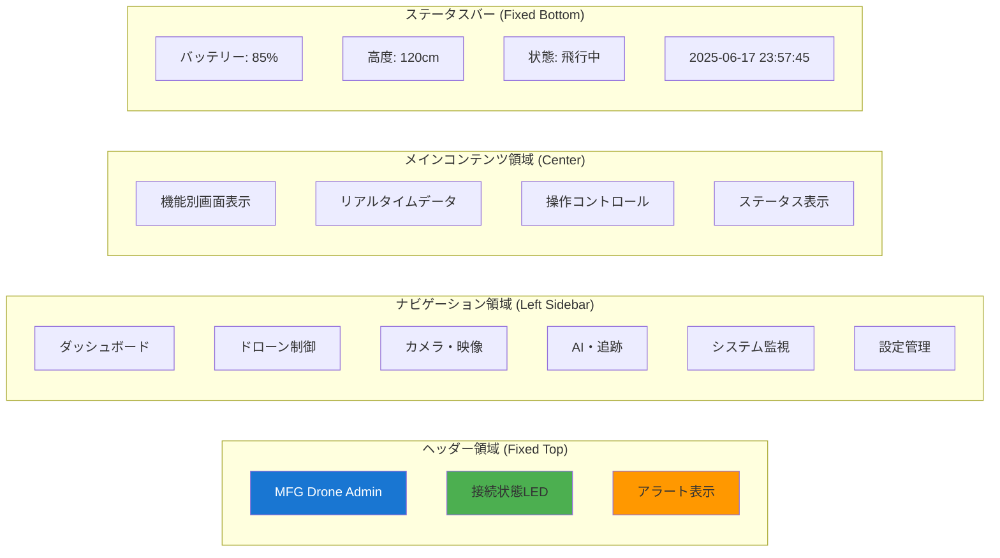

## 個別画面設計

### 1. ダッシュボード画面

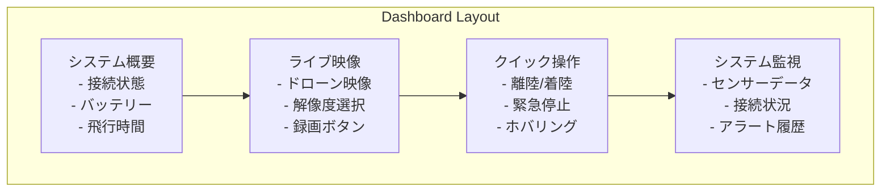

### 2. ドローン制御画面

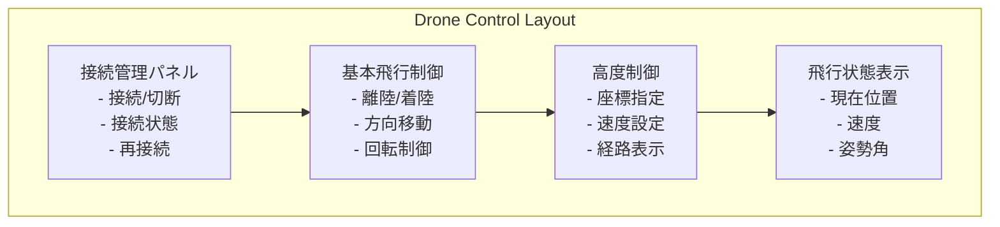

### 3. カメラ・映像画面

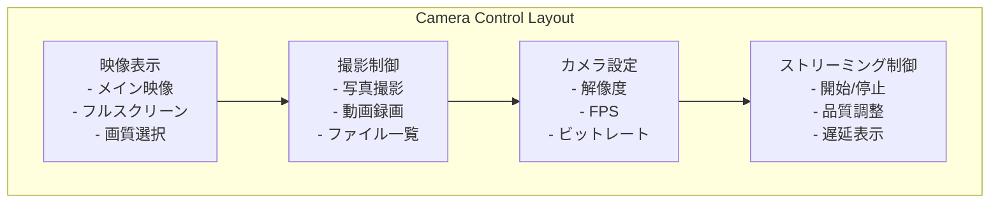

### 4. AI・追跡画面

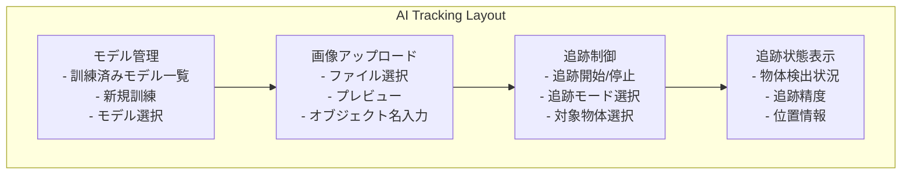

### 5. システム監視画面

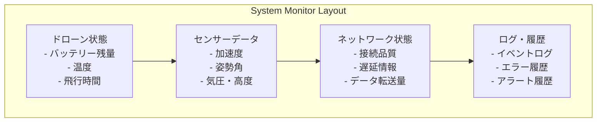

### 6. 設定管理画面

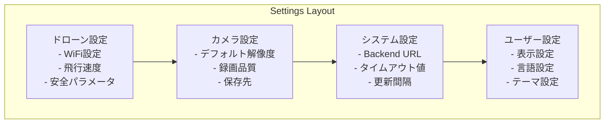

## 画面遷移図

### メイン画面遷移フロー

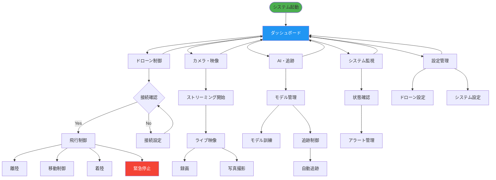

### 詳細操作フロー

#### ドローン制御フロー

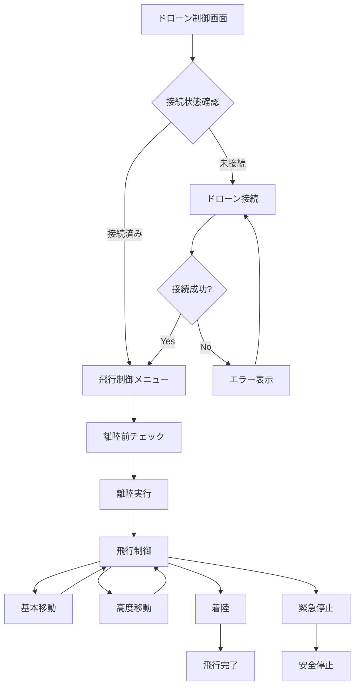

#### AI・追跡フロー

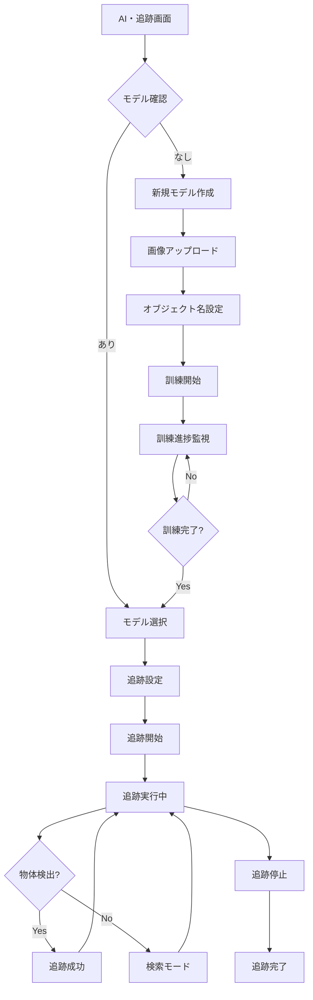

## 画面要素詳細仕様

### 共通UI要素

| 要素 | 仕様 | 備考 |
|------|------|------|
| ヘッダー高さ | 60px | 固定配置 |
| ナビゲーション幅 | 200px | 折りたたみ可能 |
| フッター高さ | 40px | 固定配置 |
| メインコンテンツ | 可変 | レスポンシブ対応 |

### カラーパレット

| 用途 | カラーコード | 説明 |
|------|-------------|------|
| プライマリ | #1976d2 | メインブランド色 |
| セカンダリ | #424242 | サブカラー |
| 成功 | #4caf50 | 接続成功・正常状態 |
| 警告 | #ff9800 | 注意・警告状態 |
| エラー | #f44336 | エラー・危険状態 |
| 背景 | #fafafa | ベース背景色 |

### 状態表示

#### 接続状態インジケーター

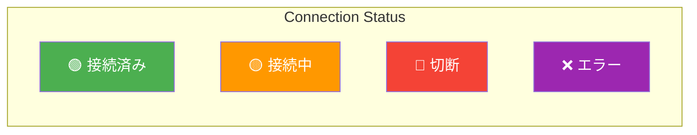

#### バッテリー表示

| 残量 | 表示色 | アイコン | アクション |
|------|--------|----------|-----------|
| 80-100% | 緑 | 🔋 | 通常運用 |
| 60-79% | 緑 | 🔋 | 通常運用 |
| 40-59% | 黄 | 🔋 | 注意監視 |
| 20-39% | オレンジ | ⚠️ | 着陸準備 |
| 0-19% | 赤 | 🚨 | 緊急着陸 |

## レスポンシブ設計

### ブレークポイント

| デバイス | 画面幅 | レイアウト調整 |
|----------|-------|---------------|
| Desktop | ≥1200px | フル機能表示 |
| Tablet | 768-1199px | ナビゲーション折りたたみ |
| Mobile | <768px | 単一画面表示 |

### モバイル対応

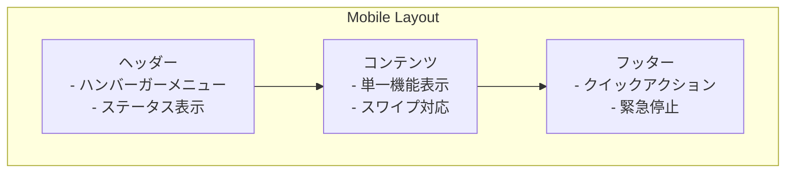

## ユーザビリティ要件

### アクセシビリティ
- **キーボード操作**: 全機能をキーボードで操作可能
- **スクリーンリーダー**: alt属性、aria-label完備
- **カラーバリアフリー**: 色以外の視覚的手がかりを提供

### 操作性
- **レスポンス時間**: 100ms以内（UI操作）
- **エラーハンドリング**: 明確なエラーメッセージと回復手順
- **確認ダイアログ**: 危険な操作には確認プロンプト

### 表示更新頻度
- **ライブ映像**: 30fps
- **センサーデータ**: 5Hz（200ms間隔）
- **システム状態**: 1Hz（1秒間隔）
- **バッテリー情報**: 0.1Hz（10秒間隔）