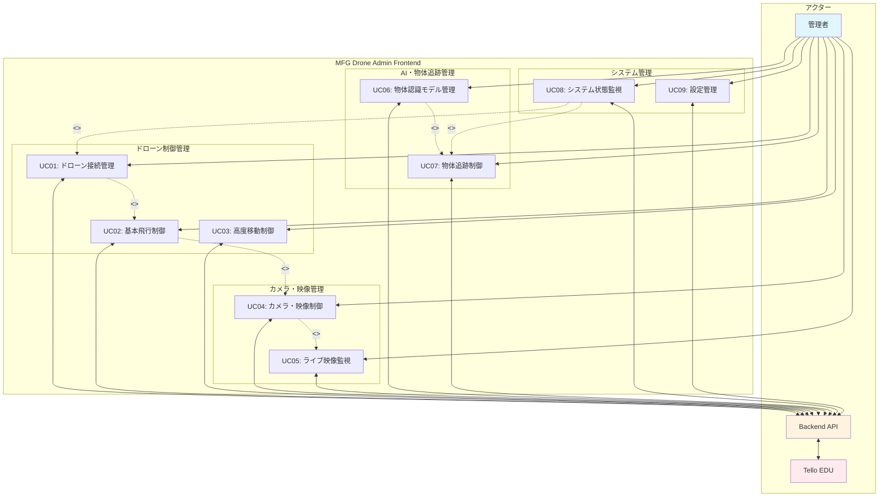
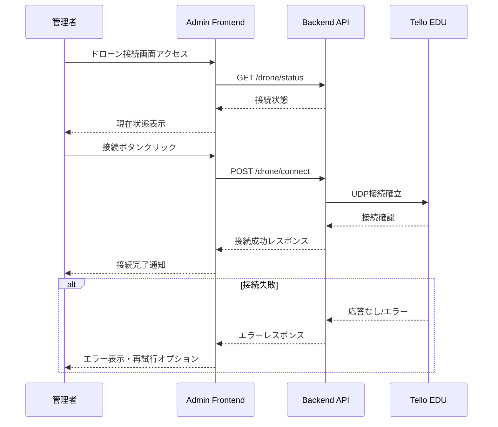
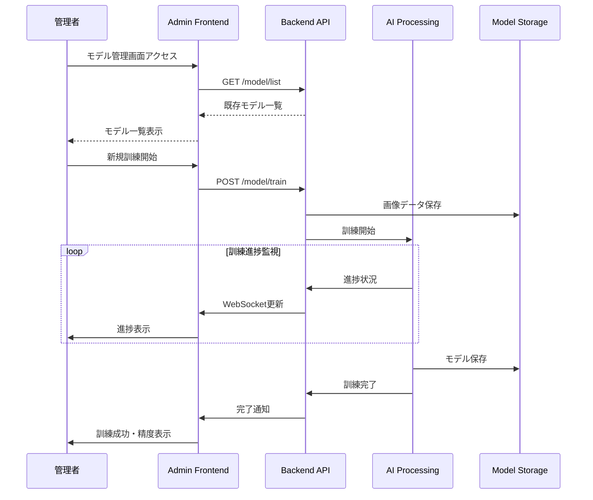
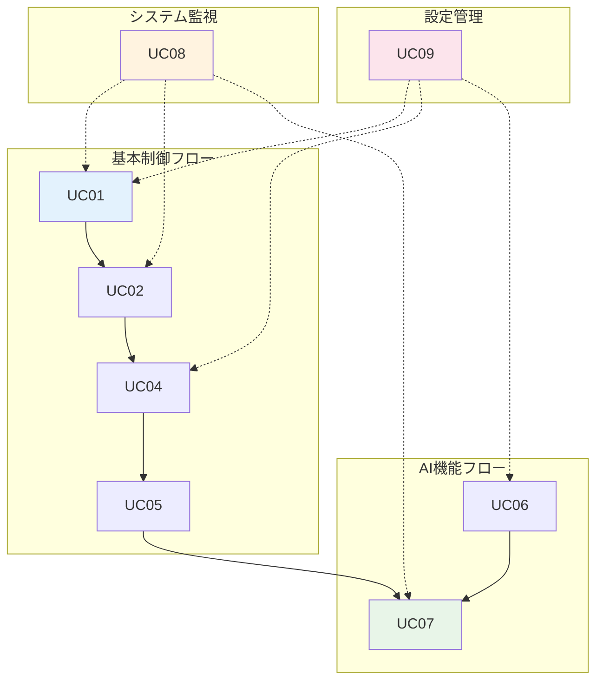

# 管理者用フロントエンド ユースケース設計

## 概要

MFG Drone Admin Frontend のユースケース設計では、管理者がドローン制御システムとどのように相互作用するかを体系的に定義します。物体認識モデルの訓練、ドローンの制御、追跡機能の開始/停止など、システム全体の運用管理を行います。

## ユースケース図

## 詳細ユースケース記述

### UC01: ドローン接続管理

**概要**: 管理者がTello EDUドローンとの接続を確立・監視・切断する

**アクター**: 管理者

**事前条件**:
- Admin Frontendが起動している
- Backend APIサーバーが動作している
- Tello EDUの電源が入っている

**基本フロー**:
1. 管理者がAdmin Frontend画面にアクセス
2. ドローン接続ステータスを確認
3. 「接続」ボタンをクリック
4. Backend APIにドローン接続リクエストを送信
5. 接続結果をUI上に表示
6. 接続成功時、他の機能を有効化

**代替フロー**:
- **5a**: 接続失敗時、エラーメッセージを表示し再接続オプションを提供
- **6a**: 接続中断時、自動再接続を試行

**事後条件**:
- ドローンとの通信が確立される
- システム状態が「接続済み」に更新される
- 飛行制御機能が利用可能になる

### UC02: 基本飛行制御

**概要**: 管理者がドローンの離陸、着陸、基本移動、緊急停止を制御する

**アクター**: 管理者

**事前条件**:
- ドローンが接続済み
- バッテリー残量が十分（10%以上）
- 飛行エリアの安全性が確認済み

**基本フロー**:
1. 管理者が飛行制御画面にアクセス
2. 離陸前チェック（バッテリー、接続状態）を実行
3. 離陸ボタンをクリック
4. 方向移動ボタン（前後、左右、上下、回転）で移動制御
5. 着陸ボタンで安全に着陸

**代替フロー**:
- **2a**: バッテリー不足時、離陸を拒否しメッセージ表示
- **4a**: 飛行中に接続が切れた場合、自動ホバリング
- **5a**: 緊急事態時、緊急停止ボタンで即座に停止

**事後条件**:
- ドローンが指定された動作を実行
- 飛行ログが記録される

### UC03: 高度移動制御

**概要**: 管理者が3D座標指定による高精度移動制御を行う

**アクター**: 管理者

**事前条件**:
- ドローンが飛行中
- 座標系が初期化済み
- 目標座標が安全範囲内

**基本フロー**:
1. 管理者が高度制御画面にアクセス
2. 目標座標(X,Y,Z)と移動速度を入力
3. 移動コマンドを実行
4. 移動進捗をリアルタイムで監視
5. 移動完了を確認

**代替フロー**:
- **2a**: 危険な座標入力時、警告メッセージを表示
- **4a**: 移動中に障害物検知時、停止または経路変更

**事後条件**:
- ドローンが指定座標に移動完了
- 移動軌跡が記録される

### UC04: カメラ・映像制御

**概要**: 管理者がドローンカメラの設定変更、写真撮影、動画録画を制御する

**アクター**: 管理者

**事前条件**:
- ドローンが接続済み
- カメラが正常動作
- ストレージ容量が十分

**基本フロー**:
1. 管理者がカメラ制御画面にアクセス
2. カメラ設定（解像度、FPS、ビットレート）を変更
3. 撮影モード（写真/動画）を選択
4. 撮影開始/停止を制御
5. 撮影データを確認・保存

**代替フロー**:
- **4a**: ストレージ不足時、古いファイル削除または外部保存を提案
- **5a**: 撮影失敗時、再撮影オプションを提供

**事後条件**:
- 撮影データがローカルに保存される
- 撮影ログが記録される

### UC05: ライブ映像監視

**概要**: 管理者がドローンからのリアルタイム映像を監視する

**アクター**: 管理者

**事前条件**:
- ドローンが接続済み
- 映像ストリーミングが有効
- ネットワーク帯域が十分

**基本フロー**:
1. 管理者が映像監視画面にアクセス
2. ライブ映像ストリーミングを開始
3. リアルタイム映像を表示
4. 映像品質を監視・調整
5. 必要に応じて映像記録

**代替フロー**:
- **3a**: 映像遅延発生時、品質設定を自動調整
- **4a**: ネットワーク不安定時、バッファリング機能を活用

**事後条件**:
- 安定したライブ映像が表示される
- 映像品質ログが記録される

### UC06: 物体認識モデル管理

**概要**: 管理者が物体認識AIモデルの訓練、管理、選択を行う

**アクター**: 管理者

**事前条件**:
- 訓練用画像データが準備済み
- Backend APIの計算リソースが利用可能
- 十分なストレージ容量

**基本フロー**:
1. 管理者がモデル管理画面にアクセス
2. 既存モデル一覧を表示
3. 新規モデル訓練を開始
   - 対象オブジェクト名を入力
   - 訓練用画像をアップロード
4. 訓練進捗をリアルタイムで監視
5. 訓練完了後、モデル精度を確認
6. モデルを保存・選択

**代替フロー**:
- **3a**: 画像ファイルが不適切な場合、エラーメッセージを表示
- **4a**: 訓練失敗時、パラメータ調整オプションを提供

**事後条件**:
- 新しい物体認識モデルが作成される
- モデルがシステムで利用可能になる

### UC07: 物体追跡制御

**概要**: 管理者が物体認識を基にした自動追跡機能を制御する

**アクター**: 管理者

**事前条件**:
- 物体認識モデルが利用可能
- ドローンが飛行中
- ライブ映像が有効

**基本フロー**:
1. 管理者が追跡制御画面にアクセス
2. 利用可能な認識モデル一覧から選択
3. 追跡モード（center/follow）を設定
4. 物体追跡を開始
5. 追跡状態と物体位置をリアルタイム監視
6. 必要に応じて追跡を停止

**代替フロー**:
- **4a**: 対象物体が検出されない場合、検索モードに移行
- **5a**: 追跡対象を見失った場合、最後の位置で待機

**事後条件**:
- ドローンが対象物体を自動追跡
- 追跡ログが記録される

### UC08: システム状態監視

**概要**: 管理者がドローンとシステム全体の状態をリアルタイムで監視する

**アクター**: 管理者

**事前条件**:
- システムが稼働中
- センサーデータが取得可能

**基本フロー**:
1. 管理者がシステム監視画面にアクセス
2. ドローン状態（バッテリー、高度、温度等）を表示
3. Backend API状態を監視
4. ネットワーク接続状態を確認
5. 異常検知時にアラート表示

**代替フロー**:
- **5a**: バッテリー低下時、自動着陸警告を表示
- **5b**: 温度異常時、冷却待機を提案

**事後条件**:
- システム全体の健全性が確認される
- 状態ログが記録される

### UC09: 設定管理

**概要**: 管理者がシステムの各種設定を変更・管理する

**アクター**: 管理者

**事前条件**:
- 管理者権限でログイン済み
- システム設定変更が可能な状態

**基本フロー**:
1. 管理者が設定管理画面にアクセス
2. 設定カテゴリを選択
   - WiFi設定
   - 飛行パラメータ
   - カメラ設定
   - システム設定
3. 設定値を変更
4. 設定を保存・適用
5. 変更結果を確認

**代替フロー**:
- **3a**: 無効な設定値入力時、検証エラーを表示
- **4a**: 設定適用失敗時、前の設定に復元

**事後条件**:
- 新しい設定がシステムに適用される
- 設定変更ログが記録される

## ユースケース関連図

## 実装優先度マトリックス

| ユースケース | 重要度 | 緊急度 | 実装優先度 | 備考 |
|-------------|-------|-------|-----------|------|
| UC01: ドローン接続管理 | 高 | 高 | 1 | システムの基盤機能 |
| UC08: システム状態監視 | 高 | 高 | 2 | 安全運航に必須 |
| UC02: 基本飛行制御 | 高 | 高 | 3 | 基本操作機能 |
| UC05: ライブ映像監視 | 高 | 中 | 4 | 操作判断に必要 |
| UC06: 物体認識モデル管理 | 中 | 中 | 5 | AI機能の基盤 |
| UC07: 物体追跡制御 | 中 | 中 | 6 | メイン機能 |
| UC04: カメラ・映像制御 | 中 | 低 | 7 | 記録機能 |
| UC03: 高度移動制御 | 低 | 低 | 8 | 上級者向け機能 |
| UC09: 設定管理 | 低 | 低 | 9 | メンテナンス機能 |

## 技術要件

### フロントエンド技術スタック
- **Framework**: Flask (Python 3.11)
- **Template Engine**: Jinja2
- **Frontend**: HTML5, CSS3, JavaScript (ES6+)
- **Real-time Communication**: WebSocket, Server-Sent Events
- **UI Components**: Bootstrap 5.3+

### API通信要件
- **Protocol**: HTTP/HTTPS, WebSocket
- **Format**: JSON
- **Base URL**: http://192.168.1.100:8000 (Raspberry Pi 5)
- **Authentication**: Session-based
- **Error Handling**: 統一エラーレスポンス形式

### 性能要件
- **Response Time**: < 500ms (通常操作)
- **Real-time Updates**: < 100ms (映像・センサーデータ)
- **Concurrent Users**: 1-2名 (管理者のみ)
- **Browser Support**: Chrome 100+, Safari 15+