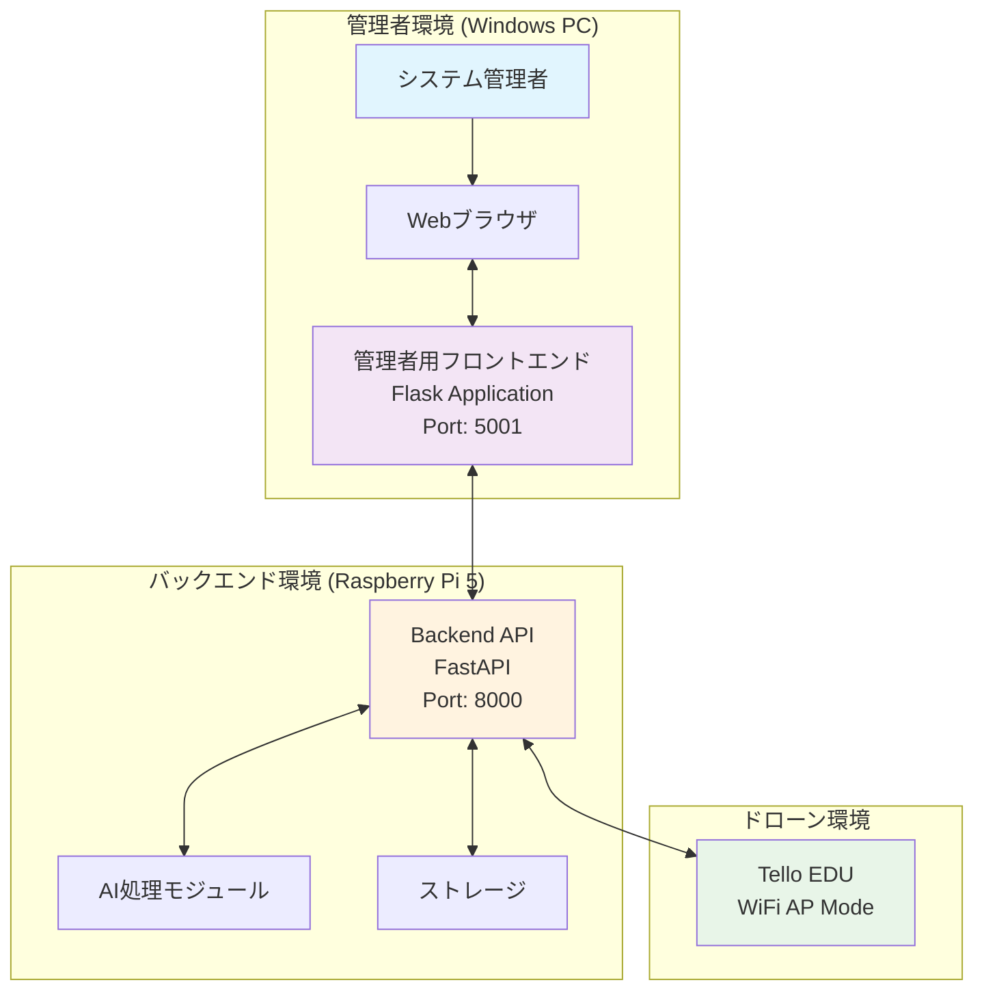
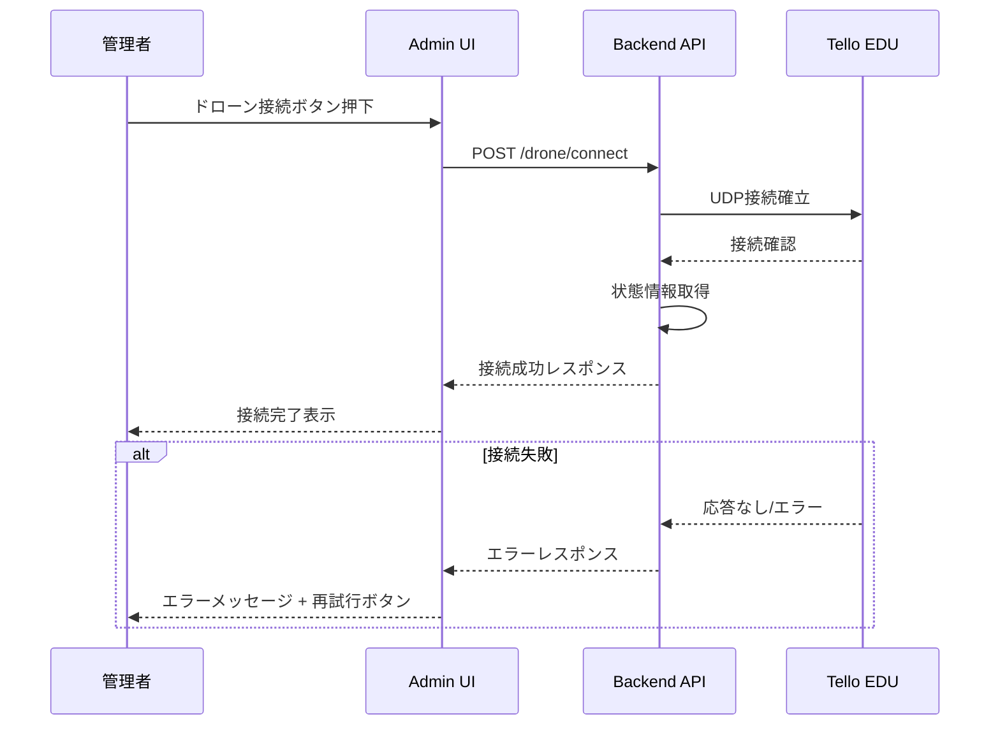
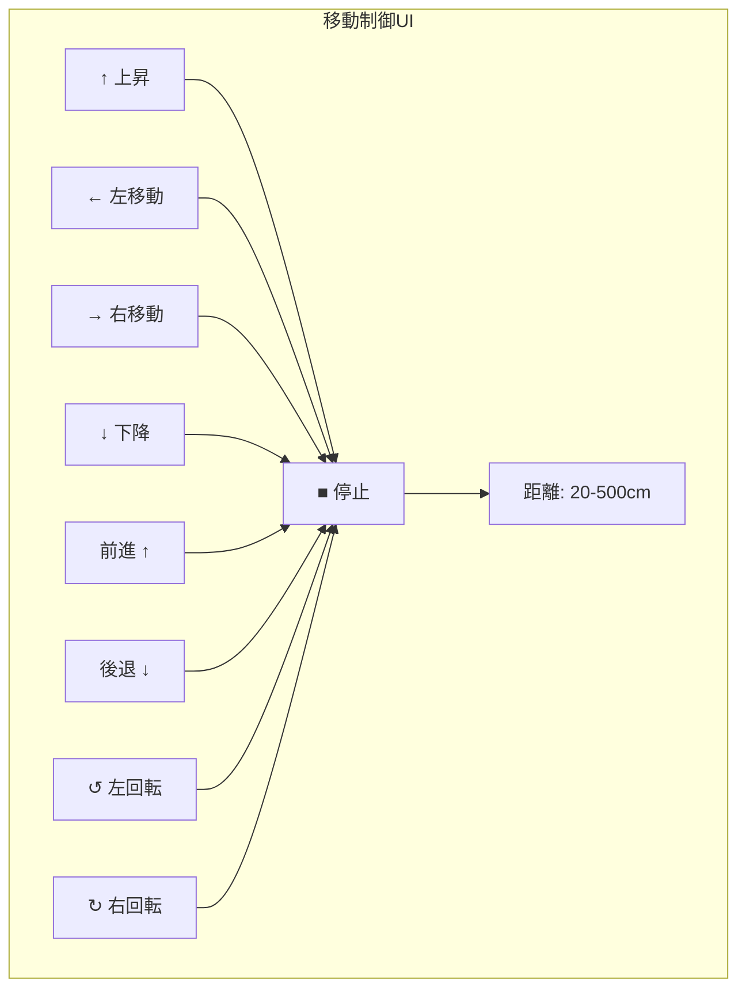
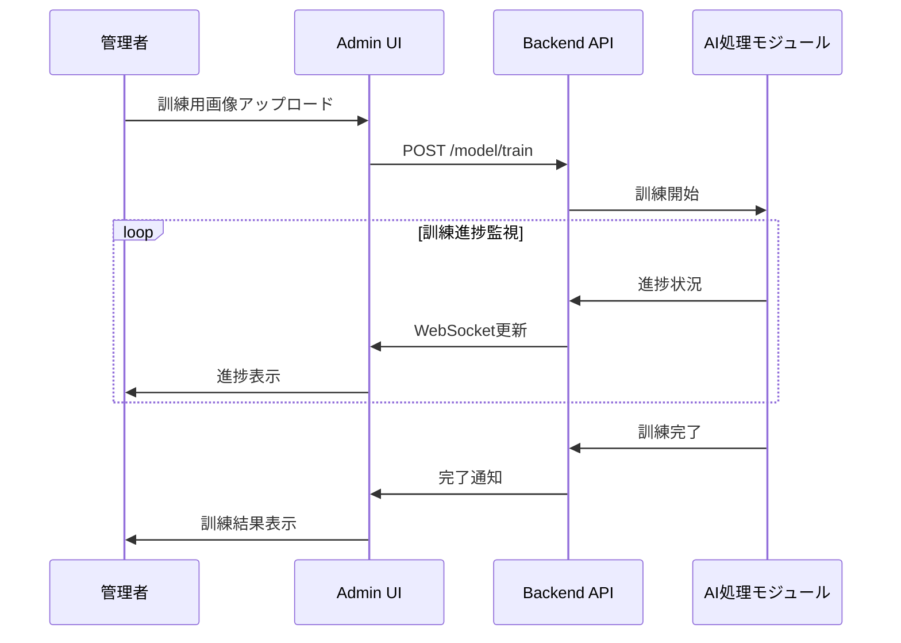
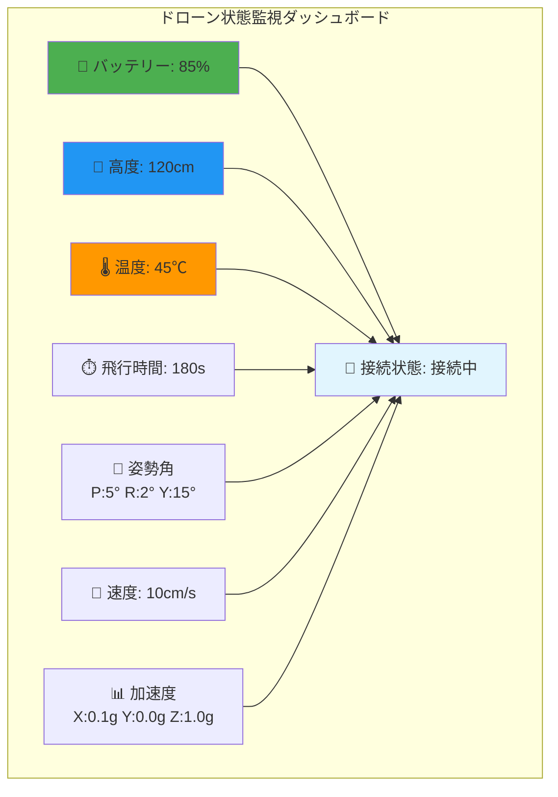
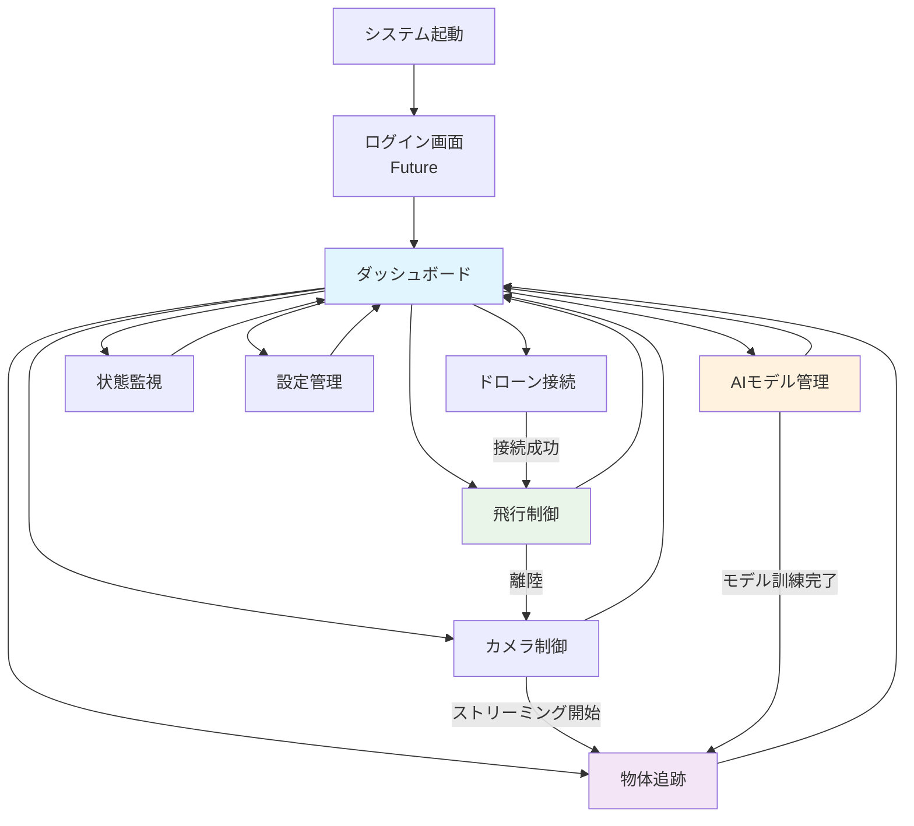
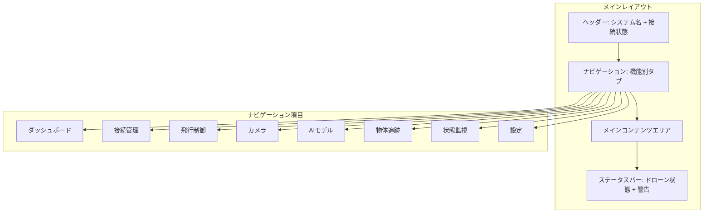

# 管理者用フロントエンド - ユースケース設計

## 概要

MFG Drone 管理者用フロントエンドは、Tello EDU ドローンの自動追従撮影システムを管理・制御するためのWebアプリケーションです。管理者は物体認識モデルの訓練、ドローンの制御、追跡機能の開始/停止など、システム全体の運用管理を行います。

## システム構成

## アクター定義

### 主要アクター
- **システム管理者**: ドローンシステムの全体管理者
- **操縦者**: ドローンの飛行制御を行う者（管理者が兼任）

### 補助アクター
- **Backend API**: システムのバックエンドサービス
- **Tello EDU**: 制御対象のドローン
- **AI処理モジュール**: 物体認識・追跡処理

## 機能分類別ユースケース

### 1. ドローン接続管理機能

#### UC-A01: ドローン接続確立
**概要**: 管理者がTello EDUドローンとの接続を確立する

**アクター**: システム管理者、Tello EDU

**事前条件**:
- Tello EDUの電源が入っている
- WiFiネットワークが利用可能
- Backend APIサーバーが起動している

**基本フロー**:
1. 管理者がAdmin画面の「ドローン接続」ボタンをクリック
2. システムがTello EDUへの接続を試行
3. 接続成功時、ドローン状態情報を取得
4. 接続状態を画面に表示

**代替フロー**:
- **2a**: 接続失敗時、エラーメッセージを表示し再試行オプションを提供
- **3a**: 状態情報取得失敗時、基本接続状態のみ表示

**事後条件**:
- ドローンとの通信チャネルが確立
- ドローン制御機能が有効化

#### UC-A02: ドローン接続切断
**概要**: 管理者がドローンとの接続を安全に切断する

**基本フロー**:
1. 管理者が「接続切断」ボタンをクリック
2. 飛行中の場合、着陸を促すダイアログを表示
3. 管理者が確認後、ドローンとの接続を切断
4. 切断状態を画面に表示

### 2. 基本飛行制御機能

#### UC-B01: 離陸制御
**概要**: 管理者がドローンを離陸させる

**事前条件**:
- ドローンが接続済み
- ドローンが地上にある
- バッテリー残量が十分（20%以上）

**基本フロー**:
1. 管理者が「離陸」ボタンをクリック
2. システムが離陸前チェックを実行
3. チェック通過後、離陸コマンドを送信
4. 離陸完了を確認し、飛行状態を表示

**代替フロー**:
- **2a**: バッテリー不足時、警告メッセージを表示し離陸を拒否
- **3a**: 離陸失敗時、エラーメッセージを表示

#### UC-B02: 着陸制御
**概要**: 管理者がドローンを着陸させる

**事前条件**:
- ドローンが飛行中

**基本フロー**:
1. 管理者が「着陸」ボタンをクリック
2. 着陸コマンドを送信
3. 着陸完了を確認し、地上状態を表示

#### UC-B03: 緊急停止
**概要**: 危険な状況でドローンを緊急停止させる

**事前条件**:
- ドローンが動作中

**基本フロー**:
1. 管理者が「緊急停止」ボタンをクリック
2. 確認ダイアログを表示
3. 管理者が確認後、緊急停止コマンドを送信
4. 緊急停止完了を表示

**UI要件**:
- 緊急停止ボタンは赤色で目立つ配置
- 誤操作防止のため確認ダイアログを表示

#### UC-B04: 基本移動制御
**概要**: 管理者がドローンを手動で移動させる

**事前条件**:
- ドローンが飛行中

**基本フロー**:
1. 管理者が移動方向（上下左右前後）を選択
2. 移動距離を指定（20-500cm）
3. 「移動実行」ボタンをクリック
4. 移動コマンドを送信し、完了を確認

**UI要件**:
- 方向キーまたは矢印ボタンで直感的操作
- 距離入力はスライダーまたは数値入力
- 移動中は他の移動コマンドを無効化

### 3. AIモデル管理機能

#### UC-C01: 学習用画像アップロード
**概要**: 管理者が物体認識モデルの訓練用画像をアップロードする

**事前条件**:
- 学習対象物体の画像が準備済み
- 画像形式がサポート済み（JPEG, PNG）

**基本フロー**:
1. 管理者が「モデル訓練」画面にアクセス
2. 対象オブジェクト名を入力
3. 学習用画像ファイルを選択（複数可）
4. 画像プレビューを確認
5. 「アップロード」ボタンをクリック
6. 画像がBackend APIに送信される

**代替フロー**:
- **3a**: 対応していないファイル形式の場合、エラーメッセージを表示
- **4a**: ファイルサイズが大きすぎる場合、警告を表示

**UI要件**:
- ドラッグ＆ドロップでファイル選択
- 画像プレビューでアップロード内容を確認
- 進捗バーでアップロード状況を表示

#### UC-C02: モデル訓練実行・監視
**概要**: 管理者がAIモデルの訓練を開始し、進捗を監視する

**事前条件**:
- 学習用画像がアップロード済み
- Backend APIが利用可能

**基本フロー**:
1. 管理者が「訓練開始」ボタンをクリック
2. 訓練タスクが開始される
3. 訓練進捗をリアルタイムで表示
4. 訓練完了時、結果を表示

**UI要件**:
- 進捗バーと進捗率の表示
- 訓練ログのリアルタイム表示
- 中断ボタンの提供

#### UC-C03: 利用可能モデル一覧表示
**概要**: 管理者が訓練済みモデルの一覧を確認する

**基本フロー**:
1. 管理者が「モデル管理」タブをクリック
2. 利用可能なモデルの一覧を取得
3. モデル名、作成日時、精度を表示
4. 各モデルの詳細情報を表示

### 4. 物体追跡制御機能

#### UC-D01: 追跡開始
**概要**: 管理者が特定の物体の追跡を開始する

**事前条件**:
- ドローンが飛行中
- 映像ストリーミングが有効
- 利用可能な訓練済みモデルがある

**基本フロー**:
1. 管理者が「追跡制御」画面にアクセス
2. 追跡対象オブジェクトを選択
3. 追跡モード（center/follow）を選択
4. 「追跡開始」ボタンをクリック
5. 物体認識・追跡を開始
6. 追跡状態を画面に表示

**UI要件**:
- リアルタイム映像表示
- 検出した物体の枠線表示
- 追跡状態インジケーター

#### UC-D02: 追跡停止
**概要**: 管理者が物体追跡を停止する

**基本フロー**:
1. 管理者が「追跡停止」ボタンをクリック
2. 追跡処理を停止
3. ドローンを停止状態に変更
4. 追跡停止状態を表示

#### UC-D03: 追跡状態監視
**概要**: 管理者が追跡状況をリアルタイムで監視する

**基本フロー**:
1. 追跡中の画面で状態情報を表示
2. 対象物体の検出状態を表示
3. 物体位置（画面内座標）を表示
4. ドローンの移動状況を表示

### 5. カメラ・映像制御機能

#### UC-E01: 映像ストリーミング制御
**概要**: 管理者がドローンカメラの映像ストリーミングを制御する

**基本フロー**:
1. 管理者が「映像」タブをクリック
2. 「ストリーミング開始」ボタンをクリック
3. リアルタイム映像を表示
4. 必要に応じて「ストリーミング停止」をクリック

#### UC-E02: 写真撮影
**概要**: 管理者がドローンで写真を撮影する

**基本フロー**:
1. 管理者が「写真撮影」ボタンをクリック
2. 撮影コマンドを送信
3. 撮影完了を確認
4. 保存された写真のパスを表示

#### UC-E03: カメラ設定変更
**概要**: 管理者がカメラの設定を変更する

**基本フロー**:
1. 管理者が「カメラ設定」画面にアクセス
2. 解像度、FPS、ビットレートを設定
3. 「設定適用」ボタンをクリック
4. 設定変更を確認

### 6. システム監視機能

#### UC-F01: ドローン状態監視
**概要**: 管理者がドローンの状態をリアルタイムで監視する

**基本フロー**:
1. 管理者が「状態監視」画面にアクセス
2. ドローン状態情報を定期的に取得
3. バッテリー、高度、温度等を表示
4. 異常値の場合、警告を表示

**表示情報**:
- バッテリー残量 (%)
- 飛行高度 (cm)
- 温度 (℃)
- 累積飛行時間 (秒)
- 姿勢角 (ピッチ/ロール/ヨー)
- 速度 (cm/s)
- 加速度 (g)

#### UC-F02: システムヘルスチェック
**概要**: 管理者がシステム全体の健全性を確認する

**基本フロー**:
1. 管理者が「システム状態」画面にアクセス
2. Backend APIの状態を確認
3. ドローン接続状態を確認
4. 各サービスの動作状況を表示

### 7. 設定管理機能

#### UC-G01: WiFi設定変更
**概要**: 管理者がドローンのWiFi接続設定を変更する

**基本フロー**:
1. 管理者が「設定」画面にアクセス
2. WiFi SSID/パスワードを入力
3. 「設定適用」ボタンをクリック
4. 設定変更を確認

#### UC-G02: 飛行パラメータ設定
**概要**: 管理者がドローンの飛行パラメータを設定する

**基本フロー**:
1. 管理者が「飛行設定」画面にアクセス
2. 飛行速度を設定（1.0-15.0 m/s）
3. 「設定適用」ボタンをクリック
4. 設定変更を確認

## 画面遷移図

## 画面レイアウト設計

## 優先度と実装順序

| 優先度 | 機能分類 | ユースケース | 実装理由 |
|--------|---------|-------------|----------|
| 1 | 基本機能 | UC-A01: ドローン接続 | システム動作の前提 |
| 2 | 基本機能 | UC-F01: ドローン状態監視 | 安全運用の必須要件 |
| 3 | 基本機能 | UC-B01,B02,B03: 基本飛行制御 | 手動制御の実現 |
| 4 | 基本機能 | UC-E01: 映像ストリーミング | 視覚的制御の実現 |
| 5 | 発展機能 | UC-C01,C02: AIモデル管理 | 物体認識の準備 |
| 6 | 発展機能 | UC-D01,D02,D03: 物体追跡 | 自動追従の実現 |
| 7 | 補助機能 | UC-E02,E03: 写真・設定 | 運用の利便性向上 |
| 8 | 補助機能 | UC-G01,G02: 設定管理 | システム設定の管理 |

## 技術要件

### フロントエンド技術
- **フレームワーク**: Flask 2.3+ 
- **テンプレートエンジン**: Jinja2
- **UI**: HTML5 + CSS3 + JavaScript ES6+
- **CSSフレームワーク**: Bootstrap 5
- **リアルタイム通信**: WebSocket

### バックエンド連携
- **API通信**: RESTful API (JSON)
- **リアルタイム更新**: WebSocket
- **ファイルアップロード**: multipart/form-data
- **エラーハンドリング**: HTTP ステータスコード + JSON エラー

### 性能要件
- **画面応答時間**: < 1秒
- **リアルタイム更新**: < 100ms
- **ファイルアップロード**: 最大100MB
- **同時接続**: 1管理者セッション

## セキュリティ要件

### 現在の仕様
- 家庭内ネットワーク限定
- HTTP通信（開発段階）

### 将来の拡張
- HTTPS/TLS暗号化
- 認証システム
- セッション管理
- CSRFトークン

## 実装ガイドライン

### コード規約
- PEP 8準拠
- 関数名：snake_case
- クラス名：PascalCase
- 定数：UPPER_CASE

### エラーハンドリング
- Backend APIエラーの適切な処理
- ユーザーフレンドリーなエラーメッセージ
- ログ出力と監視

### テスト方針
- 単体テスト：pytest
- UIテスト：Selenium
- API連携テスト：Mock/Stub使用

この設計書を基に、段階的に管理者用フロントエンドの実装を進めることで、安全で使いやすいドローン制御システムを構築できます。