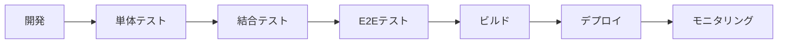

# MFGドローン フロントエンドシステム アーキテクチャ設計書

## 1. 概要

本文書は、MFGドローン自動追従撮影システムのフロントエンドアーキテクチャ設計を定義します。Tello EDUドローンを使用した物体追跡・撮影システムの管理者向けWebUIアプリケーションの技術仕様、実装方針、および非機能要件を規定します。

### 1.1 システム位置づけ

```
┌─────────────────┐    ┌────────────────────┐    ┌──────────────┐
│ フロントエンド   │◄──►│ バックエンドAPI     │◄──►│ Tello EDU    │
│ (Windows 11)    │    │ (Raspberry Pi 5)   │    │ ドローン群    │
│ + iPad Air      │    │ FastAPI + YOLO     │    │ (WiFi経由)   │
└─────────────────┘    └────────────────────┘    └──────────────┘
```

## 2. 技術仕様・実装方式

### 2.1 プログラミング言語・フレームワーク選定

#### 2.1.1 推奨技術スタック：**Node.js + React**

**選定理由：**
- **クロスプラットフォーム対応**: Windows 11とiPad Air（Safari）の両方で最適な体験
- **リアルタイム性**: WebSocketやServer-Sent Eventsとの親和性
- **豊富なエコシステム**: ドローン制御UIに必要なチャート、マップ、カメラライブラリが充実
- **開発効率**: TypeScriptによる型安全性とReactの宣言的UI
- **バックエンド統合**: FastAPIのOpenAPI定義から自動的にクライアントコード生成可能

**技術構成：**
```javascript
// Core
- Node.js 18.x LTS
- React 18.x + TypeScript
- Vite (ビルドツール)

// UI Framework
- Material-UI (MUI) または Ant Design
- Styled-components

// 状態管理
- Redux Toolkit + RTK Query (API統合)
- React Context (軽量な状態)

// リアルタイム通信
- Socket.io-client
- React Query (サーバー状態管理)

// Charts & Visualization
- Chart.js + react-chartjs-2
- React Flow (ドローン制御フロー表示)

// Media & Camera
- React Webcam
- MediaStream API

// Utilities
- Axios (HTTP client)
- Date-fns (日時処理)
- React Hook Form (フォーム管理)
```

#### 2.1.2 代替案：**Python + Streamlit/Dash**

**メリット:**
- バックエンドとの技術統一
- データサイエンス/機械学習UIの構築が容易
- 短期間でのプロトタイプ開発

**デメリット:**
- iPad Airでの操作性に制限
- リアルタイム映像表示のパフォーマンス課題
- モダンなUX/UIの実現が困難

**採用判断**: 管理者専用でデスクトップのみの場合は検討可能

### 2.2 アプリケーション構成

#### 2.2.1 アーキテクチャパターン：**Layered Architecture**

```
┌─────────────────────────────────────────────────────────┐
│                    Presentation Layer                   │
│  ┌─────────────┐ ┌─────────────┐ ┌─────────────────┐    │
│  │ Components  │ │ Pages       │ │ Hooks/Context   │    │
│  │ (UI Parts)  │ │ (Screens)   │ │ (State Logic)   │    │
│  └─────────────┘ └─────────────┘ └─────────────────┘    │
└─────────────────────────────────────────────────────────┘
┌─────────────────────────────────────────────────────────┐
│                    Application Layer                    │
│  ┌─────────────┐ ┌─────────────┐ ┌─────────────────┐    │
│  │ Services    │ │ Stores      │ │ API Clients     │    │
│  │ (Business)  │ │ (State Mgmt)│ │ (REST/WS)      │    │
│  └─────────────┘ └─────────────┘ └─────────────────┘    │
└─────────────────────────────────────────────────────────┘
┌─────────────────────────────────────────────────────────┐
│                   Infrastructure Layer                  │
│  ┌─────────────┐ ┌─────────────┐ ┌─────────────────┐    │
│  │ HTTP Client │ │ WebSocket   │ │ Local Storage   │    │
│  │ (Axios)     │ │ (Socket.io) │ │ (Browser API)   │    │
│  └─────────────┘ └─────────────┘ └─────────────────┘    │
└─────────────────────────────────────────────────────────┘
```

#### 2.2.2 ディレクトリ構造

```
frontend/
├── public/                     # 静的ファイル
│   ├── index.html
│   └── assets/
├── src/
│   ├── components/             # 再利用可能UIコンポーネント
│   │   ├── common/            # 共通コンポーネント
│   │   │   ├── Button/
│   │   │   ├── Modal/
│   │   │   └── Layout/
│   │   ├── drone/             # ドローン関連コンポーネント
│   │   │   ├── DroneCard/
│   │   │   ├── DroneControl/
│   │   │   └── CameraStream/
│   │   ├── vision/            # ビジョン関連コンポーネント
│   │   │   ├── DatasetGrid/
│   │   │   ├── ModelList/
│   │   │   └── TrackingView/
│   │   └── dashboard/         # ダッシュボード関連
│   │       ├── SystemStatus/
│   │       ├── MetricsChart/
│   │       └── AlertPanel/
│   ├── pages/                  # ページコンポーネント
│   │   ├── Login/
│   │   ├── Dashboard/
│   │   ├── DroneManagement/
│   │   ├── DatasetManagement/
│   │   ├── ModelManagement/
│   │   ├── TrackingControl/
│   │   └── Settings/
│   ├── hooks/                  # カスタムReactフック
│   │   ├── useWebSocket.ts
│   │   ├── useDroneStatus.ts
│   │   └── useTrackingStatus.ts
│   ├── services/               # ビジネスロジック
│   │   ├── api/               # API クライアント
│   │   │   ├── droneApi.ts
│   │   │   ├── visionApi.ts
│   │   │   ├── modelApi.ts
│   │   │   └── dashboardApi.ts
│   │   ├── websocket/         # WebSocket管理
│   │   │   └── wsClient.ts
│   │   └── storage/           # ローカルストレージ
│   │       └── localStorage.ts
│   ├── store/                  # 状態管理
│   │   ├── index.ts           # Store設定
│   │   ├── slices/            # Redux Slices
│   │   │   ├── authSlice.ts
│   │   │   ├── droneSlice.ts
│   │   │   ├── visionSlice.ts
│   │   │   └── dashboardSlice.ts
│   │   └── api/               # RTK Query API定義
│   │       └── apiSlice.ts
│   ├── types/                  # TypeScript型定義
│   │   ├── api.ts             # API型定義
│   │   ├── drone.ts
│   │   ├── vision.ts
│   │   └── common.ts
│   ├── utils/                  # ユーティリティ関数
│   │   ├── format.ts
│   │   ├── validation.ts
│   │   └── constants.ts
│   ├── styles/                 # スタイル定義
│   │   ├── global.css
│   │   ├── theme.ts
│   │   └── components/
│   ├── App.tsx
│   └── main.tsx
├── tests/                      # テストファイル
│   ├── __mocks__/
│   ├── components/
│   ├── pages/
│   └── services/
├── package.json
├── tsconfig.json
├── vite.config.ts
├── vitest.config.ts
└── README.md
```

### 2.3 使用パッケージ仕様

#### 2.3.1 主要依存関係

```json
{
  "dependencies": {
    "react": "^18.2.0",
    "react-dom": "^18.2.0",
    "react-router-dom": "^6.8.0",
    "@reduxjs/toolkit": "^1.9.3",
    "react-redux": "^8.0.5",
    "@mui/material": "^5.11.10",
    "@mui/icons-material": "^5.11.9", 
    "@emotion/react": "^11.10.5",
    "@emotion/styled": "^11.10.5",
    "axios": "^1.3.4",
    "socket.io-client": "^4.6.1",
    "chart.js": "^4.2.1",
    "react-chartjs-2": "^5.2.0",
    "react-hook-form": "^7.43.5",
    "@hookform/resolvers": "^2.9.11",
    "yup": "^1.0.2",
    "date-fns": "^2.29.3",
    "react-query": "^3.39.3",
    "react-webcam": "^7.0.1"
  },
  "devDependencies": {
    "@types/react": "^18.0.28",
    "@types/react-dom": "^18.0.11",
    "@vitejs/plugin-react": "^3.1.0",
    "typescript": "^4.9.3",
    "vite": "^4.1.0",
    "vitest": "^0.29.1",
    "@testing-library/react": "^14.0.0",
    "@testing-library/jest-dom": "^5.16.5",
    "eslint": "^8.35.0",
    "@typescript-eslint/eslint-plugin": "^5.54.0",
    "prettier": "^2.8.4"
  }
}
```

#### 2.3.2 パッケージ選定理由

| パッケージ | 目的 | 選定理由 |
|------------|------|----------|
| **Material-UI** | UIコンポーネント | ドローン制御UIに適したコンポーネント豊富、レスポンシブ対応 |
| **Redux Toolkit** | 状態管理 | 複雑なドローン状態管理、RTK Queryでのキャッシュ機能 |
| **Socket.io** | リアルタイム通信 | WebSocket接続の安定性、再接続機能 |
| **Chart.js** | データ可視化 | ドローンテレメトリ、学習進捗の可視化 |
| **React Hook Form** | フォーム管理 | 設定画面、パラメータ入力の効率的処理 |
| **React Webcam** | カメラ制御 | ドローンライブ映像表示 |

## 3. データ永続化方法

### 3.1 クライアントサイドストレージ

#### 3.1.1 ブラウザローカルストレージ

```typescript
interface StorageSchema {
  // ユーザー設定
  userPreferences: {
    theme: 'light' | 'dark';
    language: 'ja' | 'en';
    dashboardLayout: string;
    cameraSettings: CameraConfig;
  };
  
  // セッション情報
  auth: {
    token: string;
    refreshToken: string;
    expiry: number;
  };
  
  // オフライン対応
  cachedData: {
    droneList: Drone[];
    systemStatus: SystemStatus;
    lastUpdated: number;
  };
}
```

#### 3.1.2 データ永続化戦略

```typescript
// services/storage/localStorage.ts
class LocalStorageService {
  private readonly STORAGE_KEY = 'mfg-drone-app';
  
  // ユーザー設定の永続化
  saveUserPreferences(prefs: UserPreferences): void {
    const data = this.getData();
    data.userPreferences = prefs;
    this.setData(data);
  }
  
  // 認証トークンの保存（セキュリティ考慮）
  saveAuthToken(token: string, refreshToken: string): void {
    // httpOnly cookieでの保存を推奨
    // ローカルストレージは開発/テスト用途のみ
  }
  
  // オフライン時のデータキャッシュ
  cacheCriticalData(data: CachedData): void {
    // ドローン状態、アラート情報等の重要データ
    // 5分間のTTLを持つ
  }
}
```

### 3.2 サーバーサイドデータ管理

- **主データ**: バックエンドAPI（FastAPI + SQLite/PostgreSQL）で管理
- **ファイル管理**: 撮影画像、学習モデルファイル
- **ログデータ**: 操作履歴、エラーログ、パフォーマンスメトリクス

## 4. 単体テスト方式

### 4.1 テストフレームワーク：**Vitest + React Testing Library**

#### 4.1.1 テスト構成

```typescript
// tests/__mocks__/handlers.ts - APIモック
import { rest } from 'msw';

export const handlers = [
  rest.get('/api/drones', (req, res, ctx) => {
    return res(ctx.json([
      { id: 'drone-1', name: 'Tello-01', status: 'connected' }
    ]));
  }),
  
  rest.post('/api/drones/:id/takeoff', (req, res, ctx) => {
    return res(ctx.json({ success: true }));
  })
];

// tests/components/DroneCard.test.tsx
import { render, screen, fireEvent } from '@testing-library/react';
import { DroneCard } from '@/components/drone/DroneCard';

describe('DroneCard', () => {
  const mockDrone = {
    id: 'test-drone',
    name: 'Test Drone',
    status: 'connected',
    battery: 85
  };

  it('ドローン情報を正しく表示する', () => {
    render(<DroneCard drone={mockDrone} />);
    
    expect(screen.getByText('Test Drone')).toBeInTheDocument();
    expect(screen.getByText('85%')).toBeInTheDocument();
  });

  it('離陸ボタンクリック時にコールバックが呼ばれる', () => {
    const mockOnTakeoff = vi.fn();
    render(<DroneCard drone={mockDrone} onTakeoff={mockOnTakeoff} />);
    
    fireEvent.click(screen.getByText('離陸'));
    expect(mockOnTakeoff).toHaveBeenCalledWith('test-drone');
  });
});
```

#### 4.1.2 テスト種別・カバレッジ

| テスト種別 | 対象 | カバレッジ目標 |
|------------|------|----------------|
| **Unit Tests** | コンポーネント、ユーティリティ関数 | 90%以上 |
| **Integration Tests** | API統合、状態管理 | 80%以上 |
| **E2E Tests** | ユーザーシナリオ | 主要フロー100% |

```json
// vitest.config.ts
{
  "test": {
    "coverage": {
      "provider": "v8",
      "reporter": ["text", "html", "json"],
      "threshold": {
        "global": {
          "branches": 80,
          "functions": 90,
          "lines": 90,
          "statements": 90
        }
      }
    }
  }
}
```

### 4.2 テストケース設計

#### 4.2.1 極値・異常値テスト

```typescript
// tests/services/droneApi.test.ts
describe('DroneAPI極値テスト', () => {
  it('バッテリー残量0%の場合の処理', async () => {
    const drone = { ...mockDrone, battery: 0 };
    
    render(<DroneCard drone={drone} />);
    
    // 離陸ボタンが無効化されていることを確認
    expect(screen.getByText('離陸')).toBeDisabled();
    expect(screen.getByText('バッテリー不足')).toBeInTheDocument();
  });

  it('ネットワーク接続エラー時のフォールバック', async () => {
    // APIモックでエラーレスポンスを設定
    server.use(
      rest.get('/api/drones', (req, res, ctx) => 
        res(ctx.status(500))
      )
    );

    render(<DroneManagement />);
    
    await waitFor(() => {
      expect(screen.getByText('オフラインモード')).toBeInTheDocument();
    });
  });
});
```

## 5. 結合テスト環境・実行環境構築

### 5.1 開発環境構築

#### 5.1.1 環境構成

```yaml
# docker-compose.dev.yml
version: '3.8'
services:
  frontend-dev:
    build:
      context: ./frontend
      dockerfile: Dockerfile.dev
    ports:
      - "3000:3000"
    volumes:
      - ./frontend:/app
      - /app/node_modules
    environment:
      - VITE_API_BASE_URL=http://localhost:8000
      - VITE_WS_URL=ws://localhost:8000
    depends_on:
      - backend-mock

  backend-mock:
    build:
      context: ./backend
      dockerfile: Dockerfile
    ports:
      - "8000:8000"
    environment:
      - ENVIRONMENT=development
      - ENABLE_DUMMY_DRONE=true
    volumes:
      - ./backend:/app

  test-runner:
    build:
      context: ./frontend
      dockerfile: Dockerfile.test
    volumes:
      - ./frontend:/app
      - ./test-reports:/app/test-reports
    command: npm run test:ci
```

#### 5.1.2 NPMスクリプト設定

```json
{
  "scripts": {
    "dev": "vite",
    "build": "tsc && vite build",
    "test": "vitest",
    "test:ui": "vitest --ui",
    "test:coverage": "vitest --coverage",
    "test:e2e": "playwright test",
    "lint": "eslint src --ext ts,tsx",
    "lint:fix": "eslint src --ext ts,tsx --fix",
    "type-check": "tsc --noEmit",
    "docker:dev": "docker-compose -f docker-compose.dev.yml up",
    "docker:test": "docker-compose -f docker-compose.test.yml up --abort-on-container-exit"
  }
}
```

### 5.2 結合テスト実行環境

#### 5.2.1 テスト自動化（GitHub Actions）

```yaml
# .github/workflows/frontend-ci.yml
name: Frontend CI

on:
  push:
    branches: [main, develop]
    paths: ['frontend/**']
  pull_request:
    paths: ['frontend/**']

jobs:
  test:
    runs-on: ubuntu-latest
    steps:
      - uses: actions/checkout@v3
      
      - name: Setup Node.js
        uses: actions/setup-node@v3
        with:
          node-version: 18
          cache: 'npm'
          cache-dependency-path: frontend/package-lock.json
      
      - name: Install dependencies
        run: cd frontend && npm ci
      
      - name: Type check
        run: cd frontend && npm run type-check
      
      - name: Lint
        run: cd frontend && npm run lint
      
      - name: Unit tests
        run: cd frontend && npm run test:coverage
      
      - name: Build
        run: cd frontend && npm run build
      
      - name: Upload coverage
        uses: codecov/codecov-action@v3
        with:
          file: ./frontend/coverage/coverage-final.json

  e2e-test:
    runs-on: ubuntu-latest
    steps:
      - uses: actions/checkout@v3
      
      - name: Start test environment
        run: docker-compose -f docker-compose.test.yml up -d
      
      - name: Run E2E tests
        run: cd frontend && npm run test:e2e
      
      - name: Stop test environment
        run: docker-compose -f docker-compose.test.yml down
```

#### 5.2.2 ドローンなしテスト環境

```typescript
// tests/setup/mockDroneEnvironment.ts
export class MockDroneEnvironment {
  private wsServer: WebSocketServer;
  private httpServer: Express;
  
  async setup(): Promise<void> {
    // モックバックエンドAPI起動
    this.httpServer = createMockAPIServer();
    
    // モックWebSocketサーバー起動
    this.wsServer = createMockWebSocketServer();
    
    // ダミーテレメトリデータ送信開始
    this.startDummyTelemetryStream();
  }
  
  simulateDroneScenario(scenario: DroneScenario): void {
    switch(scenario) {
      case 'battery_low':
        this.sendTelemetry({ battery: 15, status: 'warning' });
        break;
      case 'connection_lost':
        this.wsServer.close();
        break;
      case 'emergency_landing':
        this.sendTelemetry({ status: 'emergency_landing' });
        break;
    }
  }
}
```

## 6. 非機能要件

### 6.1 パフォーマンス要件

| 項目 | 要件 | 実装方法 |
|------|------|----------|
| **初期表示時間** | 3秒以内 | Code Splitting、Lazy Loading |
| **ライブ映像遅延** | 500ms以内 | WebRTC、最適化されたStreaming |
| **操作レスポンス** | 100ms以内 | UI状態の即座更新、楽観的更新 |
| **同時接続ドローン** | 最大10台 | 効率的な状態管理、メモリ最適化 |

#### 6.1.1 最適化実装

```typescript
// components/CameraStream/index.tsx - パフォーマンス最適化
import { memo, useCallback } from 'react';

export const CameraStream = memo(({ droneId }: { droneId: string }) => {
  const { stream, isConnected } = useWebcamStream(droneId);
  
  // メモ化されたイベントハンドラ
  const handleStreamError = useCallback((error: Error) => {
    console.error(`Stream error for drone ${droneId}:`, error);
    // エラー処理
  }, [droneId]);
  
  return (
    <div className="camera-stream">
      {isConnected ? (
        <video
          ref={stream}
          autoPlay
          muted
          playsInline // iOS対応
          onError={handleStreamError}
        />
      ) : (
        <div className="stream-placeholder">
          接続中...
        </div>
      )}
    </div>
  );
});
```

### 6.2 セキュリティ要件

#### 6.2.1 認証・認可

```typescript
// services/auth/authService.ts
class AuthService {
  private readonly JWT_STORAGE_KEY = 'auth_token';
  
  async login(credentials: LoginCredentials): Promise<AuthResult> {
    // API認証
    const response = await this.apiClient.post('/auth/login', credentials);
    
    // JWTトークン検証
    const token = this.validateJWT(response.data.token);
    
    // httpOnly cookieに保存（推奨）
    document.cookie = `auth_token=${token}; httpOnly; secure; sameSite=strict`;
    
    return { user: response.data.user, token };
  }
  
  // CSRF対策
  private generateCSRFToken(): string {
    return crypto.randomUUID();
  }
}
```

#### 6.2.2 入力検証・サニタイゼーション

```typescript
// utils/validation.ts
import { z } from 'zod';

export const DroneCommandSchema = z.object({
  droneId: z.string().regex(/^[a-zA-Z0-9_-]+$/),
  command: z.enum(['takeoff', 'land', 'move', 'rotate']),
  parameters: z.object({
    direction: z.enum(['up', 'down', 'left', 'right', 'forward', 'back']).optional(),
    distance: z.number().min(20).max(500).optional(),
    angle: z.number().min(1).max(360).optional()
  }).optional()
});

// コンポーネントでの使用
export const DroneControlPanel = ({ droneId }: { droneId: string }) => {
  const sendCommand = async (command: unknown) => {
    try {
      // 入力検証
      const validCommand = DroneCommandSchema.parse({
        droneId,
        ...command
      });
      
      await droneApi.sendCommand(validCommand);
    } catch (error) {
      if (error instanceof z.ZodError) {
        showValidationError(error.errors);
      }
    }
  };
};
```

### 6.3 ユーザビリティ要件

#### 6.3.1 レスポンシブ対応

```typescript
// styles/breakpoints.ts
export const breakpoints = {
  mobile: '320px',
  tablet: '768px',
  desktop: '1024px',
  large: '1440px'
} as const;

// components/Layout/responsive.tsx
import { useMediaQuery } from '@mui/material';

export const ResponsiveLayout = ({ children }: { children: React.ReactNode }) => {
  const isMobile = useMediaQuery('(max-width: 768px)');
  const isTablet = useMediaQuery('(max-width: 1024px)');
  
  return (
    <Box sx={{
      display: 'flex',
      flexDirection: isMobile ? 'column' : 'row',
      padding: isMobile ? 1 : 2
    }}>
      {children}
    </Box>
  );
};
```

#### 6.3.2 アクセシビリティ対応

```typescript
// components/DroneControl/AccessibleButton.tsx
export const DroneControlButton = ({
  action,
  disabled,
  onClick
}: DroneControlButtonProps) => {
  return (
    <Button
      variant="contained"
      disabled={disabled}
      onClick={onClick}
      aria-label={`ドローンを${action}する`}
      aria-describedby={`${action}-description`}
      sx={{
        minHeight: 44, // タッチターゲットサイズ
        fontSize: '1rem'
      }}
    >
      {action}
      <span id={`${action}-description`} className="sr-only">
        {disabled ? '現在実行できません' : `${action}コマンドを実行します`}
      </span>
    </Button>
  );
};
```

### 6.4 可用性要件

#### 6.4.1 オフライン対応

```typescript
// hooks/useOfflineSupport.ts
export const useOfflineSupport = () => {
  const [isOnline, setIsOnline] = useState(navigator.onLine);
  const [cachedData, setCachedData] = useState<CachedData | null>(null);
  
  useEffect(() => {
    const handleOnline = () => {
      setIsOnline(true);
      // オンライン復帰時のデータ同期
      syncCachedData();
    };
    
    const handleOffline = () => {
      setIsOnline(false);
      // オフライン時の重要データキャッシュ
      cacheEssentialData();
    };
    
    window.addEventListener('online', handleOnline);
    window.addEventListener('offline', handleOffline);
    
    return () => {
      window.removeEventListener('online', handleOnline);
      window.removeEventListener('offline', handleOffline);
    };
  }, []);
  
  return { isOnline, cachedData };
};
```

#### 6.4.2 エラーハンドリング・リカバリ

```typescript
// components/ErrorBoundary.tsx
class DroneAppErrorBoundary extends React.Component<Props, State> {
  constructor(props: Props) {
    super(props);
    this.state = { hasError: false, error: null };
  }
  
  static getDerivedStateFromError(error: Error): State {
    return { hasError: true, error };
  }
  
  componentDidCatch(error: Error, errorInfo: ErrorInfo) {
    // エラーログ送信
    errorReportingService.reportError(error, {
      ...errorInfo,
      userAgent: navigator.userAgent,
      timestamp: new Date().toISOString()
    });
  }
  
  render() {
    if (this.state.hasError) {
      return (
        <ErrorFallback 
          error={this.state.error}
          onRetry={() => this.setState({ hasError: false, error: null })}
        />
      );
    }
    
    return this.props.children;
  }
}
```

## 7. 開発・デプロイメント戦略

### 7.1 開発フロー



### 7.2 プロダクションビルド

```dockerfile
# Dockerfile.prod
FROM node:18-alpine AS builder

WORKDIR /app
COPY package*.json ./
RUN npm ci --only=production

COPY . .
RUN npm run build

FROM nginx:alpine
COPY --from=builder /app/dist /usr/share/nginx/html
COPY nginx.conf /etc/nginx/nginx.conf

EXPOSE 80
CMD ["nginx", "-g", "daemon off;"]
```

### 7.3 監視・ログ収集

```typescript
// services/monitoring/analytics.ts
export class FrontendMonitoring {
  // パフォーマンス監視
  trackPageLoad(pageName: string, loadTime: number): void {
    analytics.track('page_load', {
      page: pageName,
      load_time: loadTime,
      user_agent: navigator.userAgent
    });
  }
  
  // エラー追跡
  trackError(error: Error, context: ErrorContext): void {
    analytics.track('frontend_error', {
      message: error.message,
      stack: error.stack,
      page: window.location.pathname,
      ...context
    });
  }
  
  // ユーザー行動分析
  trackDroneOperation(operation: string, success: boolean): void {
    analytics.track('drone_operation', {
      operation,
      success,
      timestamp: new Date().toISOString()
    });
  }
}
```

## 8. 今後の拡張方針

### 8.1 Phase 1（MVP実装）
- 基本的なドローン制御UI
- ダッシュボード機能
- 認証・セキュリティ

### 8.2 Phase 2（機能拡張）
- データセット管理UI
- 機械学習モデル管理
- 高度な映像処理機能

### 8.3 Phase 3（最適化・運用）
- パフォーマンス最適化
- 詳細監視・アラート機能
- マルチテナント対応

---

**文書情報**
- 作成日: 2025-07-03
- 作成者: Claude Code
- バージョン: 1.0
- ステータス: 提案・検討段階