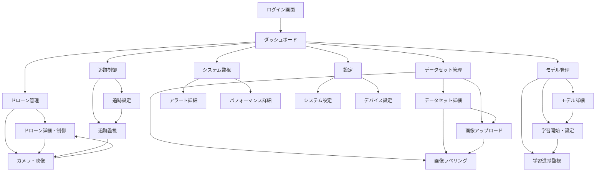

# フロントエンド画面設計提案書

## 概要

本文書は、MFGドローン自動追従撮影システムの管理者用フロントエンドのWeb UI設計提案です。
バックエンドAPIサーバと連携し、ドローン制御、物体認識モデルの訓練・管理、追跡開始/停止、システム監視を行う包括的な管理インターフェースを提供します。

## 1. 必要機能一覧

### 1.1. 認証・セキュリティ機能
- **API-01** APIキー認証
- **API-02** セッション管理
- **API-03** 接続状態表示・管理

### 1.2. ドローン管理機能
- **DRN-01** ドローン一覧表示・検索
- **DRN-02** ドローン接続・切断
- **DRN-03** ドローン状態監視（バッテリー、飛行状態、高度、温度等）
- **DRN-04** 手動飛行制御（離陸、着陸、移動、回転）
- **DRN-05** 緊急停止機能
- **DRN-06** ドローン登録・設定管理

### 1.3. カメラ・映像機能
- **CAM-01** カメラストリーミング開始・停止
- **CAM-02** リアルタイム映像表示
- **CAM-03** 写真撮影・保存
- **CAM-04** 撮影画像一覧・管理

### 1.4. 物体認識・データセット管理機能
- **DST-01** データセット作成・削除
- **DST-02** データセット一覧表示・検索
- **DST-03** 画像アップロード（ドラッグ&ドロップ対応）
- **DST-04** 画像ラベリング・編集
- **DST-05** データセット統計表示
- **DST-06** 外部画像インポート機能

### 1.5. モデル管理・学習機能  
- **MDL-01** 学習済みモデル一覧表示
- **MDL-02** モデル学習開始・停止
- **MDL-03** 学習進捗監視（リアルタイム）
- **MDL-04** 学習パラメータ設定
- **MDL-05** モデル精度・性能評価表示
- **MDL-06** モデル削除・エクスポート

### 1.6. 物体追跡機能
- **TRK-01** 追跡開始・停止
- **TRK-02** 追跡対象選択（モデル・信頼度設定）
- **TRK-03** 追跡状態監視（対象検出状態、位置）
- **TRK-04** 追跡パラメータ調整（追従距離等）
- **TRK-05** リアルタイム物体検出表示

### 1.7. システム監視・ダッシュボード機能
- **SYS-01** システム状態監視（CPU、メモリ、ディスク使用率）
- **SYS-02** 接続ドローン数表示
- **SYS-03** アクティブ追跡数表示
- **SYS-04** 実行中学習ジョブ数表示
- **SYS-05** アラート・通知管理
- **SYS-06** パフォーマンスメトリクス表示
- **SYS-07** ログ表示・フィルタリング

### 1.8. 設定・管理機能
- **CFG-01** システム設定管理
- **CFG-02** デバイス設定管理
- **CFG-03** ユーザー設定保存・復元
- **CFG-04** バックアップ・復元機能

## 2. 画面遷移図

## 3. 画面一覧と機能マッピング

| 画面名 | 画面概要 | 実装機能 | 主要API |
|--------|----------|----------|---------|
| **ログイン画面** | システム認証 | API-01, API-02, API-03 | - |
| **ダッシュボード** | システム全体監視 | SYS-01～07, DRN-03 | `/api/dashboard/system`, `/api/dashboard/drones` |
| **ドローン管理** | ドローン一覧・選択 | DRN-01, DRN-06 | `/api/drones` |
| **ドローン詳細・制御** | 個別ドローン操作 | DRN-02～05 | `/api/drones/{id}/*` |
| **カメラ・映像** | 映像表示・撮影 | CAM-01～04 | `/api/drones/{id}/camera/*` |
| **データセット管理** | データセット一覧 | DST-01, DST-02, DST-05 | `/api/vision/datasets` |
| **データセット詳細** | データセット編集 | DST-03, DST-04, DST-06 | `/api/vision/datasets/{id}/*` |
| **画像アップロード** | 画像追加インターフェース | DST-03, DST-06 | `/api/vision/datasets/{id}/images` |
| **画像ラベリング** | 画像注釈・編集 | DST-04 | `/api/vision/datasets/{id}/images` |
| **モデル管理** | 学習済みモデル一覧 | MDL-01, MDL-06 | `/api/models` |
| **モデル詳細** | モデル情報・評価 | MDL-05 | `/api/models/{id}` |
| **学習開始・設定** | 学習パラメータ設定 | MDL-02, MDL-04 | `/api/models` |
| **学習進捗監視** | 学習状況表示 | MDL-03 | `/api/models/training/{id}` |
| **追跡設定** | 追跡パラメータ設定 | TRK-01, TRK-02, TRK-04 | `/api/vision/tracking/start` |
| **追跡監視** | 追跡状況表示 | TRK-03, TRK-05 | `/api/vision/tracking/status` |
| **システム監視** | 詳細監視画面 | SYS-01～07 | `/api/dashboard/system` |
| **アラート詳細** | アラート管理 | SYS-05 | 将来実装 |
| **パフォーマンス詳細** | 詳細メトリクス | SYS-06 | 将来実装 |
| **システム設定** | システム設定管理 | CFG-01, CFG-03 | 将来実装 |
| **デバイス設定** | デバイス設定管理 | CFG-02, CFG-04 | 将来実装 |

## 4. 技術要件

### 4.1. フロントエンド技術スタック
- **基盤**: HTML5, CSS3, JavaScript (ES6+)
- **UI Framework**: 検討中（React, Vue.js, または Vanilla JS）
- **CSS Framework**: Bootstrap 5 または Tailwind CSS
- **Charts**: Chart.js, D3.js
- **Real-time**: WebSocket または Server-Sent Events
- **Icons**: Font Awesome

### 4.2. レスポンシブ対応
- デスクトップ（1920x1080以上）
- タブレット（iPad Air 13インチ対応）
- モバイル（最小幅320px）

### 4.3. ブラウザ対応
- Chrome 90+
- Firefox 88+
- Safari 14+
- Edge 90+

## 5. 開発フェーズ提案

### Phase 1: 基盤機能（MVP）
- ログイン・認証
- ダッシュボード
- ドローン基本制御
- カメラ映像表示

### Phase 2: データ管理機能
- データセット管理
- 画像アップロード・ラベリング
- モデル一覧表示

### Phase 3: AI機能
- モデル学習・監視
- 物体検出・追跡

### Phase 4: 高度機能
- 詳細設定・カスタマイズ
- アラート・通知機能
- パフォーマンス最適化

## 6. UI/UX設計方針

### 6.1. デザイン原則
- **直感的操作**: 専門知識なしでも操作可能
- **リアルタイム性**: 状態変化の即座な反映
- **安全性**: 誤操作防止（確認ダイアログ等）
- **効率性**: 頻繁な操作の最適化

### 6.2. カラーシステム
- Primary: ドローン制御・重要操作
- Success: 正常状態・完了
- Warning: 注意・警告
- Danger: 緊急・エラー
- Info: 情報・補助

### 6.3. レイアウト構成
- **ヘッダー**: ナビゲーション・ユーザー情報
- **サイドバー**: 主要機能メニュー
- **メインエリア**: コンテンツ表示
- **フッター**: システム情報・ステータス

## 7. セキュリティ考慮事項

- APIキー認証の実装
- CSRF対策
- XSS対策
- 入力値検証・サニタイズ
- HTTPS通信の強制

## 8. 次のステップ

1. **技術選定**: フロントエンドフレームワークの決定
2. **プロトタイプ作成**: 主要画面のワイヤーフレーム作成
3. **API連携テスト**: バックエンドとの結合テスト
4. **ユーザビリティテスト**: 実際の運用を想定したテスト

---

**作成日**: 2025-07-02  
**作成者**: Claude Code  
**バージョン**: 1.0  
**ステータス**: 提案・検討段階