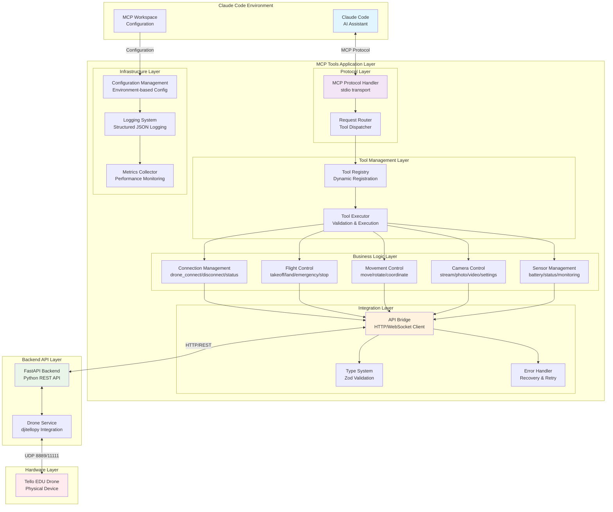
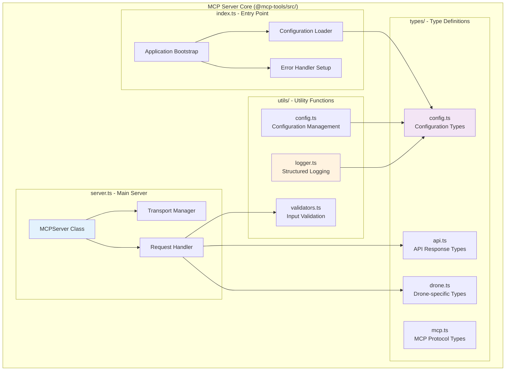
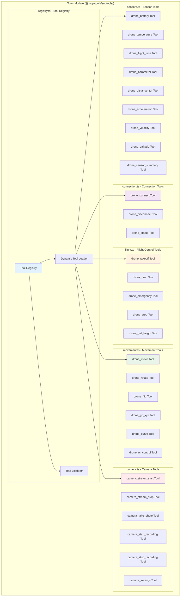
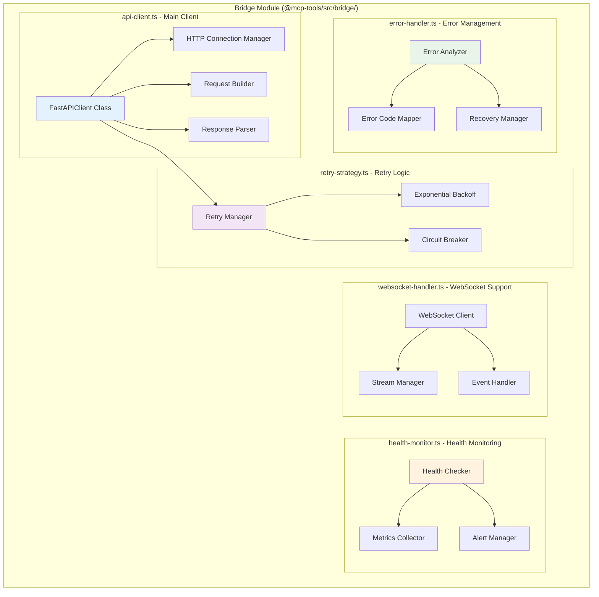
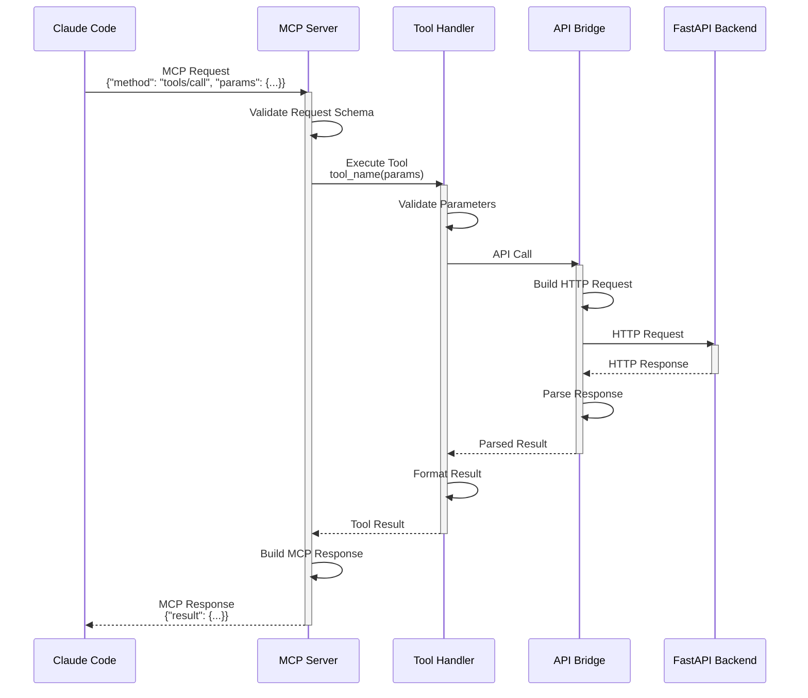
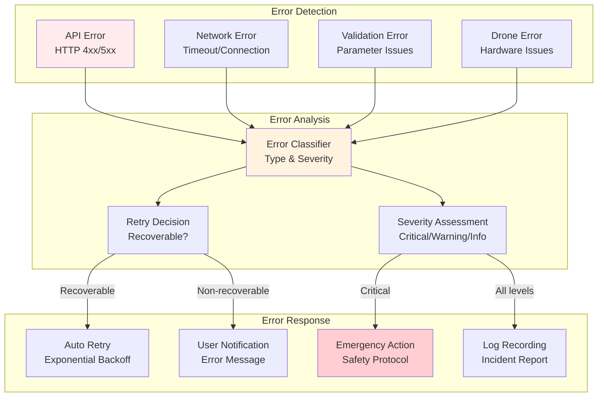
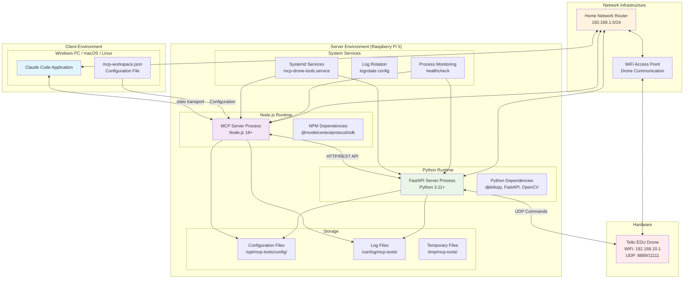
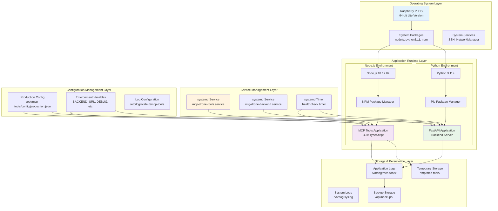
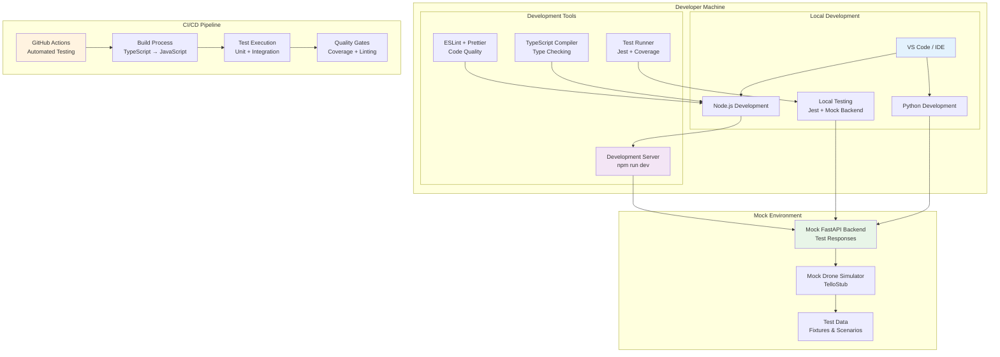

# MCPツール アーキテクチャ仕様書

## 概要

MCPツールシステムのアーキテクチャ仕様を、アプリケーションアーキテクチャとインフラストラクチャアーキテクチャの両面から詳細に定義します。本システムは、Claude Code によるドローン制御を実現するための分散システムです。

## アプリケーションアーキテクチャ

### 全体アーキテクチャ概要



### モジュール・コンポーネント構成

#### 1. MCP Server Core Module



#### 2. Tool Management Module



#### 3. API Bridge Module



### データフロー・処理パターン

#### Request-Response パターン



#### Error Handling パターン



## インフラストラクチャアーキテクチャ

### システム構成図



### デプロイメント構成

#### Production Environment (Raspberry Pi 5)



#### Development Environment



### ネットワーク構成

#### Communication Protocols & Ports

```mermaid
graph TB
    subgraph "Client Network"
        ClientPC[Client PC<br/>192.168.1.100]
    end
    
    subgraph "Server Network"
        RaspberryPi[Raspberry Pi 5<br/>192.168.1.101]
        MCPServerPort[MCP Server<br/>stdio (no network port)]
        FastAPIPort[FastAPI Backend<br/>:8000 HTTP]
        HealthCheckPort[Health Check<br/>:8000/health]
    end
    
    subgraph "Drone Network"
        TelloDrone[Tello EDU<br/>192.168.10.1]
        ControlPort[Control Commands<br/>UDP :8889]
        VideoPort[Video Stream<br/>UDP :11111]
    end
    
    subgraph "Network Infrastructure"
        Router[Home Router<br/>192.168.1.1]
        WiFiNetwork[WiFi Network<br/>SSID: home_network]
        DroneWiFi[Drone WiFi AP<br/>SSID: TELLO-XXXXXX]
    end

    ClientPC <-->|MCP stdio| MCPServerPort
    MCPServerPort <-->|HTTP :8000| FastAPIPort
    FastAPIPort <-->|Health Check| HealthCheckPort
    
    FastAPIPort <-->|UDP :8889| ControlPort
    FastAPIPort <-->|UDP :11111| VideoPort
    
    ClientPC <--> Router
    RaspberryPi <--> Router
    Router <--> WiFiNetwork
    WiFiNetwork <--> DroneWiFi
    ControlPort <--> TelloDrone
    VideoPort <--> TelloDrone

    style ClientPC fill:#e1f5fe
    style MCPServerPort fill:#f3e5f5
    style FastAPIPort fill:#e8f5e8
    style TelloDrone fill:#ffebee
```

#### Security & Firewall Configuration

```mermaid
graph TB
    subgraph "Security Layers"
        subgraph "Network Security"
            FirewallRules[Firewall Rules<br/>iptables / ufw]
            NetworkSegmentation[Network Segmentation<br/>IoT Device Isolation]
            WiFiSecurity[WiFi Security<br/>WPA3 Encryption]
        end
        
        subgraph "Application Security"
            InputValidation[Input Validation<br/>Zod Schema Validation]
            APIAuthentication[API Authentication<br/>Future: API Keys]
            RateLimiting[Rate Limiting<br/>Request Throttling]
        end
        
        subgraph "System Security"
            UserPermissions[User Permissions<br/>Non-root Execution]
            FilePermissions[File Permissions<br/>Secure Configuration]
            LogSecurity[Log Security<br/>Secure Log Access]
        end
        
        subgraph "Monitoring & Alerts"
            SecurityLogging[Security Logging<br/>Access & Error Logs]
            IntrusionDetection[Intrusion Detection<br/>Fail2ban]
            HealthMonitoring[Health Monitoring<br/>System Status]
        end
    end

    FirewallRules -->|Block unauthorized| NetworkSegmentation
    NetworkSegmentation -->|Isolate IoT| WiFiSecurity
    
    InputValidation -->|Validate MCP calls| APIAuthentication
    APIAuthentication -->|Limit access| RateLimiting
    
    UserPermissions -->|Restrict access| FilePermissions
    FilePermissions -->|Secure config| LogSecurity
    
    SecurityLogging -->|Monitor access| IntrusionDetection
    IntrusionDetection -->|Alert on issues| HealthMonitoring

    style FirewallRules fill:#ffebee
    style InputValidation fill:#fff3e0
    style UserPermissions fill:#e8f5e8
    style SecurityLogging fill:#e1f5fe
```



### 運用・監視

#### System Monitoring

```mermaid
graph TB
    subgraph "Performance Monitoring"
        CPUMonitoring[CPU Usage<br/>System Load]
        MemoryMonitoring[Memory Usage<br/>Heap & RSS]
        NetworkMonitoring[Network I/O<br/>Bandwidth Usage]
        DiskMonitoring[Disk I/O<br/>Storage Usage]
    end
    
    subgraph "Application Monitoring"
        MCPMetrics[MCP Server Metrics<br/>Request Count & Latency]
        APIMetrics[API Bridge Metrics<br/>Success Rate & Response Time]
        DroneMetrics[Drone Metrics<br/>Connection Status & Battery]
        ErrorMetrics[Error Metrics<br/>Error Rate & Types]
    end
    
    subgraph "Health Checks"
        SystemHealth[System Health<br/>Service Status]
        ApplicationHealth[Application Health<br/>Component Status]
        ExternalHealth[External Health<br/>Drone Connectivity]
        EndToEndHealth[End-to-End Health<br/>Full Flow Test]
    end
    
    subgraph "Alerting System"
        CriticalAlerts[Critical Alerts<br/>System Down / Emergency]
        WarningAlerts[Warning Alerts<br/>Performance Degradation]
        InfoAlerts[Info Alerts<br/>Status Changes]
        AlertChannels[Alert Channels<br/>Log Files / Email (Future)]
    end

    CPUMonitoring --> SystemHealth
    MemoryMonitoring --> SystemHealth
    NetworkMonitoring --> ApplicationHealth
    DiskMonitoring --> SystemHealth
    
    MCPMetrics --> ApplicationHealth
    APIMetrics --> ApplicationHealth
    DroneMetrics --> ExternalHealth
    ErrorMetrics --> ApplicationHealth
    
    SystemHealth --> CriticalAlerts
    ApplicationHealth --> WarningAlerts
    ExternalHealth --> CriticalAlerts
    EndToEndHealth --> WarningAlerts
    
    CriticalAlerts --> AlertChannels
    WarningAlerts --> AlertChannels
    InfoAlerts --> AlertChannels

    style CPUMonitoring fill:#e3f2fd
    style MCPMetrics fill:#f3e5f5
    style SystemHealth fill:#e8f5e8
    style CriticalAlerts fill:#ffebee
```

### スケーラビリティ・可用性

#### High Availability Considerations

```mermaid
graph TB
    subgraph "Redundancy Planning"
        ServiceRedundancy[Service Redundancy<br/>Multiple MCP Server Instances]
        DataBackup[Data Backup<br/>Configuration & Logs]
        FailoverPlanning[Failover Planning<br/>Backup Raspberry Pi]
    end
    
    subgraph "Load Management"
        ConnectionPooling[Connection Pooling<br/>HTTP Client Optimization]
        RequestQueueing[Request Queueing<br/>Async Processing]
        ResourceManagement[Resource Management<br/>Memory & CPU Limits]
    end
    
    subgraph "Recovery Mechanisms"
        AutoRestart[Auto Restart<br/>Systemd Service Recovery]
        GracefulShutdown[Graceful Shutdown<br/>Clean Process Termination]
        StateRecovery[State Recovery<br/>Connection Re-establishment]
    end
    
    subgraph "Capacity Planning"
        ConcurrentConnections[Concurrent Connections<br/>Multiple Claude Instances]
        DroneFleet[Drone Fleet<br/>Multi-Drone Support (Future)]
        CloudIntegration[Cloud Integration<br/>Remote MCP Server (Future)]
    end

    ServiceRedundancy --> AutoRestart
    DataBackup --> StateRecovery
    FailoverPlanning --> GracefulShutdown
    
    ConnectionPooling --> RequestQueueing
    RequestQueueing --> ResourceManagement
    
    AutoRestart --> GracefulShutdown
    GracefulShutdown --> StateRecovery
    
    ConcurrentConnections --> DroneFleet
    DroneFleet --> CloudIntegration

    style ServiceRedundancy fill:#e3f2fd
    style ConnectionPooling fill:#f3e5f5
    style AutoRestart fill:#e8f5e8
    style ConcurrentConnections fill:#fff3e0
```

## 技術仕様詳細

### パフォーマンス要件

| 項目 | 要件 | 測定方法 |
|------|------|----------|
| MCP Tool Response | < 50ms | Claude → MCP Server → Response |
| API Bridge Latency | < 100ms | MCP → FastAPI → Response |
| Drone Command Execution | < 200ms | API → Drone → Confirmation |
| Emergency Stop Response | < 500ms | 最優先処理での応答時間 |
| Video Stream Latency | < 150ms | フレーム取得から配信まで |
| Battery Monitoring Frequency | 30秒間隔 | 定期バッテリー状態取得 |
| Memory Usage (MCP Server) | < 256MB | RSS Memory |
| Memory Usage (API Bridge) | < 128MB | HTTP Client Memory |
| CPU Usage (Normal Operation) | < 30% | Raspberry Pi 5 CPU |
| Disk Storage (Logs) | < 1GB/month | Log file rotation |

### 信頼性要件

| 項目 | 要件 | 実装方法 |
|------|------|----------|
| System Uptime | 99.5% | Systemd auto-restart |
| Request Success Rate | > 95% | Retry mechanism |
| Error Recovery Time | < 30秒 | Automatic recovery |
| Data Persistence | 100% | Structured logging |
| Connection Recovery | < 10秒 | Auto-reconnection |
| Graceful Degradation | 対応済み | Fallback mechanisms |

### セキュリティ要件

| 項目 | 要件 | 実装状況 |
|------|------|----------|
| Input Validation | 全パラメータ | Zod schema validation |
| Authentication | 基本実装 | Local network only |
| Authorization | 基本実装 | Tool-level permissions |
| Audit Logging | 完全実装 | Structured JSON logs |
| Data Encryption | 将来実装 | HTTPS/TLS support |
| Network Security | 基本実装 | Firewall rules |