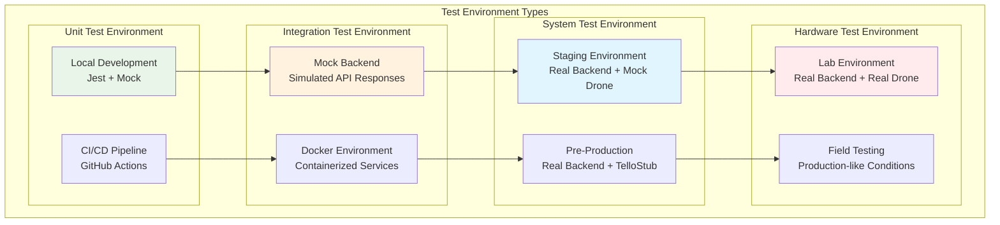
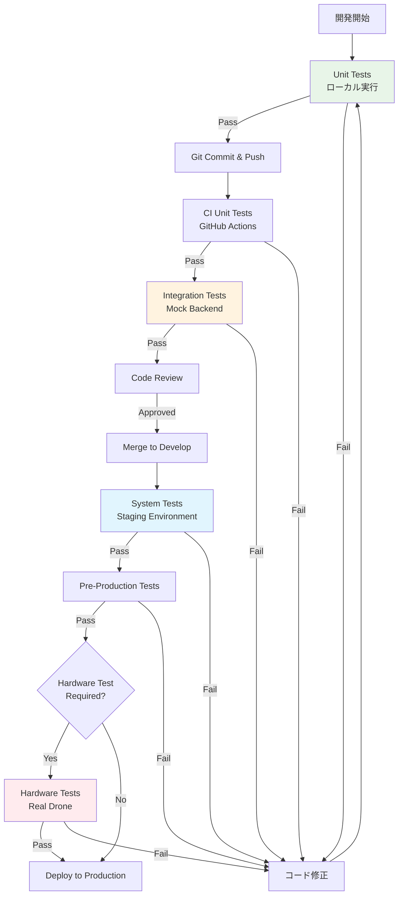

# MCPツール 開発方針

## 概要

MCPツールシステムの開発、実行、テスト環境に関する包括的なガイドラインを定義します。開発者がプロジェクトに参加し、効率的に開発を進めるための技術仕様、環境設定、ベストプラクティスを提供します。

## 開発環境情報

### 開発言語・フレームワーク

#### 主要技術スタック

| コンポーネント | 技術 | バージョン | 用途 |
|-------------|------|----------|------|
| **MCP Server** | TypeScript | 5.0+ | メインアプリケーション |
| **Runtime** | Node.js | 18.17.0+ | JavaScript実行環境 |
| **MCP SDK** | @modelcontextprotocol/sdk | ^0.5.0 | MCP Protocol実装 |
| **HTTP Client** | Axios | ^1.6.0 | API通信 |
| **Validation** | Zod | ^3.22.0 | スキーマ検証 |
| **Testing** | Jest | ^29.7.0 | テストフレームワーク |
| **Linting** | ESLint | ^8.50.0 | コード品質 |
| **Formatting** | Prettier | ^3.0.0 | コードフォーマット |

#### パッケージ管理

```json
{
  "engines": {
    "node": ">=18.17.0",
    "npm": ">=9.0.0"
  },
  "dependencies": {
    "@modelcontextprotocol/sdk": "^0.5.0",
    "axios": "^1.6.0",
    "zod": "^3.22.0",
    "winston": "^3.11.0"
  },
  "devDependencies": {
    "@types/node": "^20.0.0",
    "@typescript-eslint/eslint-plugin": "^6.0.0",
    "@typescript-eslint/parser": "^6.0.0",
    "eslint": "^8.50.0",
    "jest": "^29.7.0",
    "prettier": "^3.0.0",
    "typescript": "^5.0.0"
  }
}
```

### 開発ツール・IDE設定

#### 推奨IDE構成

**Visual Studio Code設定 (.vscode/settings.json)**
```json
{
  "typescript.preferences.importModuleSpecifier": "relative",
  "editor.formatOnSave": true,
  "editor.codeActionsOnSave": {
    "source.fixAll.eslint": true,
    "source.organizeImports": true
  },
  "editor.defaultFormatter": "esbenp.prettier-vscode",
  "typescript.suggest.autoImports": true,
  "jest.autoRun": "watch"
}
```

**推奨拡張機能**
```json
{
  "recommendations": [
    "esbenp.prettier-vscode",
    "dbaeumer.vscode-eslint",
    "ms-vscode.vscode-typescript-next",
    "orta.vscode-jest",
    "bradlc.vscode-tailwindcss",
    "ms-vscode.vscode-json"
  ]
}
```

#### TypeScript設定

**tsconfig.json**
```json
{
  "compilerOptions": {
    "target": "ES2022",
    "module": "ESNext",
    "moduleResolution": "node",
    "outDir": "./dist",
    "rootDir": "./src",
    "strict": true,
    "esModuleInterop": true,
    "skipLibCheck": true,
    "forceConsistentCasingInFileNames": true,
    "declaration": true,
    "declarationMap": true,
    "sourceMap": true,
    "removeComments": false,
    "noImplicitAny": true,
    "noImplicitReturns": true,
    "noImplicitThis": true,
    "noUnusedLocals": true,
    "noUnusedParameters": true
  },
  "include": ["src/**/*"],
  "exclude": ["node_modules", "dist", "tests"]
}
```

#### コード品質設定

**ESLint設定 (.eslintrc.json)**
```json
{
  "extends": [
    "@typescript-eslint/recommended",
    "prettier"
  ],
  "parser": "@typescript-eslint/parser",
  "parserOptions": {
    "ecmaVersion": 2022,
    "sourceType": "module"
  },
  "rules": {
    "@typescript-eslint/no-unused-vars": "error",
    "@typescript-eslint/explicit-function-return-type": "warn",
    "@typescript-eslint/no-explicit-any": "error",
    "prefer-const": "error",
    "no-var": "error"
  }
}
```

**Prettier設定 (.prettierrc)**
```json
{
  "semi": true,
  "trailingComma": "es5",
  "singleQuote": true,
  "printWidth": 100,
  "tabWidth": 2,
  "useTabs": false
}
```

### 開発OS・ハードウェア要件

#### 最小システム要件

| 項目 | 最小要件 | 推奨 |
|------|----------|------|
| **OS** | Windows 10, macOS 12, Ubuntu 20.04 | Windows 11, macOS 13, Ubuntu 22.04 |
| **CPU** | 2コア 2.0GHz | 4コア 3.0GHz |
| **RAM** | 8GB | 16GB |
| **Storage** | 10GB 空き容量 | 20GB SSD |
| **Network** | WiFi 802.11n | WiFi 802.11ac/ax |

#### プラットフォーム別セットアップ

**Windows 11 開発環境**
```powershell
# Node.js インストール (Chocolatey使用)
choco install nodejs --version 18.17.0

# Git for Windows
choco install git

# Visual Studio Code
choco install vscode

# 開発用フォルダ作成
mkdir C:\Development\mcp-tools
cd C:\Development\mcp-tools

# プロジェクトクローン
git clone https://github.com/coolerking/mfg_drone_by_claudecode.git
cd mfg_drone_by_claudecode/mcp-tools

# 依存関係インストール
npm install
```

**macOS 開発環境**
```bash
# Homebrew インストール
/bin/bash -c "$(curl -fsSL https://raw.githubusercontent.com/Homebrew/install/HEAD/install.sh)"

# Node.js インストール
brew install node@18

# 開発ツールインストール
brew install git
brew install --cask visual-studio-code

# プロジェクトセットアップ
mkdir ~/Development/mcp-tools
cd ~/Development/mcp-tools
git clone https://github.com/coolerking/mfg_drone_by_claudecode.git
cd mfg_drone_by_claudecode/mcp-tools
npm install
```

**Ubuntu 22.04 開発環境**
```bash
# システム更新
sudo apt update && sudo apt upgrade -y

# Node.js インストール (NodeSource repository)
curl -fsSL https://deb.nodesource.com/setup_18.x | sudo -E bash -
sudo apt-get install -y nodejs

# 開発ツールインストール
sudo apt install git build-essential

# VS Code インストール
wget -qO- https://packages.microsoft.com/keys/microsoft.asc | gpg --dearmor > packages.microsoft.gpg
sudo install -o root -g root -m 644 packages.microsoft.gpg /etc/apt/trusted.gpg.d/
sudo sh -c 'echo "deb [arch=amd64,arm64,armhf signed-by=/etc/apt/trusted.gpg.d/packages.microsoft.gpg] https://packages.microsoft.com/repos/code stable main" > /etc/apt/sources.list.d/vscode.list'
sudo apt update
sudo apt install code

# プロジェクトセットアップ
mkdir ~/Development/mcp-tools
cd ~/Development/mcp-tools
git clone https://github.com/coolerking/mfg_drone_by_claudecode.git
cd mfg_drone_by_claudecode/mcp-tools
npm install
```

## 実行環境情報

### 本番環境 (Raspberry Pi 5)

#### ハードウェア仕様

| 項目 | 仕様 | 備考 |
|------|------|------|
| **CPU** | ARM Cortex-A76 Quad-core 2.4GHz | BCM2712 SoC |
| **RAM** | 8GB LPDDR4X-4267 | 推奨構成 |
| **Storage** | 64GB microSD Class 10 (最小) | 128GB SSD推奨 |
| **Network** | WiFi 802.11ac, Bluetooth 5.0, Gigabit Ethernet | デュアルバンド対応 |
| **GPIO** | 40-pin GPIO header | 拡張性確保 |
| **電源** | 5V/5A USB-C | 十分な電力供給 |

#### OS・ランタイム環境

**Raspberry Pi OS Lite 64-bit**
```bash
# OS情報
$ cat /etc/os-release
PRETTY_NAME="Raspberry Pi OS Lite"
NAME="Raspberry Pi OS"
VERSION_ID="12"
VERSION="12 (bookworm)"
ID=debian
ID_LIKE=debian

# カーネル情報
$ uname -a
Linux raspberrypi 6.1.21-v8+ #1642 SMP PREEMPT Mon Apr  3 17:24:16 BST 2023 aarch64 GNU/Linux

# Node.js バージョン
$ node --version
v18.17.0

# Python バージョン (Backend API用)
$ python3 --version
Python 3.11.2
```

#### システムサービス設定

**Systemd サービス (mcp-drone-tools.service)**
```ini
[Unit]
Description=MCP Drone Tools Server
After=network.target
Wants=network.target

[Service]
Type=simple
User=mcp-tools
Group=mcp-tools
WorkingDirectory=/opt/mcp-tools
ExecStart=/usr/bin/node dist/index.js
Restart=always
RestartSec=10
Environment=NODE_ENV=production
Environment=BACKEND_URL=http://localhost:8000
EnvironmentFile=-/opt/mcp-tools/.env

# Security settings
NoNewPrivileges=true
PrivateTmp=true
ProtectSystem=strict
ProtectHome=true
ReadWritePaths=/opt/mcp-tools/logs /tmp/mcp-tools

[Install]
WantedBy=multi-user.target
```

#### ディレクトリ構造

```
/opt/mcp-tools/
├── dist/                    # コンパイル済みJavaScript
│   ├── index.js
│   ├── server.js
│   └── ...
├── config/                  # 設定ファイル
│   ├── production.json
│   └── default.json
├── logs/                    # ログファイル
│   ├── application.log
│   ├── error.log
│   └── access.log
├── scripts/                 # 運用スクリプト
│   ├── start.sh
│   ├── stop.sh
│   └── health-check.sh
├── package.json
├── .env                     # 環境変数
└── README.md
```

#### パフォーマンス設定

**Node.js メモリ制限**
```bash
# /opt/mcp-tools/scripts/start.sh
#!/bin/bash
export NODE_OPTIONS="--max-old-space-size=512"
export UV_THREADPOOL_SIZE=8
cd /opt/mcp-tools
node dist/index.js
```

**システムリソース監視**
```bash
# CPU・メモリ使用率監視
watch -n 5 'echo "CPU Usage:"; top -bn1 | grep "Cpu(s)" | awk "{print $2}" | cut -d"%" -f1; echo "Memory Usage:"; free -m | awk "NR==2{printf \"%.1f%%\n\", $3*100/$2}"'

# ネットワーク監視
sudo iftop -i wlan0

# ログ監視
sudo journalctl -u mcp-drone-tools.service -f
```

### 開発・ステージング環境

#### Docker開発環境

**Dockerfile**
```dockerfile
FROM node:18-alpine

WORKDIR /app

# 依存関係インストール
COPY package*.json ./
RUN npm ci --only=production

# アプリケーションコピー
COPY dist/ ./dist/
COPY config/ ./config/

# 非rootユーザー作成
RUN addgroup -g 1001 -S nodejs
RUN adduser -S mcp-tools -u 1001
USER mcp-tools

EXPOSE 3000
CMD ["node", "dist/index.js"]
```

**docker-compose.yml**
```yaml
version: '3.8'
services:
  mcp-tools:
    build: .
    ports:
      - "3000:3000"
    environment:
      - NODE_ENV=development
      - BACKEND_URL=http://mock-backend:8000
    depends_on:
      - mock-backend
    volumes:
      - ./logs:/app/logs
      
  mock-backend:
    image: fastapi-mock:latest
    ports:
      - "8000:8000"
    environment:
      - MOCK_MODE=true
```

## テスト環境

### テスト環境の種類と用途



### 1. 単体テスト環境

#### ローカル開発環境

**Jest設定 (jest.config.js)**
```javascript
module.exports = {
  preset: 'ts-jest',
  testEnvironment: 'node',
  roots: ['<rootDir>/src', '<rootDir>/tests'],
  testMatch: ['**/__tests__/**/*.ts', '**/?(*.)+(spec|test).ts'],
  transform: {
    '^.+\\.ts$': 'ts-jest',
  },
  collectCoverageFrom: [
    'src/**/*.ts',
    '!src/**/*.d.ts',
    '!src/**/index.ts',
  ],
  coverageDirectory: 'coverage',
  coverageReporters: ['text', 'lcov', 'html'],
  coverageThreshold: {
    global: {
      branches: 90,
      functions: 95,
      lines: 95,
      statements: 95,
    },
  },
  setupFilesAfterEnv: ['<rootDir>/tests/setup.ts'],
  testTimeout: 10000,
};
```

**テスト実行コマンド**
```bash
# 全テスト実行
npm run test

# 監視モード
npm run test:watch

# カバレッジ付き実行
npm run test:coverage

# 特定ファイルのテスト
npm run test -- --testPathPattern=connection

# デバッグモード
npm run test:debug
```

#### CI/CD環境 (GitHub Actions)

**テスト用ワークフロー (.github/workflows/test.yml)**
```yaml
name: Test Suite

on:
  push:
    branches: [ main, develop ]
  pull_request:
    branches: [ main ]

jobs:
  unit-tests:
    runs-on: ubuntu-latest
    strategy:
      matrix:
        node-version: [18.x, 20.x]
    
    steps:
    - uses: actions/checkout@v4
    
    - name: Use Node.js ${{ matrix.node-version }}
      uses: actions/setup-node@v4
      with:
        node-version: ${{ matrix.node-version }}
        cache: 'npm'
    
    - name: Install dependencies
      run: npm ci
    
    - name: Run linting
      run: npm run lint
    
    - name: Run type checking
      run: npm run type-check
    
    - name: Run unit tests
      run: npm run test:coverage
    
    - name: Upload coverage reports
      uses: codecov/codecov-action@v3
      with:
        file: ./coverage/lcov.info
        flags: unittests
        name: codecov-umbrella
```

### 2. 結合テスト環境

#### Mock Backend環境

**Mock Server実装 (tests/mocks/backend-server.ts)**
```typescript
import express from 'express';
import { MockDroneState } from './mock-drone-state';

export class MockBackendServer {
  private app: express.Application;
  private server: any;
  private droneState: MockDroneState;
  
  constructor() {
    this.app = express();
    this.droneState = new MockDroneState();
    this.setupRoutes();
  }
  
  private setupRoutes(): void {
    // Health check
    this.app.get('/health', (req, res) => {
      res.json({ status: 'healthy' });
    });
    
    // Drone connection
    this.app.post('/drone/connect', (req, res) => {
      if (this.droneState.isAvailable()) {
        this.droneState.connect();
        res.json({
          status: 'connected',
          drone_info: {
            battery: this.droneState.getBattery(),
            temperature: this.droneState.getTemperature()
          }
        });
      } else {
        res.status(500).json({ error: 'Connection failed' });
      }
    });
    
    // Other drone endpoints...
  }
  
  public async start(port: number = 8000): Promise<void> {
    return new Promise((resolve) => {
      this.server = this.app.listen(port, () => {
        console.log(`Mock backend server running on port ${port}`);
        resolve();
      });
    });
  }
  
  public async stop(): Promise<void> {
    return new Promise((resolve) => {
      this.server.close(resolve);
    });
  }
}
```

#### Docker統合テスト環境

**Docker Compose設定 (docker-compose.test.yml)**
```yaml
version: '3.8'
services:
  mcp-tools-test:
    build:
      context: .
      dockerfile: Dockerfile.test
    environment:
      - NODE_ENV=test
      - BACKEND_URL=http://mock-backend:8000
    depends_on:
      - mock-backend
    command: npm run test:integration
    
  mock-backend:
    build:
      context: ./tests/mocks
      dockerfile: Dockerfile.mock
    ports:
      - "8000:8000"
    environment:
      - MOCK_MODE=true
      - LOG_LEVEL=debug
```

### 3. システムテスト環境

#### Staging環境 (Real Backend + Mock Drone)

**設定ファイル (config/staging.json)**
```json
{
  "backend": {
    "url": "http://staging-backend:8000",
    "timeout": 10000,
    "retries": 3
  },
  "drone": {
    "mock": true,
    "type": "TelloStub",
    "responses": {
      "delay": 100,
      "errorRate": 0.05
    }
  },
  "logging": {
    "level": "info",
    "format": "json",
    "destinations": ["console", "file"]
  }
}
```

#### システムテスト実行

**システムテスト用スクリプト (scripts/run-system-tests.sh)**
```bash
#!/bin/bash
set -e

echo "Starting system test environment..."

# Backend API server start
cd ../backend
python -m uvicorn main:app --host 0.0.0.0 --port 8000 &
BACKEND_PID=$!

# Wait for backend to be ready
echo "Waiting for backend to be ready..."
until curl -f http://localhost:8000/health; do
  echo "Backend not ready, waiting..."
  sleep 2
done

# Start MCP Tools in test mode
cd ../mcp-tools
export NODE_ENV=staging
export BACKEND_URL=http://localhost:8000
npm run build
npm run test:system

# Cleanup
echo "Cleaning up..."
kill $BACKEND_PID
echo "System tests completed."
```

### 4. ハードウェアテスト環境

#### 実機テスト環境セットアップ

**安全性確保のためのテスト環境**
```bash
# ハードウェアテスト用の環境変数
export HARDWARE_TEST=true
export DRONE_MAX_HEIGHT=150  # cm (安全高度制限)
export DRONE_MAX_DISTANCE=200  # cm (安全距離制限)
export TEST_AREA="indoor"  # 屋内テスト限定
export OBSERVER_REQUIRED=true  # 人的監視必須
export EMERGENCY_STOP_TIMEOUT=500  # ms (緊急停止応答時間)

# テスト前チェック
npm run test:pre-hardware-check
```

**ハードウェアテスト用設定 (config/hardware-test.json)**
```json
{
  "backend": {
    "url": "http://localhost:8000",
    "timeout": 5000,
    "retries": 2
  },
  "drone": {
    "mock": false,
    "type": "TelloEDU",
    "safety": {
      "maxHeight": 150,
      "maxDistance": 200,
      "batteryMinimum": 30,
      "observerRequired": true,
      "indoorOnly": true
    }
  },
  "testing": {
    "safetyChecks": true,
    "emergencyProtocols": true,
    "testTimeout": 30000,
    "retryOnFailure": false
  }
}
```

### テスト実行フローチャート



## 開発ワークフロー・ベストプラクティス

### Git ワークフロー

#### ブランチ戦略

```
main
├── develop
│   ├── feature/add-new-tool
│   ├── feature/improve-error-handling
│   └── bugfix/connection-timeout-issue
├── release/v1.2.0
└── hotfix/critical-emergency-stop-fix
```

#### コミットメッセージ規約

```
feat: add drone_curve tool for curved flight paths
fix: resolve connection timeout issue in API bridge  
docs: update API documentation for movement tools
test: add unit tests for camera tools
refactor: improve error handling in retry strategy
perf: optimize memory usage in tool registry
```

### 開発プロセス

#### Pull Request チェックリスト

```markdown
## Pull Request Checklist

### Code Quality
- [ ] TypeScript コンパイルエラーなし
- [ ] ESLint warning/error なし
- [ ] Prettier フォーマット適用済み
- [ ] 新機能にはunit test追加
- [ ] Test coverage ≥ 95% 維持

### Documentation
- [ ] README.md 更新 (必要に応じて)
- [ ] API documentation 更新
- [ ] CHANGELOG.md エントリ追加

### Testing
- [ ] Unit tests パス
- [ ] Integration tests パス
- [ ] Manual testing 実行済み
- [ ] Hardware testing (必要に応じて)

### Security & Performance
- [ ] セキュリティ脆弱性チェック
- [ ] Performance regression なし
- [ ] Memory leak チェック
```

このような包括的な開発方針により、MCPツールシステムの高品質な開発・運用・保守が実現できます。