# MCPツール シーケンス図

## 概要

MCPツールシステムの各ユースケースについて、正常系・代替系・異常系のシーケンス図を詳細に定義します。これらの図は、Claude Code、MCPサーバー、API Bridge、FastAPI Backend、Tello EDU間の相互作用を時系列で示します。

## UC01: ドローン接続管理

### 正常系シーケンス

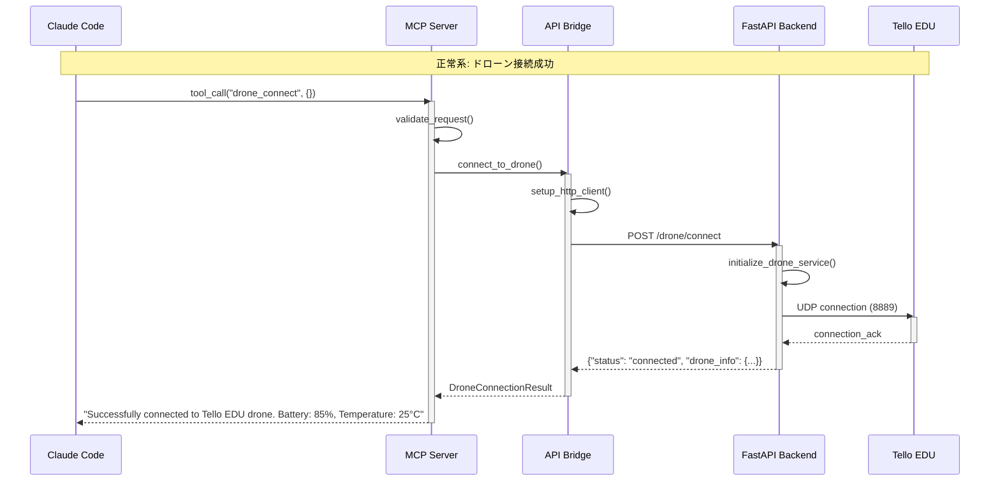

### 代替系シーケンス（リトライあり）

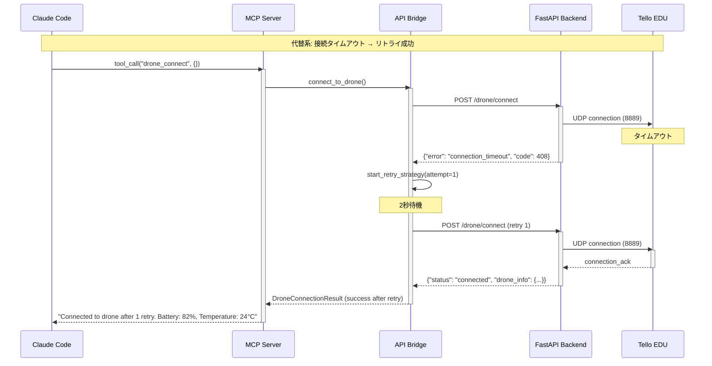

### 異常系シーケンス（接続失敗）

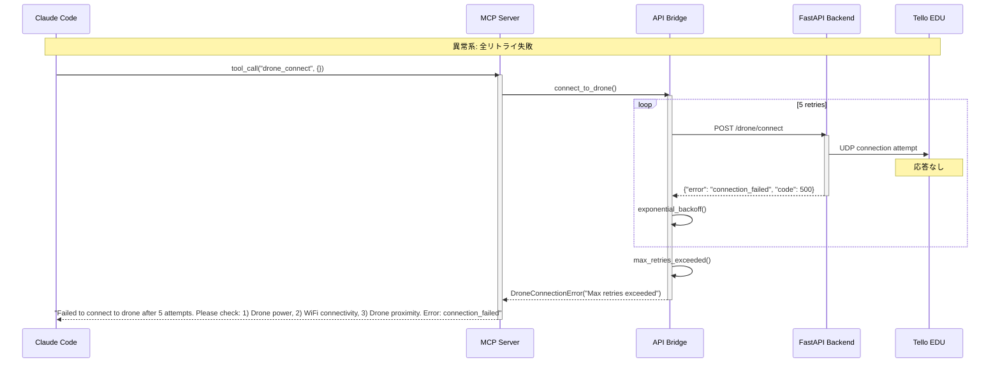

## UC04: 基本飛行操作（離陸）

### 正常系シーケンス

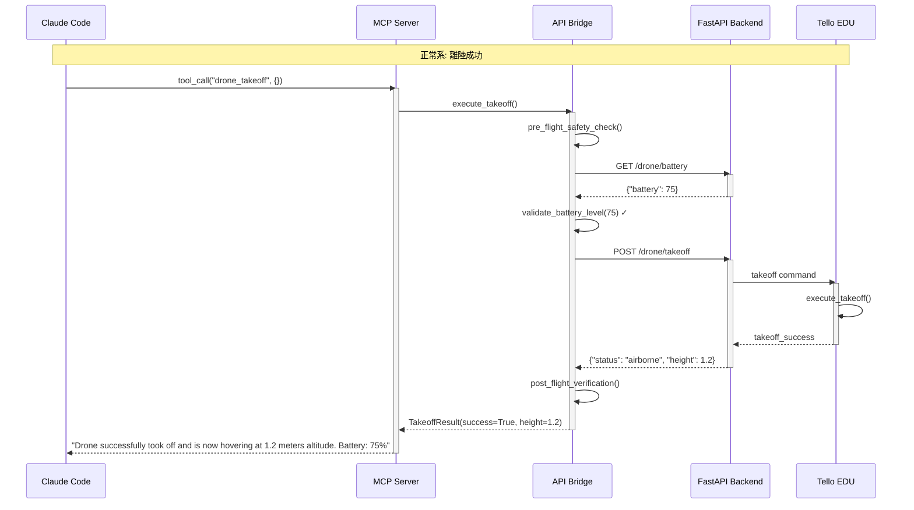

### 代替系シーケンス（バッテリー低下警告）

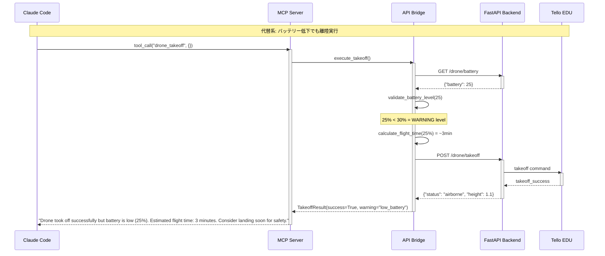

### 異常系シーケンス（バッテリー不足）

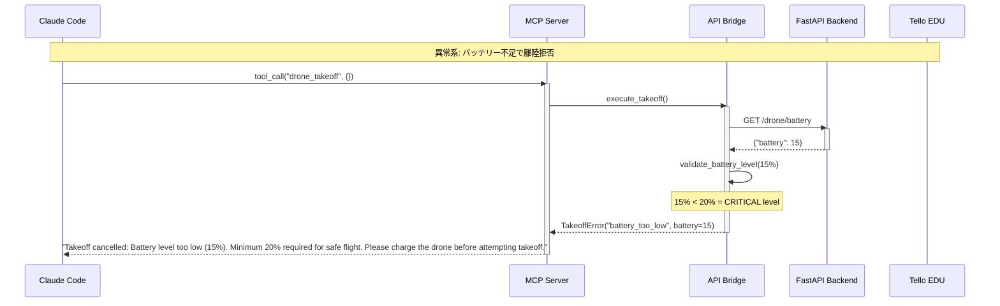

## UC05: 緊急停止制御

### 正常系シーケンス

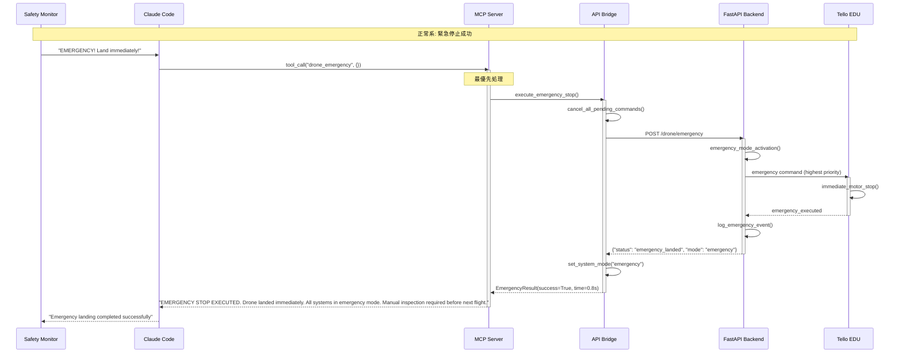

### 異常系シーケンス（通信断絶）

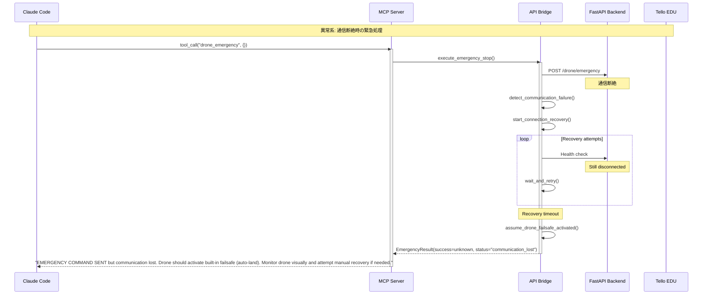

## UC07: 方向移動制御

### 正常系シーケンス

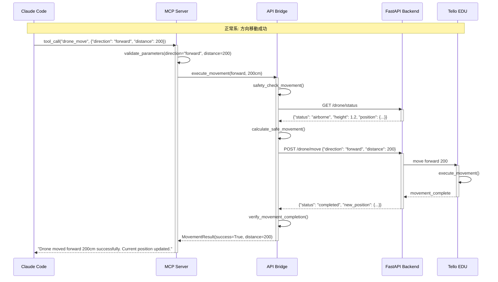

### 代替系シーケンス（パラメータ調整）

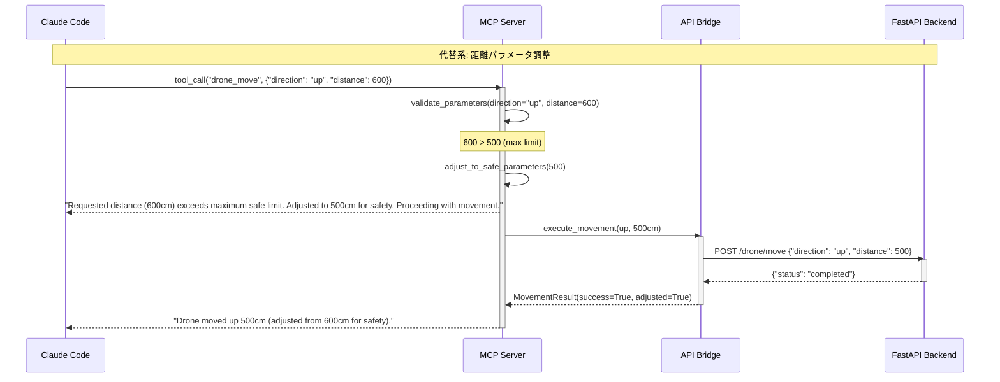

### 異常系シーケンス（移動中障害）

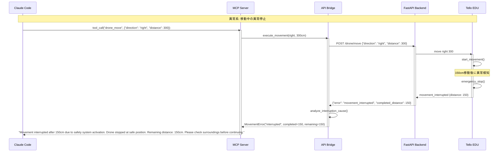

## UC10: 映像ストリーミング

### 正常系シーケンス

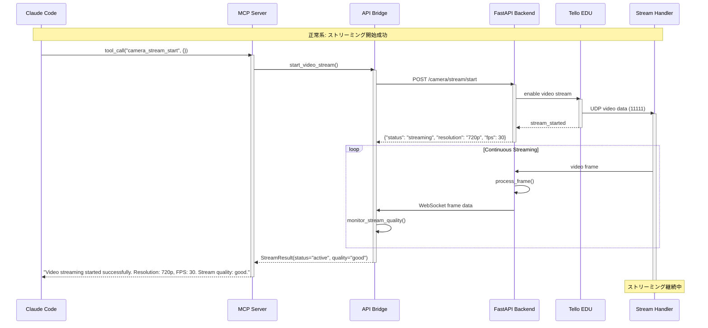

### 代替系シーケンス（品質低下対応）

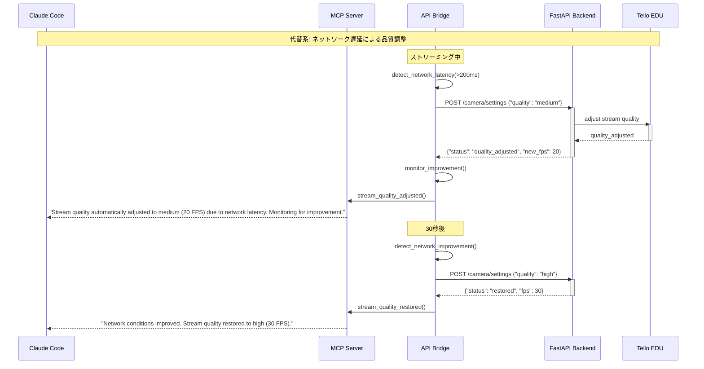

### 異常系シーケンス（ストリーミング停止）

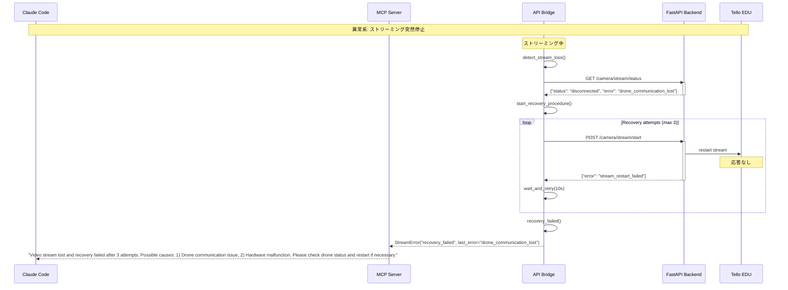

## UC13: バッテリー監視

### 正常系シーケンス

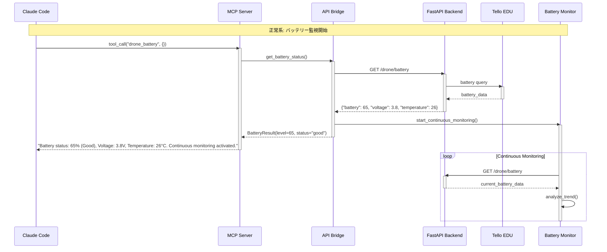

### 代替系シーケンス（バッテリー警告）

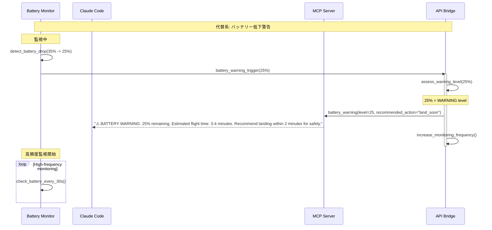

### 異常系シーケンス（緊急バッテリー低下）

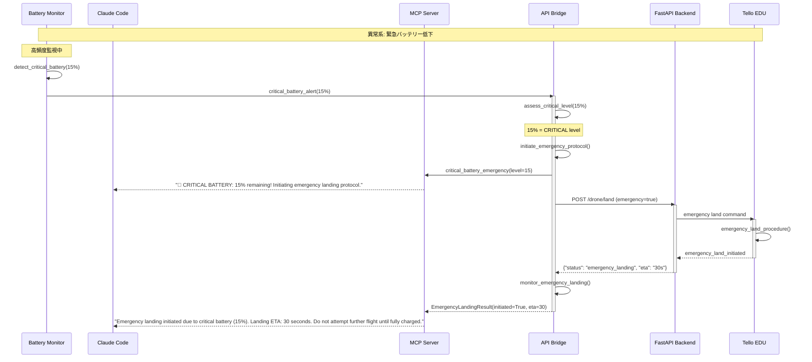

## UC16: 自然言語コマンド処理

### 正常系シーケンス（複合コマンド）

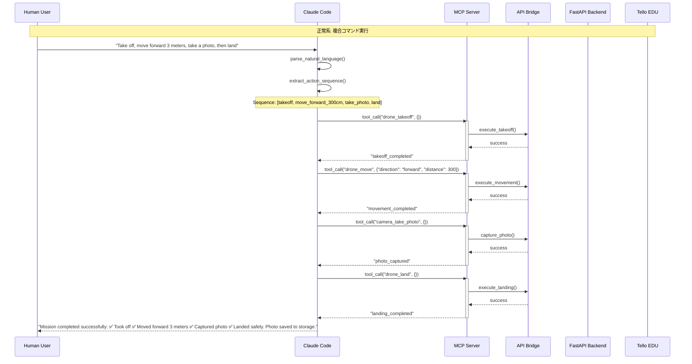

### 代替系シーケンス（曖昧な指示の明確化）

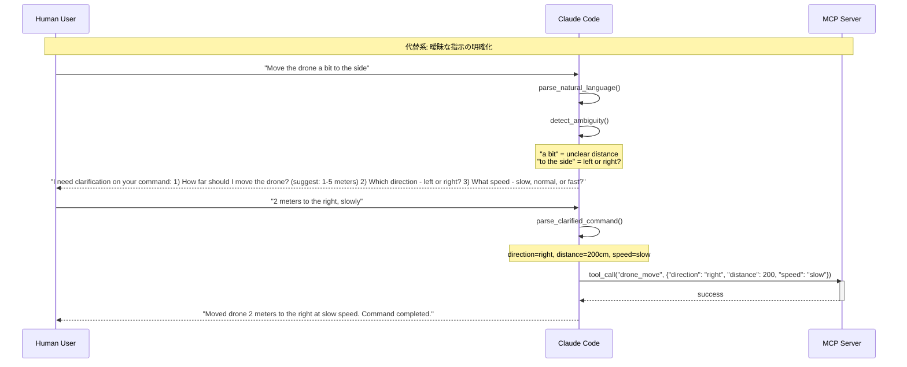

### 異常系シーケンス（実行不可能な組み合わせ）

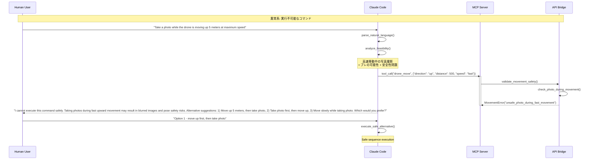

## パフォーマンス・品質指標

### レスポンス時間目標

| 操作タイプ | 目標時間 | 測定ポイント |
|-----------|---------|-------------|
| MCP Tool Call | < 50ms | Claude → MCP Server |
| API Bridge Call | < 100ms | MCP → FastAPI |
| ドローンコマンド | < 200ms | API → Drone response |
| 緊急停止 | < 500ms | 最優先実行 |
| バッテリー取得 | < 30ms | センサーデータ取得 |
| 映像ストリーミング | < 150ms | フレーム遅延 |

### エラー処理基準

| エラータイプ | 自動リトライ | 最大試行回数 | 人的介入 |
|-------------|-------------|-------------|----------|
| 接続タイムアウト | ✓ | 5回 | リトライ失敗時 |
| 通信断絶 | ✓ | 3回 | 即座 |
| バッテリー不足 | ✗ | - | 即座 |
| 移動中断 | ✓ | 2回 | 2回失敗時 |
| ストリーミング失敗 | ✓ | 3回 | 回復不可時 |
| 緊急停止失敗 | ✗ | - | 即座 |

### 安全性保証

1. **多層防御**: Claude → MCP → API → Drone の各層で安全チェック
2. **フェイルセーフ**: 通信断絶時のドローン自動安全機能
3. **人的監視**: 全自動化ではなく人的監視者による最終安全確認
4. **ログ記録**: 全操作の詳細ログによる事後分析可能性