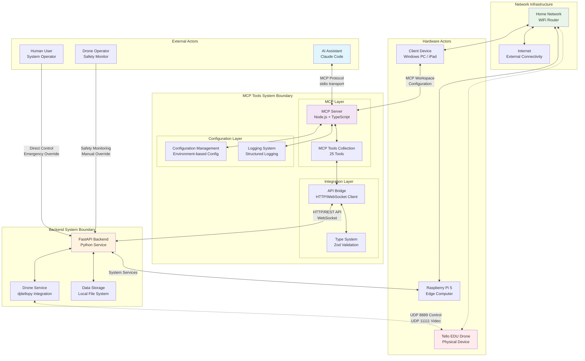
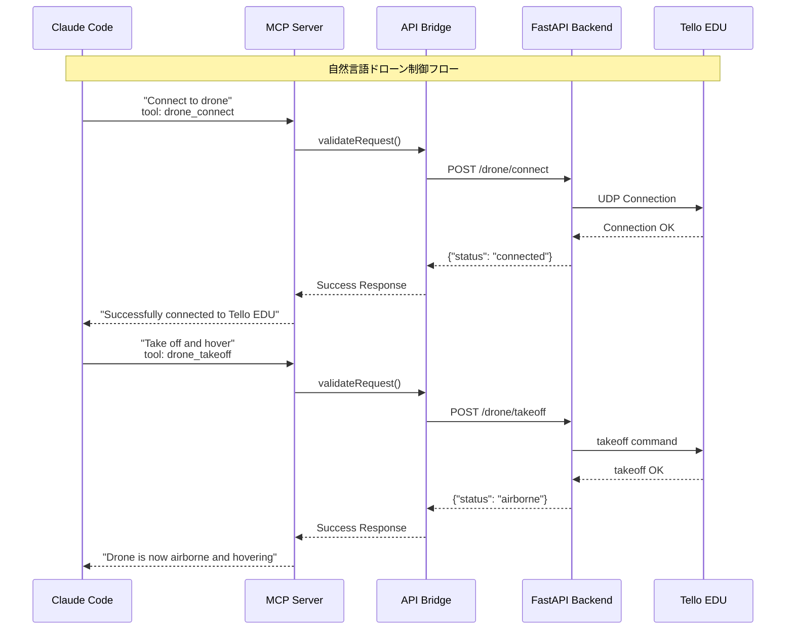
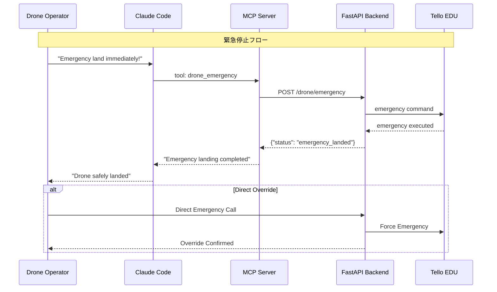
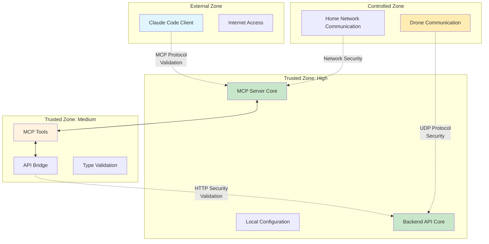

# MCPツール システムコンテキストダイアグラム

## 概要

MCP (Model Context Protocol) ツールシステムは、Claude Code と MFG Drone Backend API を統合し、自然言語によるドローン制御を実現するシステムです。このドキュメントでは、MCPツールシステムの外部環境との関係性とシステム境界を明確に定義します。

## システムコンテキスト図



## 外部アクター定義

### AI/機械アクター

#### 1. Claude Code (AI Assistant)
**役割**: 自然言語によるドローン制御とシステム操作のメインインターフェース

**責任範囲**:
- MCP Protocol による通信
- 自然言語コマンドの解釈・実行
- ドローン制御の高度な意思決定
- リアルタイム状況判断と対応
- エラー状況の分析と回復支援

**システムとの関係**:
- MCP Server との stdio transport 通信
- 25個のMCPツールへの直接アクセス
- 型安全な操作（TypeScript + Zod validation）
- 構造化されたエラーハンドリング

**例：自然言語コマンド**:
```
"Connect to the drone and check battery status"
"Take off and hover at safe altitude, then start video streaming"
"Move forward 2 meters slowly and take a photo"
"Track the red object and follow it automatically"
"Emergency land immediately due to low battery"
```

### 人的アクター

#### 2. Human User (System Operator)
**役割**: MCPシステムの設定、監視、高レベル制御を行うオペレーター

**責任範囲**:
- MCPワークスペース設定の管理
- Claude Code の指示・監督
- システム状態の監視
- 安全性の最終確認

**システムとの関係**:
- mcp-workspace.json 設定管理
- Claude Code 経由での間接制御
- Backend API への直接アクセス（緊急時）

#### 3. Drone Operator (Safety Monitor)
**役割**: 飛行安全の監視と緊急時の手動介入担当者

**責任範囲**:
- 飛行安全の常時監視
- 緊急時の手動制御切り替え
- 物理的な安全確保
- 法的規制の遵守確認

**システムとの関係**:
- Backend API への直接アクセス権
- 緊急停止の最優先実行権限
- MCP制御のオーバーライド権限

### ハードウェアアクター

#### 4. Tello EDU Drone
**特性**: DJI製教育用小型ドローン（MCPツール制御対象）

**機能**:
- 自律飛行制御（MCP経由）
- リアルタイム映像ストリーミング
- センサーデータ提供（バッテリー、高度、姿勢）
- WiFi AP モードでの通信

**MCP統合での通信フロー**:
```
Claude Code → MCP Tools → API Bridge → FastAPI → djitellopy → Tello EDU
```

#### 5. Raspberry Pi 5
**特性**: MCPサーバーとBackend APIの統合実行環境

**役割**:
- Node.js MCP Server の実行
- Python FastAPI Backend の実行
- ログ・設定データの管理
- リアルタイム処理のリソース提供

#### 6. Client Device
**特性**: MCPワークスペース設定デバイス

**役割**:
- mcp-workspace.json 設定管理
- Claude Code 実行環境
- MCP Server接続クライアント

## システム境界とデータフロー

### MCP Protocol データフロー



### 緊急制御フロー



## システム境界の詳細

### 信頼境界 (Trust Boundaries)



## 統合アーキテクチャの特徴

### 1. **双方向通信**
- Claude Code ↔ MCP Server: stdio transport
- MCP Server ↔ Backend API: HTTP/WebSocket
- Backend API ↔ Drone: UDP (8889/11111)

### 2. **型安全性**
- TypeScript + Zod バリデーション
- API レスポンス型定義
- エラー型の統一

### 3. **非同期処理**
- リアルタイムセンサーデータ
- 映像ストリーミング
- 並行制御コマンド処理

### 4. **エラー処理**
- 8段階のエラーコード
- 自動リトライ機能
- Graceful degradation

### 5. **監視・ログ**
- 構造化ログ (JSON)
- 性能メトリクス
- デバッグトレース

## 制約と前提条件

### 技術制約
1. **MCP Protocol制限**: stdio transport のみ対応
2. **通信遅延**: Claude ↔ MCP ↔ API ↔ Drone (累積遅延)
3. **同時接続**: 1つのClaude Codeインスタンスのみ
4. **リソース**: Raspberry Pi 5の計算能力制限

### 運用制約
1. **ネットワーク**: 安定したWiFi環境必須
2. **監視**: 人的安全監視者の配置必須
3. **緊急対応**: 手動オーバーライド体制必須
4. **法的遵守**: ドローン飛行規制の遵守

### 将来拡張計画
1. **Multi-Client**: 複数のClaude Codeインスタンス対応
2. **Cloud Integration**: クラウドMCPサーバー対応
3. **Advanced AI**: 自律判断機能の強化
4. **Security**: エンドツーエンド暗号化対応