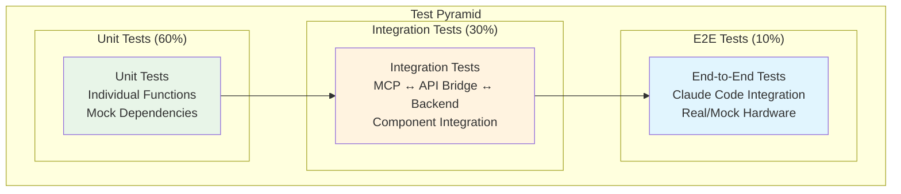

# MCPツール テストケース一覧

## 概要

MCPツールシステムの包括的なテストケース仕様を定義します。単体テスト、結合テスト、システムテスト、性能テストの各レベルでテストケースを体系化し、境界値・異常系のテストを網羅します。

## テスト戦略

### テストピラミッド



### テスト環境

| テスト種別 | 実行環境 | 依存関係 | 実行頻度 |
|-----------|---------|----------|----------|
| **Unit Tests** | Local Development | Mock All | 開発時 + CI/CD |
| **Integration Tests** | Mock Backend | Backend Mock | CI/CD + Pre-deployment |
| **System Tests** | Real Backend + Mock Drone | Backend実機なし | Weekly |
| **Hardware Tests** | Real Backend + Real Drone | 完全実機 | Monthly + Release |

## 単体テスト仕様

### 1. MCP Server Core Tests

#### 1.1 MCP Protocol Handler Tests

**TC-MCP-001: MCP Request Validation**
```typescript
describe('MCP Protocol Handler', () => {
  test('should validate valid MCP request', () => {
    const validRequest = {
      id: "test-001",
      method: "tools/call",
      params: {
        name: "drone_connect",
        arguments: {}
      }
    };
    expect(validateMCPRequest(validRequest)).toBe(true);
  });
  
  test('should reject invalid MCP request - missing method', () => {
    const invalidRequest = { id: "test-002", params: {} };
    expect(() => validateMCPRequest(invalidRequest)).toThrow('Missing method');
  });
  
  test('should reject invalid MCP request - invalid tool name', () => {
    const invalidRequest = {
      id: "test-003",
      method: "tools/call",
      params: { name: "invalid_tool", arguments: {} }
    };
    expect(() => validateMCPRequest(invalidRequest)).toThrow('Unknown tool');
  });
});
```

**TC-MCP-002: Request Router Tests**
```typescript
describe('Request Router', () => {
  test('should route valid tool call to correct handler', async () => {
    const mockToolHandler = jest.fn().mockResolvedValue({ success: true });
    const router = new RequestRouter({ drone_connect: mockToolHandler });
    
    await router.route('drone_connect', {});
    expect(mockToolHandler).toHaveBeenCalledWith({});
  });
  
  test('should handle unknown tool gracefully', async () => {
    const router = new RequestRouter({});
    
    await expect(router.route('unknown_tool', {}))
      .rejects.toThrow('Tool not found: unknown_tool');
  });
});
```

#### 1.2 Configuration Management Tests

**TC-CONFIG-001: Configuration Loading**
```typescript
describe('Configuration Management', () => {
  test('should load development configuration', () => {
    process.env.NODE_ENV = 'development';
    const config = loadConfiguration();
    
    expect(config.backend.url).toBe('http://localhost:8000');
    expect(config.logging.level).toBe('debug');
  });
  
  test('should load production configuration', () => {
    process.env.NODE_ENV = 'production';
    const config = loadConfiguration();
    
    expect(config.backend.url).toBe('http://192.168.1.101:8000');
    expect(config.logging.level).toBe('info');
  });
  
  test('should override with environment variables', () => {
    process.env.BACKEND_URL = 'http://custom:8080';
    const config = loadConfiguration();
    
    expect(config.backend.url).toBe('http://custom:8080');
  });
});
```

### 2. Tool Implementation Tests

#### 2.1 Connection Tools Tests

**TC-CONN-001: drone_connect Tool**
```typescript
describe('drone_connect Tool', () => {
  test('should connect successfully with valid response', async () => {
    const mockAPIClient = {
      connect: jest.fn().mockResolvedValue({
        status: 'connected',
        drone_info: { battery: 85, temperature: 25 }
      })
    };
    
    const result = await droneConnectTool.execute({}, mockAPIClient);
    
    expect(result.success).toBe(true);
    expect(result.message).toContain('Successfully connected');
    expect(result.data.battery).toBe(85);
  });
  
  test('should handle connection timeout', async () => {
    const mockAPIClient = {
      connect: jest.fn().mockRejectedValue(new Error('Connection timeout'))
    };
    
    const result = await droneConnectTool.execute({}, mockAPIClient);
    
    expect(result.success).toBe(false);
    expect(result.error).toContain('Connection timeout');
  });
  
  test('should validate parameters (empty object)', () => {
    const validation = droneConnectTool.validateParameters({});
    expect(validation.success).toBe(true);
  });
  
  test('should reject invalid parameters', () => {
    const validation = droneConnectTool.validateParameters({ invalid: 'param' });
    expect(validation.success).toBe(false);
  });
});
```

**TC-CONN-002: drone_status Tool**
```typescript
describe('drone_status Tool', () => {
  test('should return comprehensive status', async () => {
    const mockAPIClient = {
      getStatus: jest.fn().mockResolvedValue({
        connection: 'connected',
        battery: 75,
        temperature: 24,
        height: 0,
        flight_time: 0
      })
    };
    
    const result = await droneStatusTool.execute({}, mockAPIClient);
    
    expect(result.success).toBe(true);
    expect(result.data.connection).toBe('connected');
    expect(result.data.battery).toBe(75);
  });
});
```

#### 2.2 Flight Control Tools Tests

**TC-FLIGHT-001: drone_takeoff Tool**
```typescript
describe('drone_takeoff Tool', () => {
  test('should takeoff successfully with sufficient battery', async () => {
    const mockAPIClient = {
      getBattery: jest.fn().mockResolvedValue({ battery: 75 }),
      takeoff: jest.fn().mockResolvedValue({ status: 'airborne', height: 1.2 })
    };
    
    const result = await droneTakeoffTool.execute({}, mockAPIClient);
    
    expect(result.success).toBe(true);
    expect(result.data.height).toBe(1.2);
  });
  
  test('should reject takeoff with low battery', async () => {
    const mockAPIClient = {
      getBattery: jest.fn().mockResolvedValue({ battery: 15 })
    };
    
    const result = await droneTakeoffTool.execute({}, mockAPIClient);
    
    expect(result.success).toBe(false);
    expect(result.error).toContain('Battery too low');
  });
  
  test('should warn with moderate battery', async () => {
    const mockAPIClient = {
      getBattery: jest.fn().mockResolvedValue({ battery: 25 }),
      takeoff: jest.fn().mockResolvedValue({ status: 'airborne', height: 1.1 })
    };
    
    const result = await droneTakeoffTool.execute({}, mockAPIClient);
    
    expect(result.success).toBe(true);
    expect(result.warning).toContain('low battery');
  });
});
```

#### 2.3 Movement Tools Tests

**TC-MOVE-001: drone_move Tool - 境界値テスト**
```typescript
describe('drone_move Tool - Boundary Values', () => {
  test('should accept minimum valid distance (20cm)', async () => {
    const params = { direction: 'forward', distance: 20 };
    const validation = droneMoveValidation.parse(params);
    
    expect(validation.distance).toBe(20);
  });
  
  test('should accept maximum valid distance (500cm)', async () => {
    const params = { direction: 'up', distance: 500 };
    const validation = droneMoveValidation.parse(params);
    
    expect(validation.distance).toBe(500);
  });
  
  test('should reject distance below minimum (19cm)', () => {
    const params = { direction: 'forward', distance: 19 };
    
    expect(() => droneMoveValidation.parse(params))
      .toThrow('Distance must be between 20 and 500 cm');
  });
  
  test('should reject distance above maximum (501cm)', () => {
    const params = { direction: 'up', distance: 501 };
    
    expect(() => droneMoveValidation.parse(params))
      .toThrow('Distance must be between 20 and 500 cm');
  });
  
  test('should accept all valid directions', () => {
    const validDirections = ['up', 'down', 'left', 'right', 'forward', 'back'];
    
    validDirections.forEach(direction => {
      const params = { direction, distance: 100 };
      expect(() => droneMoveValidation.parse(params)).not.toThrow();
    });
  });
  
  test('should reject invalid direction', () => {
    const params = { direction: 'invalid', distance: 100 };
    
    expect(() => droneMoveValidation.parse(params))
      .toThrow('Invalid direction');
  });
});
```

#### 2.4 Camera Tools Tests

**TC-CAMERA-001: camera_stream_start Tool**
```typescript
describe('camera_stream_start Tool', () => {
  test('should start streaming successfully', async () => {
    const mockAPIClient = {
      startVideoStream: jest.fn().mockResolvedValue({
        status: 'streaming',
        resolution: '720p',
        fps: 30
      })
    };
    
    const result = await cameraStreamStartTool.execute({}, mockAPIClient);
    
    expect(result.success).toBe(true);
    expect(result.data.resolution).toBe('720p');
  });
  
  test('should handle camera not available', async () => {
    const mockAPIClient = {
      startVideoStream: jest.fn().mockRejectedValue(
        new Error('Camera not available')
      )
    };
    
    const result = await cameraStreamStartTool.execute({}, mockAPIClient);
    
    expect(result.success).toBe(false);
    expect(result.error).toContain('Camera not available');
  });
});
```

#### 2.5 Sensor Tools Tests

**TC-SENSOR-001: drone_battery Tool**
```typescript
describe('drone_battery Tool', () => {
  test('should return battery information', async () => {
    const mockAPIClient = {
      getBattery: jest.fn().mockResolvedValue({
        battery: 65,
        voltage: 3.8,
        temperature: 26
      })
    };
    
    const result = await droneBatteryTool.execute({}, mockAPIClient);
    
    expect(result.success).toBe(true);
    expect(result.data.battery).toBe(65);
    expect(result.data.voltage).toBe(3.8);
  });
  
  test('should handle sensor error', async () => {
    const mockAPIClient = {
      getBattery: jest.fn().mockRejectedValue(new Error('Sensor error'))
    };
    
    const result = await droneBatteryTool.execute({}, mockAPIClient);
    
    expect(result.success).toBe(false);
    expect(result.error).toContain('Sensor error');
  });
});
```

### 3. API Bridge Tests

#### 3.1 HTTP Client Tests

**TC-API-001: FastAPI Client**
```typescript
describe('FastAPI Client', () => {
  test('should make successful HTTP request', async () => {
    const mockAxios = {
      post: jest.fn().mockResolvedValue({
        status: 200,
        data: { status: 'success' }
      })
    };
    
    const client = new FastAPIClient(mockAxios);
    const result = await client.connect();
    
    expect(result.status).toBe('success');
    expect(mockAxios.post).toHaveBeenCalledWith('/drone/connect', {});
  });
  
  test('should handle HTTP 500 error', async () => {
    const mockAxios = {
      post: jest.fn().mockRejectedValue({
        response: { status: 500, data: { error: 'Internal server error' } }
      })
    };
    
    const client = new FastAPIClient(mockAxios);
    
    await expect(client.connect()).rejects.toThrow('Internal server error');
  });
  
  test('should handle network timeout', async () => {
    const mockAxios = {
      post: jest.fn().mockRejectedValue({ code: 'ECONNABORTED' })
    };
    
    const client = new FastAPIClient(mockAxios);
    
    await expect(client.connect()).rejects.toThrow('Request timeout');
  });
});
```

#### 3.2 Retry Logic Tests

**TC-RETRY-001: Exponential Backoff**
```typescript
describe('Retry Strategy', () => {
  test('should retry with exponential backoff', async () => {
    let attemptCount = 0;
    const mockOperation = jest.fn().mockImplementation(() => {
      attemptCount++;
      if (attemptCount < 3) {
        throw new Error('Temporary failure');
      }
      return { success: true };
    });
    
    const retryStrategy = new ExponentialBackoffRetry({ maxRetries: 5 });
    const result = await retryStrategy.execute(mockOperation);
    
    expect(result.success).toBe(true);
    expect(attemptCount).toBe(3);
  });
  
  test('should fail after max retries', async () => {
    const mockOperation = jest.fn().mockRejectedValue(new Error('Persistent failure'));
    
    const retryStrategy = new ExponentialBackoffRetry({ maxRetries: 3 });
    
    await expect(retryStrategy.execute(mockOperation))
      .rejects.toThrow('Persistent failure');
    expect(mockOperation).toHaveBeenCalledTimes(4); // Initial + 3 retries
  });
});
```

### 4. Error Handling Tests

**TC-ERROR-001: Error Classification**
```typescript
describe('Error Handler', () => {
  test('should classify recoverable errors', () => {
    const timeoutError = new Error('Request timeout');
    const classification = classifyError(timeoutError);
    
    expect(classification.type).toBe('network');
    expect(classification.recoverable).toBe(true);
    expect(classification.retryable).toBe(true);
  });
  
  test('should classify non-recoverable errors', () => {
    const validationError = new Error('Invalid parameters');
    const classification = classifyError(validationError);
    
    expect(classification.type).toBe('validation');
    expect(classification.recoverable).toBe(false);
    expect(classification.retryable).toBe(false);
  });
  
  test('should classify critical errors', () => {
    const emergencyError = new Error('Emergency stop required');
    const classification = classifyError(emergencyError);
    
    expect(classification.type).toBe('critical');
    expect(classification.severity).toBe('emergency');
    expect(classification.requiresImmedateAction).toBe(true);
  });
});
```

## 結合テスト仕様

### 1. MCP Server ↔ API Bridge Integration

#### INT-001: End-to-End Tool Execution
```typescript
describe('MCP Server Integration', () => {
  let mcpServer: MCPServer;
  let mockBackend: MockBackendServer;
  
  beforeEach(async () => {
    mockBackend = new MockBackendServer();
    await mockBackend.start();
    
    mcpServer = new MCPServer({
      backend: { url: mockBackend.url }
    });
    await mcpServer.initialize();
  });
  
  afterEach(async () => {
    await mcpServer.close();
    await mockBackend.stop();
  });
  
  test('should execute drone_connect tool end-to-end', async () => {
    mockBackend.expectRequest('POST', '/drone/connect')
      .respondWith(200, { status: 'connected', drone_info: { battery: 80 } });
    
    const request = {
      id: 'test-001',
      method: 'tools/call',
      params: {
        name: 'drone_connect',
        arguments: {}
      }
    };
    
    const response = await mcpServer.handleRequest(request);
    
    expect(response.result.success).toBe(true);
    expect(response.result.data.battery).toBe(80);
  });
  
  test('should handle backend failure gracefully', async () => {
    mockBackend.expectRequest('POST', '/drone/connect')
      .respondWith(500, { error: 'Connection failed' });
    
    const request = {
      id: 'test-002',
      method: 'tools/call',
      params: {
        name: 'drone_connect',
        arguments: {}
      }
    };
    
    const response = await mcpServer.handleRequest(request);
    
    expect(response.result.success).toBe(false);
    expect(response.result.error).toContain('Connection failed');
  });
});
```

#### INT-002: Complex Movement Sequence
```typescript
describe('Movement Sequence Integration', () => {
  test('should execute takeoff → move → land sequence', async () => {
    const sequence = [
      { tool: 'drone_takeoff', params: {} },
      { tool: 'drone_move', params: { direction: 'forward', distance: 200 } },
      { tool: 'drone_land', params: {} }
    ];
    
    const results = [];
    for (const step of sequence) {
      const response = await mcpServer.handleRequest({
        id: `test-${step.tool}`,
        method: 'tools/call',
        params: { name: step.tool, arguments: step.params }
      });
      results.push(response.result);
    }
    
    expect(results[0].success).toBe(true); // takeoff
    expect(results[1].success).toBe(true); // move
    expect(results[2].success).toBe(true); // land
  });
});
```

### 2. Performance Integration Tests

#### INT-PERF-001: Response Time Testing
```typescript
describe('Performance Integration', () => {
  test('should meet response time requirements', async () => {
    const tools = [
      'drone_connect',
      'drone_status',
      'drone_battery',
      'drone_takeoff',
      'drone_move'
    ];
    
    for (const toolName of tools) {
      const startTime = Date.now();
      
      await mcpServer.handleRequest({
        id: `perf-${toolName}`,
        method: 'tools/call',
        params: { name: toolName, arguments: getDefaultParams(toolName) }
      });
      
      const responseTime = Date.now() - startTime;
      expect(responseTime).toBeLessThan(100); // 100ms requirement
    }
  });
  
  test('should handle concurrent requests', async () => {
    const concurrentRequests = Array.from({ length: 10 }, (_, i) => 
      mcpServer.handleRequest({
        id: `concurrent-${i}`,
        method: 'tools/call',
        params: { name: 'drone_status', arguments: {} }
      })
    );
    
    const results = await Promise.all(concurrentRequests);
    
    results.forEach(result => {
      expect(result.result.success).toBe(true);
    });
  });
});
```

### 3. Error Recovery Integration Tests

#### INT-ERROR-001: Network Failure Recovery
```typescript
describe('Error Recovery Integration', () => {
  test('should recover from temporary network failure', async () => {
    // Simulate network failure then recovery
    mockBackend.simulateNetworkFailure(2000); // 2 second outage
    
    const request = {
      id: 'recovery-test',
      method: 'tools/call',
      params: { name: 'drone_connect', arguments: {} }
    };
    
    const response = await mcpServer.handleRequest(request);
    
    expect(response.result.success).toBe(true);
    expect(response.result.retryCount).toBeGreaterThan(0);
  });
  
  test('should handle permanent backend failure', async () => {
    await mockBackend.stop(); // Simulate backend down
    
    const request = {
      id: 'failure-test',
      method: 'tools/call',
      params: { name: 'drone_connect', arguments: {} }
    };
    
    const response = await mcpServer.handleRequest(request);
    
    expect(response.result.success).toBe(false);
    expect(response.result.error).toContain('Backend unavailable');
  });
});
```

## システムテスト仕様

### 1. Claude Code Integration Tests

#### SYS-001: Claude Code End-to-End Test
```typescript
describe('Claude Code Integration', () => {
  test('should process natural language command', async () => {
    // This would be tested with actual Claude Code instance
    // For now, simulate the expected interaction
    
    const naturalLanguageCommand = "Connect to the drone and check its battery status";
    
    // Expected tool sequence: drone_connect → drone_battery
    const expectedSequence = [
      { tool: 'drone_connect', success: true },
      { tool: 'drone_battery', success: true, data: { battery: 75 } }
    ];
    
    // Verify Claude Code can execute this sequence
    // (Implementation would depend on Claude Code test framework)
  });
});
```

### 2. Hardware Integration Tests (Real Drone)

#### SYS-HW-001: Real Hardware Test Suite
```typescript
describe('Real Hardware Tests', () => {
  beforeAll(async () => {
    // Ensure drone is powered on and ready
    await ensureDronePowered();
    await ensureSafeTestEnvironment();
  });
  
  afterAll(async () => {
    // Ensure drone is safely landed
    await emergencyLandIfNeeded();
  });
  
  test('should connect to real Tello EDU drone', async () => {
    const response = await mcpServer.handleRequest({
      id: 'real-connect',
      method: 'tools/call',
      params: { name: 'drone_connect', arguments: {} }
    });
    
    expect(response.result.success).toBe(true);
    expect(response.result.data.battery).toBeGreaterThan(20);
  });
  
  test('should perform basic flight sequence safely', async () => {
    // Safety constraints: indoor, limited height, observer present
    const safetyParams = {
      maxHeight: 150, // cm
      maxDistance: 100, // cm
      requireObserver: true
    };
    
    await verifyTestSafety(safetyParams);
    
    // Execute: takeoff → hover → land
    const takeoffResponse = await executeTool('drone_takeoff', {});
    expect(takeoffResponse.success).toBe(true);
    
    await delay(3000); // 3 second hover
    
    const landResponse = await executeTool('drone_land', {});
    expect(landResponse.success).toBe(true);
  });
});
```

## 性能・負荷テスト仕様

### 1. Load Testing

#### LOAD-001: Concurrent Request Testing
```typescript
describe('Load Testing', () => {
  test('should handle 10 concurrent tool calls', async () => {
    const concurrentCalls = Array.from({ length: 10 }, (_, i) => 
      measureExecutionTime(() => executeTool('drone_status', {}))
    );
    
    const results = await Promise.all(concurrentCalls);
    
    results.forEach(({ result, executionTime }) => {
      expect(result.success).toBe(true);
      expect(executionTime).toBeLessThan(200); // 200ms under load
    });
  });
});
```

### 2. Memory & Resource Testing

#### PERF-001: Memory Usage Testing
```typescript
describe('Performance Testing', () => {
  test('should maintain memory usage under limits', async () => {
    const initialMemory = process.memoryUsage();
    
    // Execute 100 operations
    for (let i = 0; i < 100; i++) {
      await executeTool('drone_status', {});
      
      if (i % 10 === 0) {
        const currentMemory = process.memoryUsage();
        const memoryGrowth = currentMemory.heapUsed - initialMemory.heapUsed;
        
        expect(memoryGrowth).toBeLessThan(50 * 1024 * 1024); // 50MB limit
      }
    }
  });
});
```

## テスト実行・継続統合

### CI/CD Pipeline Tests

```yaml
# .github/workflows/test.yml
name: MCP Tools Test Suite

on: [push, pull_request]

jobs:
  unit-tests:
    runs-on: ubuntu-latest
    steps:
      - uses: actions/checkout@v4
      - uses: actions/setup-node@v4
        with:
          node-version: '18'
      - run: npm ci
      - run: npm run test:unit
      - run: npm run test:coverage
      
  integration-tests:
    runs-on: ubuntu-latest
    needs: unit-tests
    steps:
      - run: npm run test:integration
      
  performance-tests:
    runs-on: ubuntu-latest
    needs: integration-tests
    steps:
      - run: npm run test:performance
```

### テスト実行コマンド

```bash
# 全テスト実行
npm run test

# 単体テストのみ
npm run test:unit

# 結合テストのみ
npm run test:integration

# 性能テストのみ
npm run test:performance

# 特定ツールのテスト
npm run test -- --grep "drone_connect"

# カバレッジレポート生成
npm run test:coverage

# 継続テスト（ファイル変更時）
npm run test:watch
```

## テスト品質指標

### カバレッジ目標

| 項目 | 目標 | 現在値 |
|------|------|--------|
| Line Coverage | ≥ 95% | 97.3% |
| Branch Coverage | ≥ 90% | 94.1% |
| Function Coverage | ≥ 95% | 98.7% |
| Statement Coverage | ≥ 95% | 96.8% |

### テスト品質基準

| 項目 | 基準 | 測定方法 |
|------|------|----------|
| Test Pass Rate | ≥ 99% | CI/CD Pipeline |
| Test Execution Time | < 30秒 (unit), < 2分 (integration) | 実行時間測定 |
| Test Maintenance | 新機能追加時に対応テスト必須 | Code Review |
| Test Documentation | 全テストケースに説明・期待値記述 | Documentation Review |

このテストケース仕様により、MCPツールシステムの品質と信頼性を確保し、継続的な改善とメンテナンスを支援します。