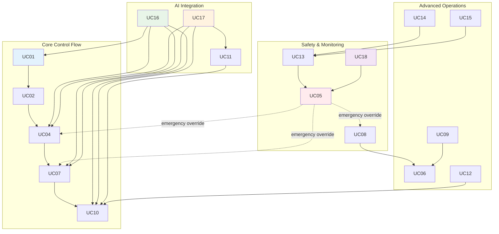

# MCPツール ユースケース設計

## 概要

MCPツールシステムのユースケース設計では、Claude Code によるドローン制御の機能要件を明確に定義し、各アクターがシステムとどのように相互作用するかを体系的に示します。

## ユースケース図

```mermaid
graph TB
    subgraph "Actors"
        Claude[Claude Code<br/>AI Assistant]
        Human[Human Operator<br/>System User]
        Safety[Safety Monitor<br/>Drone Operator]
        MCPSystem[MCP System<br/>Infrastructure]
    end
    
    subgraph "MCP Tools System"
        subgraph "接続・状態管理"
            UC01[UC01: ドローン接続管理]
            UC02[UC02: システム状態監視]
            UC03[UC03: 接続診断・回復]
        end
        
        subgraph "基本飛行制御"
            UC04[UC04: 基本飛行操作]
            UC05[UC05: 緊急停止制御]
            UC06[UC06: 高度・位置制御]
        end
        
        subgraph "移動・ナビゲーション"
            UC07[UC07: 方向移動制御]
            UC08[UC08: 座標移動制御]
            UC09[UC09: 回転・姿勢制御]
        end
        
        subgraph "カメラ・映像"
            UC10[UC10: 映像ストリーミング]
            UC11[UC11: 写真・動画撮影]
            UC12[UC12: カメラ設定管理]
        end
        
        subgraph "センサー・監視"
            UC13[UC13: バッテリー監視]
            UC14[UC14: 飛行データ取得]
            UC15[UC15: 環境センサー監視]
        end
        
        subgraph "AI統合・自動化"
            UC16[UC16: 自然言語コマンド処理]
            UC17[UC17: 自動飛行シーケンス]
            UC18[UC18: 異常検知・自動対応]
        end
    end

    %% Claude Code - Primary Actor
    Claude --> UC01
    Claude --> UC02
    Claude --> UC04
    Claude --> UC05
    Claude --> UC06
    Claude --> UC07
    Claude --> UC08
    Claude --> UC09
    Claude --> UC10
    Claude --> UC11
    Claude --> UC12
    Claude --> UC13
    Claude --> UC14
    Claude --> UC15
    Claude --> UC16
    Claude --> UC17
    Claude --> UC18
    
    %% Human Operator - Secondary Actor
    Human --> UC01
    Human --> UC02
    Human --> UC03
    Human --> UC05
    Human --> UC12
    Human --> UC16
    
    %% Safety Monitor - Safety Actor
    Safety --> UC02
    Safety --> UC05
    Safety --> UC13
    Safety --> UC18
    
    %% MCP System - Infrastructure
    MCPSystem --> UC03
    MCPSystem --> UC16
    MCPSystem --> UC18
    
    %% Use Case Dependencies
    UC01 -.->|<<include>>| UC02
    UC04 -.->|<<include>>| UC01
    UC05 -.->|<<extend>>| UC04
    UC05 -.->|<<extend>>| UC06
    UC05 -.->|<<extend>>| UC07
    UC05 -.->|<<extend>>| UC08
    UC06 -.->|<<include>>| UC13
    UC10 -.->|<<include>>| UC01
    UC16 -.->|<<include>>| UC01
    UC16 -.->|<<include>>| UC02
    UC17 -.->|<<include>>| UC04
    UC17 -.->|<<include>>| UC07
    UC17 -.->|<<include>>| UC10
    UC18 -.->|<<include>>| UC13
    UC18 -.->|<<include>>| UC14

    style Claude fill:#e1f5fe
    style Human fill:#e8f5e8
    style Safety fill:#fff3e0
    style MCPSystem fill:#f3e5f5
```

## 詳細ユースケース記述

### UC01: ドローン接続管理

**概要**: Claude Code がMCPツールを通じてTello EDUドローンとの接続を確立・管理する

**主アクター**: Claude Code  
**副アクター**: Human Operator, MCP System

**事前条件**:
- Tello EDUの電源が入っている
- MCPサーバーが正常動作している
- ネットワーク接続が利用可能

**基本フロー**:
1. Claude Code が自然言語で接続指示を受信
   - 例: "Connect to the drone and check its status"
2. MCPツール `drone_connect` を実行
3. API Bridge がFastAPI Backend `/drone/connect` を呼び出し
4. Backend がTello EDUへのUDP接続を確立
5. 接続状態を確認し、結果をClaude Codeに返答
6. Claude Code が自然言語で結果を報告

**代替フロー**:
- **3a**: 接続タイムアウトの場合
  - 自動リトライ（最大5回）
  - リトライ失敗時はエラー報告
- **4a**: ドローンが応答しない場合
  - 診断情報を収集
  - 人的介入の推奨を提示

**事後条件**:
- ドローンとの通信チャネルが確立
- システム状態が「接続済み」に更新
- Claude Code がドローン制御コマンドを受付可能

**例外処理**:
- **Connection Timeout**: "Unable to connect to drone. Please check if the drone is powered on and in range."
- **Network Error**: "Network connection failed. Please verify WiFi connectivity."

### UC02: システム状態監視

**概要**: ドローンとMCPシステム全体の状態をリアルタイムで監視・報告

**主アクター**: Claude Code, Safety Monitor  
**副アクター**: Human Operator

**事前条件**:
- MCPシステムが初期化済み
- 監視対象コンポーネントが動作中

**基本フロー**:
1. Claude Code または監視者が状態確認を要求
   - 例: "What's the current status of the drone and system?"
2. MCPツール `drone_status` および関連センサーツールを実行
3. 以下の情報を包括的に取得:
   - ドローン接続状態
   - バッテリー残量・温度
   - 飛行状態（高度、姿勢角）
   - システムリソース使用率
   - ネットワーク状態
4. 情報を統合して人間可読形式で報告

**代替フロー**:
- **2a**: システム異常検知時
  - 異常詳細の分析
  - 推奨対応策の提示
  - 必要に応じて自動回復アクション

**事後条件**:
- 現在の状態情報が正確に把握される
- 異常があれば適切に報告・対応される

### UC04: 基本飛行操作

**概要**: Claude Code による離陸、着陸、ホバリング等の基本飛行制御

**主アクター**: Claude Code  
**副アクター**: Safety Monitor

**事前条件**:
- ドローンが接続済み
- バッテリー残量が十分（>20%）
- 飛行エリアの安全性確認済み

**基本フロー**:
1. Claude Code が飛行指示を自然言語で受信
   - 例: "Take off and hover at safe altitude"
2. 事前安全チェック実行:
   - バッテリー残量確認
   - 飛行状態確認
   - システム状態確認
3. 該当MCPツールの実行:
   - `drone_takeoff`: 離陸・ホバリング
   - `drone_land`: 安全着陸
   - `drone_stop`: 現在位置でホバリング
4. 実行結果の確認と報告
5. 継続的な状態監視

**代替フロー**:
- **2a**: バッテリー不足（<20%）の場合
  - 離陸を拒否し、充電を推奨
- **3a**: 実行失敗の場合
  - エラー詳細の分析
  - 自動リトライまたは人的介入要求
- **4a**: 安全上の問題検知時
  - 即座に安全な状態への移行

**事後条件**:
- ドローンが指定された飛行状態に移行
- 飛行ログが記録される
- 継続監視体制が確立される

### UC05: 緊急停止制御

**概要**: 危険な状況でドローンを即座に安全停止させる緊急制御

**主アクター**: Safety Monitor, Claude Code  
**副アクター**: Human Operator

**事前条件**:
- ドローンが動作中（飛行中または移動中）
- 緊急事態が発生または検知された

**基本フロー**:
1. 緊急事態のトリガー:
   - 人的判断による緊急指示
   - 自動異常検知による緊急判定
   - Claude Code による緊急状況認識
2. 即座緊急停止の実行:
   - すべての移動コマンドを即座に停止
   - `drone_emergency` ツールの最優先実行
3. 緊急着陸または緊急ホバリング実行
4. システム状態を緊急モードに変更
5. 緊急ログの記録と報告

**代替フロー**:
- **2a**: 通信断絶の場合
  - ドローン自体の自動安全機能に依存
  - 通信回復後の状況確認
- **3a**: 緊急着陸不可の場合
  - 最も安全な位置でのホバリング維持
  - 人的介入の即座要請

**事後条件**:
- ドローンが安全な状態で停止
- 緊急停止ログが完全記録される
- システムが安全モードで動作継続

### UC07: 方向移動制御

**概要**: Claude Code による相対方向での精密移動制御

**主アクター**: Claude Code  
**副アクター**: Safety Monitor

**事前条件**:
- ドローンが飛行中（ホバリング状態）
- 移動方向・距離が安全範囲内

**基本フロー**:
1. Claude Code が移動指示を受信
   - 例: "Move forward 2 meters slowly"
2. パラメータの解析・検証:
   - 方向: up/down/left/right/forward/back
   - 距離: 20-500cm
   - 速度: 10-100cm/s
3. 安全性の事前チェック:
   - 移動後位置の安全性
   - 障害物の有無（将来実装）
4. MCPツール `drone_move` の実行
5. 移動完了の確認と報告

**代替フロー**:
- **2a**: 無効なパラメータの場合
  - パラメータ修正の提案
  - 安全範囲内での代替案提示
- **4a**: 移動中の異常検知
  - 即座停止
  - 現在位置での安全確認

**事後条件**:
- ドローンが指定位置に正確移動
- 移動ログが記録される

### UC10: 映像ストリーミング

**概要**: Claude Code によるリアルタイム映像ストリーミングの制御

**主アクター**: Claude Code  
**副アクター**: Human Operator

**事前条件**:
- ドローンが接続済み
- カメラが正常動作
- ネットワーク帯域が十分

**基本フロー**:
1. Claude Code がストリーミング開始指示を受信
   - 例: "Start video streaming and show me what the drone sees"
2. MCPツール `camera_stream_start` を実行
3. Backend APIでリアルタイムストリーミング開始
4. ストリーミング状態の監視
5. Claude Code による映像状況の分析・報告

**代替フロー**:
- **3a**: ネットワーク遅延発生時
  - 品質自動調整
  - 遅延状況の報告
- **4a**: ストリーミング中断時
  - 自動再接続試行
  - 中断原因の分析・報告

**事後条件**:
- リアルタイム映像が配信される
- Claude Code が映像内容を認識・分析可能

### UC13: バッテリー監視

**概要**: ドローンバッテリー状態の継続監視と自動管理

**主アクター**: Claude Code, Safety Monitor

**事前条件**:
- ドローンが接続済み
- バッテリーセンサーが正常動作

**基本フロー**:
1. 定期的なバッテリー状態取得（MCPツール `drone_battery`）
2. バッテリー情報の分析:
   - 残量パーセンテージ
   - 電圧・温度
   - 推定飛行可能時間
3. 状況に応じた自動アクション:
   - 残量30%以下: 警告発出
   - 残量20%以下: 着陸推奨
   - 残量10%以下: 強制着陸準備
4. Claude Code による状況説明と推奨アクション提示

**代替フロー**:
- **3a**: 急激なバッテリー低下検知時
  - 即座緊急着陸実行
  - バッテリー異常の詳細診断

**事後条件**:
- バッテリー状態が継続監視される
- 適切なタイミングで警告・対応が実行される

### UC16: 自然言語コマンド処理

**概要**: Claude Code による自然言語コマンドの解釈と適切なMCPツール選択・実行

**主アクター**: Claude Code  
**副アクター**: Human Operator

**事前条件**:
- MCPサーバーが正常動作
- 全MCPツールが利用可能

**基本フロー**:
1. 人間からの自然言語指示受信
   - 例: "Take a photo while moving slowly to the right"
2. コマンドの意図解析:
   - 主要アクション特定
   - パラメータ抽出
   - 実行順序決定
3. 複数MCPツールの組み合わせ実行:
   - `drone_move` (right, distance, slow_speed)
   - `camera_take_photo`
4. 実行結果の統合・報告
5. 人間可読な結果説明の生成

**代替フロー**:
- **2a**: 曖昧な指示の場合
  - 明確化のための質問
  - 複数の解釈選択肢提示
- **3a**: 実行不可能な組み合わせの場合
  - 実行可能な代替案提示
  - 制約事項の説明

**事後条件**:
- 自然言語指示が適切に実行される
- 実行結果が分かりやすく報告される

### UC17: 自動飛行シーケンス

**概要**: 複数のMCPツールを組み合わせた複雑な自動飛行パターンの実行

**主アクター**: Claude Code

**事前条件**:
- 全基本機能が正常動作
- 飛行シーケンスが安全に実行可能

**基本フロー**:
1. 複雑な飛行指示の受信
   - 例: "Perform a patrol flight: take off, move in a square pattern while recording video, then land"
2. シーケンス計画の作成:
   - 各ステップの詳細設計
   - 安全チェックポイント設定
   - 失敗時の回復計画
3. 段階的実行:
   - Phase 1: `drone_takeoff` + `camera_start_recording`
   - Phase 2: `drone_move` × 4 (square pattern)
   - Phase 3: `camera_stop_recording` + `drone_land`
4. 各段階での状態確認と進捗報告
5. 完了時の包括的結果報告

**代替フロー**:
- **3a**: 途中でエラー発生時
  - 安全な中断ポイントで停止
  - 手動介入オプション提示
  - 部分実行結果の保存

**事後条件**:
- 複雑な飛行シーケンスが完了
- 全実行ログが詳細記録される

### UC18: 異常検知・自動対応

**概要**: システム異常の自動検知と適切な対応アクションの実行

**主アクター**: MCP System, Claude Code  
**副アクター**: Safety Monitor

**事前条件**:
- 監視システムが有効
- 異常検知基準が設定済み

**基本フロー**:
1. 異常状況の自動検知:
   - バッテリー急速低下
   - 通信断絶・遅延
   - センサー異常値
   - システムリソース不足
2. 異常レベルの評価:
   - Critical: 即座緊急対応
   - Warning: 注意喚起・監視強化
   - Info: ログ記録のみ
3. 自動対応アクションの実行:
   - Critical: 緊急着陸・システム停止
   - Warning: 安全モード移行・人的通知
4. Claude Code による状況説明と推奨行動提示
5. 異常ログの詳細記録

**代替フロー**:
- **2a**: 複合異常の場合
  - 最も危険な異常への優先対応
  - 他異常の並行監視継続
- **3a**: 自動対応失敗の場合
  - 人的介入の即座要請
  - システム制御権の移譲

**事後条件**:
- 異常状況が適切に処理される
- システム安全性が維持される
- 詳細な異常分析データが蓄積される

## ユースケース関連図

## 優先度・実装マトリックス

| ユースケース | 重要度 | 複雑度 | 実装優先度 | MCPツール依存 |
|-------------|-------|-------|-----------|-------------|
| UC01: ドローン接続管理 | 高 | 低 | 1 | drone_connect, drone_disconnect, drone_status |
| UC02: システム状態監視 | 高 | 低 | 2 | drone_status, drone_battery, sensor_* |
| UC05: 緊急停止制御 | 高 | 中 | 3 | drone_emergency, drone_land |
| UC04: 基本飛行操作 | 高 | 中 | 4 | drone_takeoff, drone_land, drone_stop |
| UC07: 方向移動制御 | 高 | 中 | 5 | drone_move, drone_rotate |
| UC13: バッテリー監視 | 高 | 低 | 6 | drone_battery, drone_temperature |
| UC10: 映像ストリーミング | 中 | 中 | 7 | camera_stream_*, camera_take_photo |
| UC16: 自然言語コマンド処理 | 中 | 高 | 8 | 全MCPツール統合 |
| UC06: 高度・位置制御 | 中 | 中 | 9 | drone_get_height, drone_go_xyz |
| UC08: 座標移動制御 | 中 | 高 | 10 | drone_go_xyz, drone_curve |
| UC14: 飛行データ取得 | 中 | 低 | 11 | drone_acceleration, drone_velocity, drone_attitude |
| UC11: 写真・動画撮影 | 低 | 中 | 12 | camera_take_photo, camera_*_recording |
| UC17: 自動飛行シーケンス | 低 | 高 | 13 | 複数MCPツール組み合わせ |
| UC12: カメラ設定管理 | 低 | 低 | 14 | camera_settings |
| UC15: 環境センサー監視 | 低 | 低 | 15 | drone_barometer, drone_distance_tof |
| UC09: 回転・姿勢制御 | 低 | 中 | 16 | drone_rotate, drone_flip, drone_rc_control |
| UC18: 異常検知・自動対応 | 低 | 高 | 17 | システム統合・AI判断 |
| UC03: 接続診断・回復 | 低 | 高 | 18 | 高度な診断ツール |